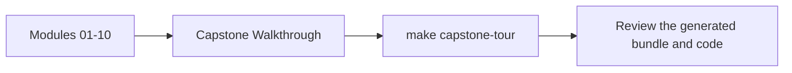
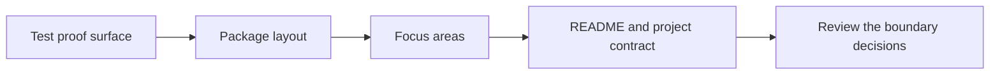

# Capstone Walkthrough

<!-- page-maps:start -->
## Page Maps

<!-- page-maps:end -->

Use this page when you want the capstone as a guided learner story instead of as package
reference alone.

## Recommended route

1. Read `capstone/TOUR.md`.
2. Run `make PROGRAM=python-programming/python-functional-programming capstone-tour`.
3. Read the generated `pytest.txt`, `focus-areas.txt`, `package-tree.txt`, and `test-tree.txt` in that order.
4. Compare what you learned with [Capstone Architecture Guide](capstone-architecture-guide.md) and [Capstone Review Worksheet](capstone-review-worksheet.md).

## What the walkthrough should teach

- how the proof bundle mirrors the course sequence
- how the test surface makes the code promises visible first
- how package layout reveals where purity, composition, and effects live
- how the project contract and guide pages keep the capstone readable to a human reviewer
