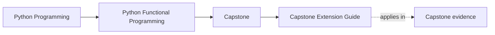
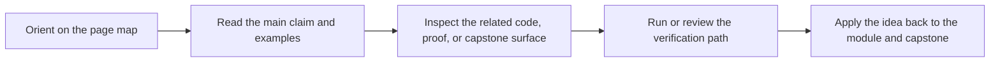

# Capstone Extension Guide

<!-- page-maps:start -->
## Page Maps

<!-- page-maps:end -->

Read the first diagram as a timing map: this guide is for a named pressure, not for wandering the whole course-book. Read the second diagram as the guide loop: arrive with a concrete question, use only the matching sections, then leave with one smaller and more honest next move.

Use this page when the course asks not only "what is this boundary?" but also "where
should the next change land?"

## Recommended route

1. Read [Capstone File Guide](capstone-file-guide.md).
2. Compare the change you are imagining with [Capstone File Guide](capstone-file-guide.md).
3. Use [Capstone Review Worksheet](capstone-review-worksheet.md) to decide what proof must change with the implementation.

## What a good answer looks like

- you can name the owning package before editing code
- you can explain why another nearby package should not absorb the change
- you can name the proof surface that must evolve with the implementation
