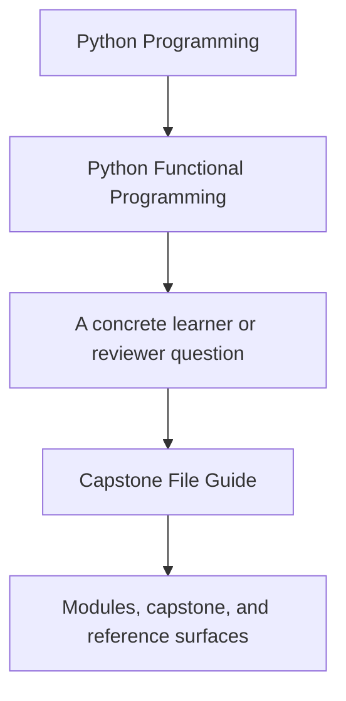
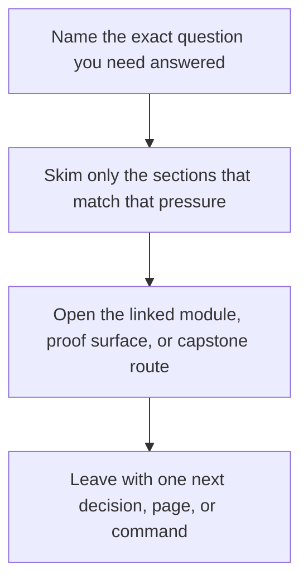

# Capstone File Guide

<!-- page-maps:start -->
## Guide Fit

<!-- page-maps:end -->

Read the first diagram as a timing map: this guide is for code-reading pressure, not for
touring the whole repository. Read the second diagram as the guide loop: arrive with one
question about files or package ownership, then leave with one smaller and more honest
next move.

This guide gives the capstone a human reading order. The goal is not to read every file
alphabetically. The goal is to understand how the project is partitioned.

Start with [Capstone Map](capstone-map.md) when you want the repository reading order kept attached to the current module question.

## Choose your reading route

| If your question is... | Start here | Then go to... |
| --- | --- | --- |
| What does the project promise before I read the code? | `tests/` | `src/funcpipe_rag/fp/` and `src/funcpipe_rag/result/` |
| Where is the pure core? | `src/funcpipe_rag/fp/` and `src/funcpipe_rag/result/` | `src/funcpipe_rag/rag/` and `src/funcpipe_rag/core/` |
| Where are pipeline assembly and policy choices? | `src/funcpipe_rag/pipelines/` and `src/funcpipe_rag/policies/` | `src/funcpipe_rag/domain/` |
| Where do effects and adapters begin? | `src/funcpipe_rag/domain/` and `src/funcpipe_rag/boundaries/` | `src/funcpipe_rag/infra/` and `src/funcpipe_rag/interop/` |
| Where should I review integration edges last? | `src/funcpipe_rag/infra/` and `src/funcpipe_rag/interop/` | the matching tests and review guides |

## What each area is for

- `tests/` tells you what the codebase promises.
- `fp/` and `result/` hold the reusable algebra and functional containers.
- `rag/` and `core/` hold the pipeline domain and value modelling.
- `pipelines/` and `policies/` hold assembly, orchestration choices, and explicit policies.
- `domain/` and `boundaries/` hold capabilities, shells, and effect coordination seams.
- `infra/` and `interop/` hold the concrete adapters and external-library bridges.

## Best local companion

Use [Capstone Architecture Guide](capstone-architecture-guide.md) when you want the same reading route anchored in package ownership instead of local file storage.

## What this order prevents

- starting in adapters and mistaking them for the core design
- treating every package as equally effectful
- losing track of where a new integration or policy should land

## Stop here when

- you know the first package group worth opening
- you know which package group should stay closed until later
- you know whether your next move is code reading or test reading
