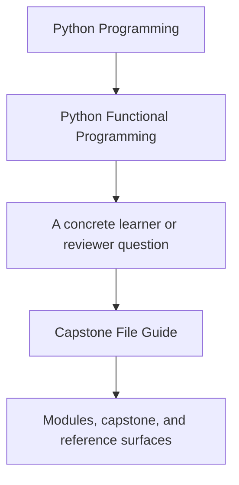
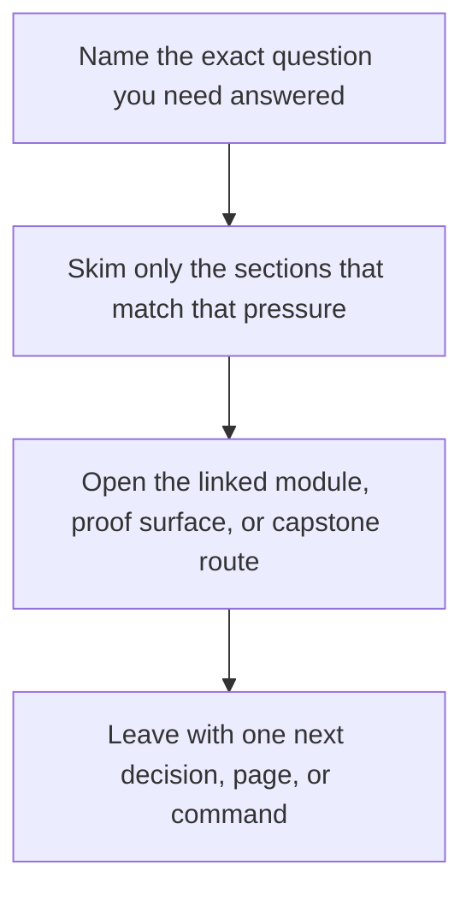

# Capstone File Guide

<!-- page-maps:start -->
## Guide Fit

<!-- page-maps:end -->

Read the first diagram as a timing map: this guide is for a named pressure, not for wandering the whole course-book. Read the second diagram as the guide loop: arrive with a concrete question, use only the matching sections, then leave with one smaller and more honest next move.

This guide gives the capstone a human reading order. The goal is not to read every file
alphabetically. The goal is to understand how the project is partitioned.

Start with the local capstone [`PACKAGE_GUIDE.md`](https://github.com/bijux/bijux-masterclass/blob/master/programs/python-programming/python-functional-programming/capstone/PACKAGE_GUIDE.md)
when you want the repository itself to carry the same reading order.

## Recommended reading order

1. `tests/`
2. `src/funcpipe_rag/fp/` and `src/funcpipe_rag/result/`
3. `src/funcpipe_rag/rag/` and `src/funcpipe_rag/core/`
4. `src/funcpipe_rag/pipelines/` and `src/funcpipe_rag/policies/`
5. `src/funcpipe_rag/domain/` and `src/funcpipe_rag/boundaries/`
6. `src/funcpipe_rag/infra/` and `src/funcpipe_rag/interop/`

## What each area is for

- `tests/` tells you what the codebase promises.
- `fp/` and `result/` hold the reusable algebra and functional containers.
- `rag/` and `core/` hold the pipeline domain and value modelling.
- `pipelines/` and `policies/` hold assembly, orchestration choices, and explicit policies.
- `domain/` and `boundaries/` hold capabilities, shells, and effect coordination seams.
- `infra/` and `interop/` hold the concrete adapters and external-library bridges.

## Best local companion

Use the capstone's local [`PACKAGE_GUIDE.md`](https://github.com/bijux/bijux-masterclass/blob/master/programs/python-programming/python-functional-programming/capstone/PACKAGE_GUIDE.md)
when you are already in the repository and want the same reading route without switching
back to the course-book.

## What this order prevents

- starting in adapters and mistaking them for the core design
- treating every package as equally effectful
- losing track of where a new integration or policy should land
