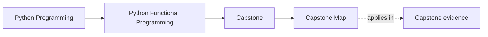
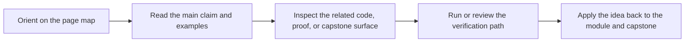

# Capstone Map

<!-- page-maps:start -->
## Page Maps

<!-- page-maps:end -->

Read the first diagram as a timing map: this page routes you into the right capstone
surface, not through every capstone page in order. Read the second diagram as the guide
loop: arrive with one question, choose the matching route, then leave with one smaller
and more honest next move.

This map turns the capstone into a deliberate study surface instead of a single guide
page. Use it whenever you want to decide where to go next for concrete evidence.

## Choose one capstone route

| If your question is... | Best page | Smallest command if needed |
| --- | --- | --- |
| Which capstone page should I open first? | [FuncPipe Capstone Guide](index.md) | none |
| Which files should I read first? | [Capstone File Guide](capstone-file-guide.md) | `make PROGRAM=python-programming/python-functional-programming inspect` |
| Which tests or proof artifacts match the current module? | [Capstone Proof Guide](capstone-proof-guide.md) | `make PROGRAM=python-programming/python-functional-programming capstone-test` |
| Where do package boundaries and adapters live? | [Capstone Architecture Guide](capstone-architecture-guide.md) | `make PROGRAM=python-programming/python-functional-programming inspect` |
| Which saved proof route fits this claim? | [Capstone Proof Guide](capstone-proof-guide.md) | `make PROGRAM=python-programming/python-functional-programming capstone-verify-report` |
| I need the guided walkthrough story. | [Capstone Walkthrough](capstone-walkthrough.md) | `make PROGRAM=python-programming/python-functional-programming capstone-walkthrough` |
| I need explicit review prompts or change placement. | [Capstone Review Worksheet](capstone-review-worksheet.md) or [Capstone Extension Guide](capstone-extension-guide.md) | none |

## Module-to-capstone bridge

| Module range | Best first route |
| --- | --- |
| Modules 01 to 03 | `fp/`, `result/`, `streaming/`, and the pipeline core |
| Modules 04 to 06 | failure containers, algebraic modelling, and configured flows |
| Modules 07 to 08 | `domain/`, `boundaries/`, `infra/`, and async effect packages |
| Modules 09 to 10 | `interop/`, review guides, and proof surfaces |

## Module-to-file, test, and proof route

| Module | Best first source surface | Best first test or review surface | Best first command |
| --- | --- | --- | --- |
| Module 01: Purity and substitution | `capstone/src/funcpipe_rag/fp/core.py`, `capstone/src/funcpipe_rag/fp/combinators.py` | `capstone/tests/unit/fp/test_core_chunk_roundtrip.py`, `capstone/tests/unit/fp/test_core_state_machine.py` | `make PROGRAM=python-programming/python-functional-programming capstone-test` |
| Module 02: Data-first APIs and expression style | `capstone/src/funcpipe_rag/pipelines/specs.py`, `capstone/src/funcpipe_rag/pipelines/configured.py` | `capstone/tests/unit/pipelines/test_specs_roundtrip.py`, `capstone/tests/unit/pipelines/test_configured_pipeline.py` | `make PROGRAM=python-programming/python-functional-programming capstone-test` |
| Module 03: Iterators and lazy dataflow | `capstone/src/funcpipe_rag/streaming/`, `capstone/src/funcpipe_rag/tree/` | `capstone/tests/unit/streaming/test_streaming.py`, `capstone/tests/unit/tree/test_tree_folds.py` | `make PROGRAM=python-programming/python-functional-programming capstone-test` |
| Module 04: Resilience and streaming failures | `capstone/src/funcpipe_rag/result/`, `capstone/src/funcpipe_rag/policies/retries.py`, `capstone/src/funcpipe_rag/policies/breakers.py` | `capstone/tests/unit/result/test_result_folds.py`, `capstone/tests/unit/policies/test_retries.py`, `capstone/tests/unit/policies/test_breakers.py` | `make PROGRAM=python-programming/python-functional-programming capstone-verify-report` |
| Module 05: Algebraic data modelling | `capstone/src/funcpipe_rag/fp/validation.py`, `capstone/src/funcpipe_rag/rag/domain/` | `capstone/tests/unit/fp/test_pattern_matching.py`, `capstone/tests/unit/rag/test_stages.py` | `make PROGRAM=python-programming/python-functional-programming capstone-test` |
| Module 06: Monadic flow and explicit context | `capstone/src/funcpipe_rag/fp/effects/`, `capstone/src/funcpipe_rag/result/types.py` | `capstone/tests/unit/fp/test_configurable.py`, `capstone/tests/unit/fp/test_layering.py`, `capstone/tests/unit/result/test_option_result.py` | `make PROGRAM=python-programming/python-functional-programming capstone-verify-report` |
| Module 07: Effect boundaries and resource safety | `capstone/src/funcpipe_rag/boundaries/`, `capstone/src/funcpipe_rag/domain/effects/`, `capstone/src/funcpipe_rag/domain/capabilities.py` | `capstone/tests/unit/domain/test_io_plan_laws.py`, `capstone/tests/unit/domain/test_session.py`, `capstone/tests/unit/domain/test_idempotent.py` | `make PROGRAM=python-programming/python-functional-programming capstone-tour` |
| Module 08: Async FuncPipe and backpressure | `capstone/src/funcpipe_rag/domain/effects/async_/`, `capstone/src/funcpipe_rag/infra/adapters/async_runtime.py` | `capstone/tests/unit/domain/test_async_backpressure.py`, `capstone/tests/unit/domain/test_async_law_properties.py`, `capstone/tests/unit/domain/test_async_resilience.py` | `make PROGRAM=python-programming/python-functional-programming capstone-verify-report` |
| Module 09: Ecosystem interop | `capstone/src/funcpipe_rag/boundaries/shells/cli.py`, `capstone/src/funcpipe_rag/pipelines/cli.py`, `capstone/src/funcpipe_rag/interop/` | `capstone/tests/unit/pipelines/test_cli_overrides.py`, `capstone/tests/unit/interop/test_stdlib_fp.py`, `capstone/tests/unit/interop/test_toolz_compat.py` | `make PROGRAM=python-programming/python-functional-programming capstone-tour` |
| Module 10: Refactoring and sustainment | [FuncPipe Capstone Guide](index.md), [Capstone Architecture Guide](capstone-architecture-guide.md), [Capstone Proof Guide](capstone-proof-guide.md), `capstone/pyproject.toml` | [Capstone Walkthrough](capstone-walkthrough.md), [Capstone Proof Guide](capstone-proof-guide.md) | `make PROGRAM=python-programming/python-functional-programming test` |

Use this table when a module page tells you to inspect the capstone and you want the
smallest stable route from concept to source, proof, and command.

## Stop here when

- you know which capstone page owns your question
- you know whether you need code, tests, review prompts, or proof artifacts
- you know the smallest command worth running next
