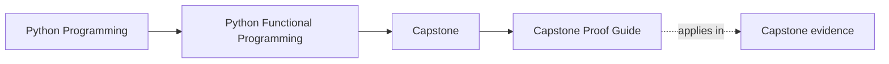
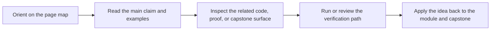

# Capstone Proof Guide

<!-- page-maps:start -->
## Page Maps

<!-- page-maps:end -->

Read the first diagram as a timing map: this guide is for a named pressure, not for wandering the whole course-book. Read the second diagram as the guide loop: arrive with a concrete question, use only the matching sections, then leave with one smaller and more honest next move.

Use this page when a lesson makes a design claim and you want the most direct evidence in
the capstone.

## Proof route

1. Read [FuncPipe Capstone Guide](index.md).
2. Run `make PROGRAM=python-programming/python-functional-programming inspect` when you need the fastest inventory of package, test, and guide ownership.
3. Read tests in this order when you need the shortest honest proof:
   `tests/unit/fp/`, `tests/unit/result/`, `tests/unit/rag/`, `tests/unit/pipelines/`,
   `tests/unit/policies/`, `tests/unit/domain/`, `tests/unit/boundaries/`,
   `tests/unit/infra/`, then `tests/unit/interop/`.
4. Run `make PROGRAM=python-programming/python-functional-programming capstone-test`
   when you want the pytest suite without the wider walkthrough or bundle routes.
5. Run `make PROGRAM=python-programming/python-functional-programming test` for the
   course-level executable proof route.
6. Run `make PROGRAM=python-programming/python-functional-programming capstone-walkthrough`
   when you need the guided walkthrough before escalating proof.
7. Run `make PROGRAM=python-programming/python-functional-programming capstone-verify-report`
   when you want a review bundle with the executed test record.
8. Run `make PROGRAM=python-programming/python-functional-programming capstone-tour` for
   the guided proof bundle.
9. Run `make PROGRAM=python-programming/python-functional-programming proof` when you want
   the sanctioned end-to-end route.
10. Run `make PROGRAM=python-programming/python-functional-programming capstone-confirm`
    when you want the strictest confirmation route exposed by the catalog.
11. Use [Capstone Review Worksheet](capstone-review-worksheet.md) to decide whether the
    evidence is strong enough.

## Test-reading route by pressure

| If you need to prove... | Open these tests first | Then cross-check with |
| --- | --- | --- |
| pure transforms and lawful composition | `tests/unit/fp/` and `tests/unit/result/` | `src/funcpipe_rag/fp/` and `src/funcpipe_rag/result/` |
| retrieval modelling, validation, and domain choices | `tests/unit/rag/` and `tests/unit/policies/` | `src/funcpipe_rag/rag/` and `src/funcpipe_rag/policies/` |
| pipeline assembly and effect boundaries | `tests/unit/pipelines/`, `tests/unit/domain/`, and `tests/unit/boundaries/` | `src/funcpipe_rag/pipelines/`, `src/funcpipe_rag/domain/`, and `src/funcpipe_rag/boundaries/` |
| adapter and interoperability seams | `tests/unit/infra/` and `tests/unit/interop/` | `src/funcpipe_rag/infra/` and `src/funcpipe_rag/interop/` |

## What you should be able to answer after proof review

- Which package owns the checked behavior?
- Which test or artifact confirmed it?
- Which future change would require stronger or different proof?
