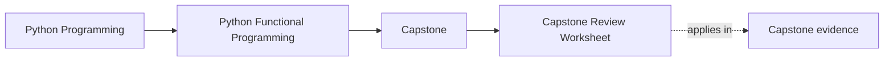
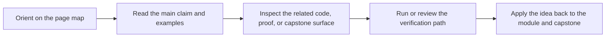

# Capstone Review Worksheet

<!-- page-maps:start -->
## Page Maps

<!-- page-maps:end -->

Read the first diagram as a timing map: this guide is for a named pressure, not for wandering the whole course-book. Read the second diagram as the guide loop: arrive with a concrete question, use only the matching sections, then leave with one smaller and more honest next move.

Use this worksheet after a module or before changing the capstone. The goal is not only
to agree with the architecture. The goal is to inspect whether the evidence justifies it.

## Purity

- Which package or function is still pure here?
- Which value shapes keep local reasoning cheap?
- Which helper would become harder to trust if it pulled I/O inward?

## Effects

- Which shell, capability, or adapter is allowed to execute the effect?
- Is the effect boundary named clearly enough that another engineer would find it quickly?
- Does the functional core stay descriptive after the boundary is introduced?

## Failure and streaming

- Which failures are values, and which are still exceptions?
- Where does the pipeline materialize a sequence, and why there?
- Which retry, timeout, or backpressure choice is policy rather than accidental behavior?

## Proof

- Which test folder or tour artifact proves the current claim?
- Which command should you run before accepting the boundary?
- Which question from [Functional Review Checklist](../reference/review-checklist.md) is most relevant to this review?
