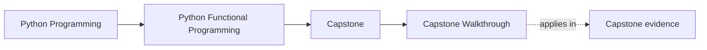
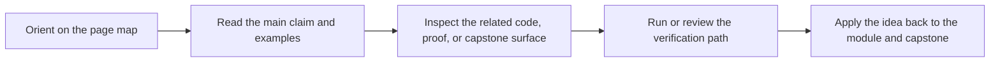

# Capstone Walkthrough

<!-- page-maps:start -->
## Page Maps

<!-- page-maps:end -->

Read the first diagram as a timing map: this guide is for a named pressure, not for wandering the whole course-book. Read the second diagram as the guide loop: arrive with a concrete question, use only the matching sections, then leave with one smaller and more honest next move.

Use this page when you want the capstone as a guided study story instead of as package
reference alone.

## Recommended route

1. Read [FuncPipe Capstone Guide](index.md).
2. Run `make PROGRAM=python-programming/python-functional-programming inspect` if you need the quickest review map before running tests.
3. Run `make PROGRAM=python-programming/python-functional-programming capstone-walkthrough`.
4. Read [Capstone Proof Guide](capstone-proof-guide.md) if you want to compare the walkthrough with the stronger saved proof routes.
5. Read the generated `pytest.txt`, `focus-areas.txt`, `package-tree.txt`, and `test-tree.txt` in that order.
6. Run `make PROGRAM=python-programming/python-functional-programming capstone-tour` only when you want the guided proof bundle after the walkthrough is already clear.
7. Run `make PROGRAM=python-programming/python-functional-programming capstone-verify-report` when you need a saved review bundle with the executed test record.
8. Compare what you learned with [Capstone Architecture Guide](capstone-architecture-guide.md), [Capstone Proof Guide](capstone-proof-guide.md), and [Capstone Review Worksheet](capstone-review-worksheet.md).

## What the walkthrough should teach

- how the proof bundle mirrors the course sequence
- how the test surface makes the code promises visible first
- how package layout reveals where purity, composition, and effects live
- how the project contract and guide pages keep the capstone readable to a human reviewer
