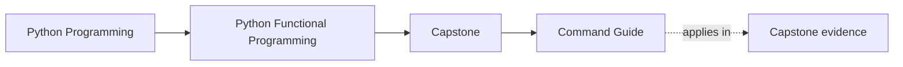
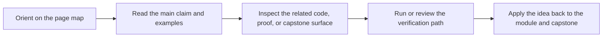

# Command Guide


<!-- page-maps:start -->
## Page Maps




<!-- page-maps:end -->

Read the first diagram as a timing map: this guide is for a named pressure, not for wandering the whole course-book. Read the second diagram as the guide loop: arrive with a concrete question, use only the matching sections, then leave with one smaller and more honest next move.

This page exists so you do not have to reverse-engineer the executable surface.
Use it whenever you want to connect a course claim to runnable evidence.

## Stable commands from the repository root

```bash
make PROGRAM=python-programming/python-functional-programming install
make PROGRAM=python-programming/python-functional-programming test
make PROGRAM=python-programming/python-functional-programming capstone-test
make PROGRAM=python-programming/python-functional-programming capstone-walkthrough
make PROGRAM=python-programming/python-functional-programming inspect
make PROGRAM=python-programming/python-functional-programming docs-serve
make PROGRAM=python-programming/python-functional-programming docs-build
make PROGRAM=python-programming/python-functional-programming capstone-tour
make PROGRAM=python-programming/python-functional-programming capstone-verify-report
make PROGRAM=python-programming/python-functional-programming capstone-confirm
make PROGRAM=python-programming/python-functional-programming proof
make PROGRAM=python-programming/python-functional-programming history-refresh
make PROGRAM=python-programming/python-functional-programming history-verify
make PROGRAM=python-programming/python-functional-programming history-clean
```

## Stable commands from the capstone directory

```bash
make install
make test
make demo
make inspect
make tour
make verify-report
make confirm
make proof
make history-refresh
make history-verify
make history-clean
```

## How to choose the right command

- Use `docs-serve` when you are reading the course-book locally.
- Use `install` before your first capstone run or when the environment changed.
- Use `test` when you want the strongest published course-level confirmation route.
- Use `capstone-test` when you only want the capstone pytest suite without the full confirmation bundle.
- Use `capstone-walkthrough` from the repository root, or `demo` inside `capstone/`, when you want the guided walkthrough route.
- Use `inspect` when you want the quickest inventory of packages, tests, and proof guides.
- Use `capstone-tour` or `tour` when you want the guided proof bundle.
- Use `capstone-verify-report` or `verify-report` when you want a durable review bundle with executed test output.
- Use `capstone-confirm` or `confirm` when you want the strictest public confirmation route from inside the capstone itself.
- Use `proof` when you want the sanctioned end-to-end evidence route in one command.
- Use `history-refresh` when you want fresh module tags plus `_history/worktrees/module-XX` for module-by-module comparison.
- Use `history-verify` when you want to confirm the generated worktrees still match the tracked module snapshot sources and manifests.
- Use `history-clean` when you want to remove the generated history surface, the local module tags, and the generated history branch before rebuilding from scratch.

## Honest rule

If a course claim matters, there should be a command or evidence bundle that helps you
inspect it. If you cannot name that route, use the capstone guides and module maps to
find the right surface before moving on.
