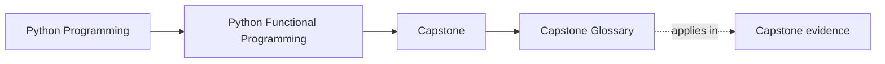
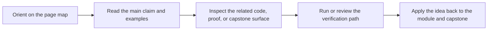

# Capstone Glossary

<!-- page-maps:start -->
## Page Maps

<!-- page-maps:end -->

This glossary belongs to **FuncPipe Capstone Guide** in **Python Functional Programming**. It keeps the language of this directory stable so the same ideas keep the same names across reading, practice, review, and capstone proof.

## How to use this glossary

Read the directory index first, then return here whenever a page, command, or review discussion starts to feel more vague than the course intends. The goal is stable language, not extra theory.

## Terms in this directory

| Term | Meaning in this directory |
| --- | --- |
| Capstone Architecture Guide | the capstone reading surface for capstone architecture guide, used to choose the next repository entry point without guessing. |
| Capstone Extension Guide | the change-placement surface for the capstone, used to decide where a new behavior belongs and what it must preserve. |
| Capstone File Guide | the capstone reading surface for capstone file guide, used to choose the next repository entry point without guessing. |
| Capstone Map | the capstone reading surface for capstone map, used to choose the next repository entry point without guessing. |
| Capstone Proof Guide | the capstone review surface for capstone proof guide, used to turn course ideas into inspection, evidence, and change decisions. |
| Capstone Review Worksheet | the capstone review surface for capstone review worksheet, used to turn course ideas into inspection, evidence, and change decisions. |
| Capstone Test Guide | the test-first capstone reading surface for capstone test guide, used to connect repository behavior to the proof route quickly. |
| Capstone Walkthrough | the capstone reading surface for capstone walkthrough, used to choose the next repository entry point without guessing. |
| Command Guide | the executable entry surface for the capstone, used when the next question is best answered by running the project rather than rereading the course. |
