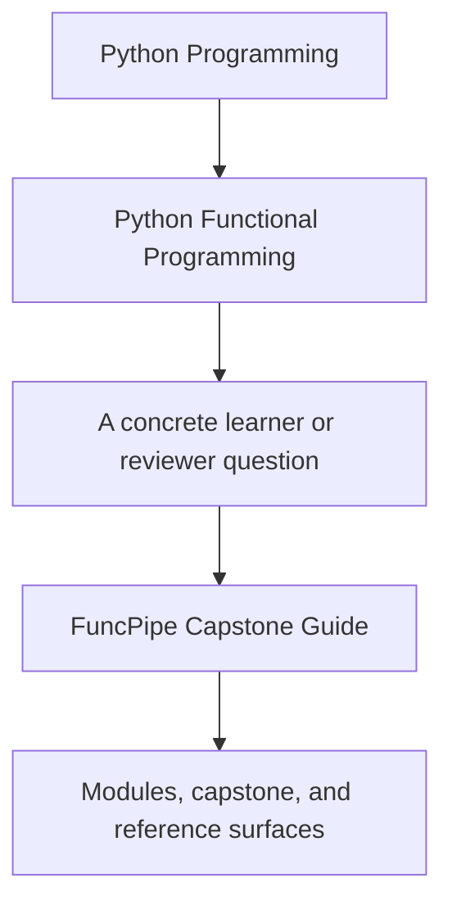
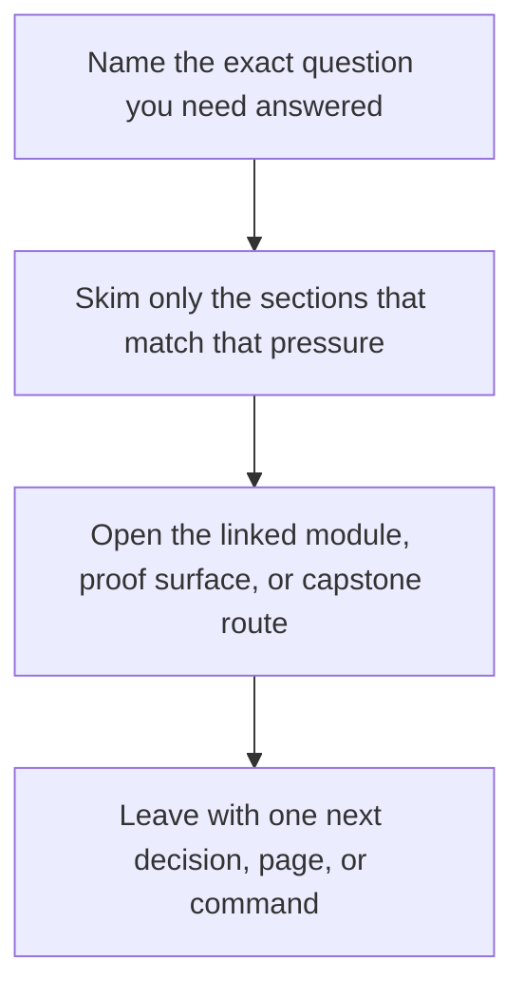

# FuncPipe Capstone Guide


<!-- page-maps:start -->
## Guide Fit




<!-- page-maps:end -->

Read the first diagram as a timing map: this guide is for a named pressure, not for wandering the whole course-book. Read the second diagram as the guide loop: arrive with a concrete question, use only the matching sections, then leave with one smaller and more honest next move.

The FuncPipe RAG capstone is the course's executable proof. It is not a separate side
project and not a graduation appendix. It is the repository the course keeps using to
show what purity, lazy pipelines, typed failures, effect boundaries, and async plans look
like in a real Python codebase.

## What this capstone is proving

The capstone demonstrates a system where:

- pure transforms remain separate from effectful shells
- dataflow, materialization, and retries are explicit design choices
- domain failures are modeled as values instead of buried in ad hoc exception paths
- infrastructure is organized behind protocols and adapters
- async coordination is bounded, testable, and inspectable

Use [Capstone Map](capstone-map.md) when you want the best next page for code reading,
architecture review, walkthrough, or proof. That page now includes a module-by-module
route to the first file, test, and command worth opening.

If the retrieval domain itself feels noisy, read [FuncPipe RAG Primer](../guides/funcpipe-rag-primer.md)
first. It narrows the vocabulary so the capstone stays attached to the FP lesson instead
of turning into a separate subject.

## What the learner should do with it

Use the capstone as evidence, not just as a runnable project:

- inspect the code after each module to locate the same contract in executable form
- read implementation and tests together so the claims stay attached to proof
- compare the pure core with the adapter layer instead of treating everything as one blob
- return to the architecture and tour material whenever the abstractions start to feel abstract

## Capstone checkpoints by module range

- Modules 01 to 03:
  Inspect pure transforms, explicit configuration, and lazy pipeline stages.
- Modules 04 to 06:
  Inspect failure containers, modelling choices, and lawful chaining patterns.
- Modules 07 to 08:
  Inspect capability protocols, adapter shells, async boundaries, and pressure-control logic.
- Modules 09 to 10:
  Inspect interop helpers, review surfaces, performance trade-offs, and sustainment decisions.

## Best entry surfaces

- Repository guide: [`capstone/README.md`](https://github.com/bijux/bijux-masterclass/blob/master/programs/python-programming/python-functional-programming/capstone/README.md)
- Architecture map: [`capstone/docs/ARCHITECTURE.md`](https://github.com/bijux/bijux-masterclass/blob/master/programs/python-programming/python-functional-programming/capstone/docs/ARCHITECTURE.md)
- Tour guide: [`capstone/docs/TOUR.md`](https://github.com/bijux/bijux-masterclass/blob/master/programs/python-programming/python-functional-programming/capstone/docs/TOUR.md)
- Source tree: [`capstone/src/funcpipe_rag/`](https://github.com/bijux/bijux-masterclass/tree/master/programs/python-programming/python-functional-programming/capstone/src/funcpipe_rag)
- Tests: [`capstone/tests/`](https://github.com/bijux/bijux-masterclass/tree/master/programs/python-programming/python-functional-programming/capstone/tests)

## Core commands

From the repository root:

```bash
make PROGRAM=python-programming/python-functional-programming install
make PROGRAM=python-programming/python-functional-programming test
make PROGRAM=python-programming/python-functional-programming capstone-test
make PROGRAM=python-programming/python-functional-programming capstone-tour
```

From the capstone directory:

```bash
make install
make test
make tour
```

At the repository root, `test` is the full course confirmation route and maps to the
capstone's `confirm` target. Use `capstone-test` from the root, or `make test` inside the
capstone, when the narrower question is only the pytest suite.

## Review questions

- Which packages stay pure, and which ones are responsible for effects?
- Where does the code choose to materialize a stream, and why there?
- Which abstractions reduce branching and duplication, and which ones would only rename complexity?
- Which guarantees are backed by tests, laws, and fixtures instead of commentary alone?

## What a strong capstone should teach

By the end of the course, the learner should be able to point at the capstone and explain
its boundaries, dataflow, failure strategy, infrastructure seams, and sustainment story
without treating any of those as hidden magic.

## Directory glossary

Use [Glossary](glossary.md) when you want the recurring language in this shelf kept stable while you move between repository routes, review surfaces, and proof commands.
