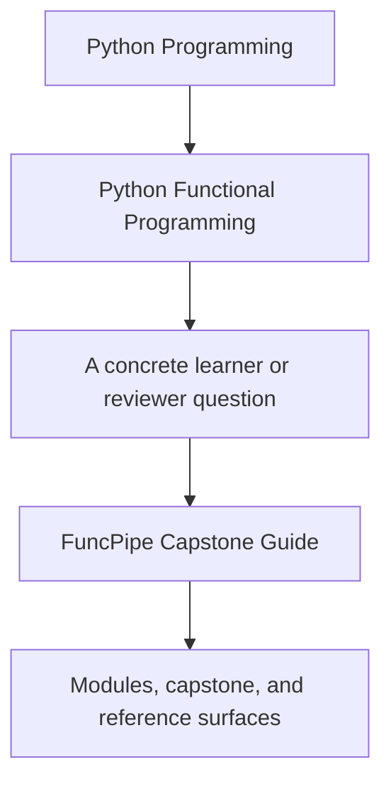
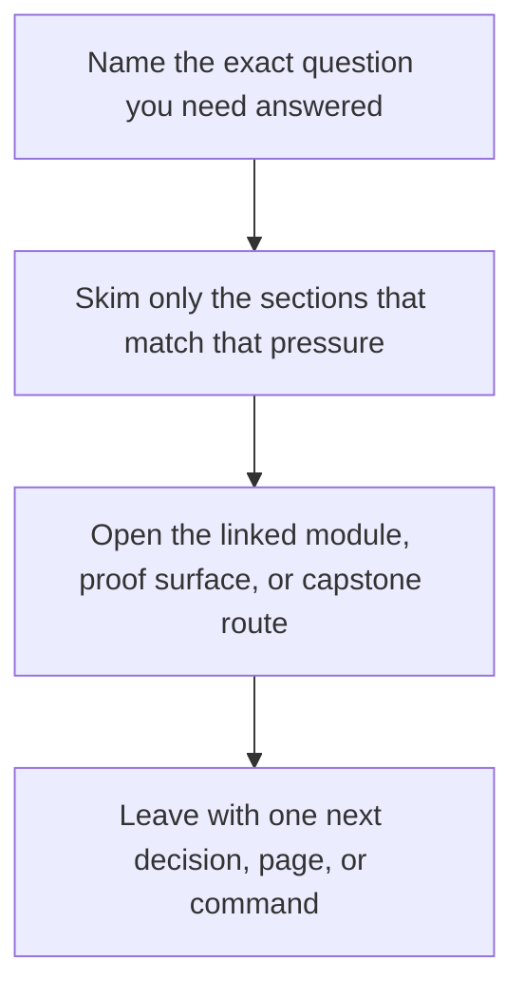

# FuncPipe Capstone Guide

<!-- page-maps:start -->
## Guide Fit

<!-- page-maps:end -->

Read the first diagram as a timing map: this guide is the bridge into the capstone, not a
replacement for the repository docs. Read the second diagram as the guide loop: arrive
with one course-shaped question, open the smallest matching capstone route, then leave
with one smaller and more honest next move.

The FuncPipe RAG capstone is the course's executable proof. It is not a separate side
project and not a graduation appendix. It is the repository the course keeps using to
show what purity, lazy pipelines, typed failures, effect boundaries, and async plans look
like in a real Python codebase.

## What this capstone is proving

The capstone demonstrates a system where:

- pure transforms remain separate from effectful shells
- dataflow, materialization, and retries are explicit design choices
- domain failures are modeled as values instead of buried in ad hoc exception paths
- infrastructure is organized behind protocols and adapters
- async coordination is bounded, testable, and inspectable

Use [Capstone Map](capstone-map.md) when you want the best next page for code reading,
architecture review, walkthrough, or proof. That page now includes a module-by-module
route to the first file, test, and command worth opening.

If the retrieval domain itself feels noisy, read [FuncPipe RAG Primer](../guides/funcpipe-rag-primer.md)
first. It narrows the vocabulary so the capstone stays attached to the FP lesson instead
of turning into a separate subject.

## Choose the right capstone route

| If your question is... | Best page |
| --- | --- |
| Which capstone surface matches the current module? | [Capstone Map](capstone-map.md) |
| Which files should I read first? | [Capstone File Guide](capstone-file-guide.md) |
| Which tests should I read first? | [Capstone Test Guide](capstone-test-guide.md) |
| Where do packages and boundaries live? | [Capstone Architecture Guide](capstone-architecture-guide.md) |
| Which proof route is honest for my question? | [Capstone Proof Guide](capstone-proof-guide.md) |
| Where should a new change land? | [Capstone Extension Guide](capstone-extension-guide.md) |

## Capstone checkpoints by module range

| Module range | What to inspect in the capstone |
| --- | --- |
| Modules 01 to 03 | pure transforms, explicit configuration, and lazy pipeline stages |
| Modules 04 to 06 | failure containers, modelling choices, and lawful chaining patterns |
| Modules 07 to 08 | capability protocols, adapter shells, async boundaries, and pressure-control logic |
| Modules 09 to 10 | interop helpers, review surfaces, performance trade-offs, and sustainment decisions |

## Best entry surfaces

- Repository guide: [`capstone/README.md`](https://github.com/bijux/bijux-masterclass/blob/master/programs/python-programming/python-functional-programming/capstone/README.md)
- Guide index: [`capstone/docs/GUIDE_INDEX.md`](https://github.com/bijux/bijux-masterclass/blob/master/programs/python-programming/python-functional-programming/capstone/docs/GUIDE_INDEX.md)
- Architecture map: [`capstone/docs/ARCHITECTURE.md`](https://github.com/bijux/bijux-masterclass/blob/master/programs/python-programming/python-functional-programming/capstone/docs/ARCHITECTURE.md)
- Tour guide: [`capstone/docs/TOUR.md`](https://github.com/bijux/bijux-masterclass/blob/master/programs/python-programming/python-functional-programming/capstone/docs/TOUR.md)
- Proof guide: [`capstone/docs/PROOF_GUIDE.md`](https://github.com/bijux/bijux-masterclass/blob/master/programs/python-programming/python-functional-programming/capstone/docs/PROOF_GUIDE.md)

## Core commands

| If you need... | From the repository root | From the capstone directory |
| --- | --- | --- |
| install the project | `make PROGRAM=python-programming/python-functional-programming install` | `make install` |
| the strongest course-level proof route | `make PROGRAM=python-programming/python-functional-programming test` | `make confirm` |
| the pytest suite only | `make PROGRAM=python-programming/python-functional-programming capstone-test` | `make test` |
| the learner-facing walkthrough bundle | `make PROGRAM=python-programming/python-functional-programming capstone-tour` | `make tour` |

## Review questions

- Which packages stay pure, and which ones are responsible for effects?
- Where does the code choose to materialize a stream, and why there?
- Which abstractions reduce branching and duplication, and which ones would only rename complexity?
- Which guarantees are backed by tests, laws, and fixtures instead of commentary alone?

## What a strong capstone should teach

By the end of the course, the learner should be able to point at the capstone and explain
its boundaries, dataflow, failure strategy, infrastructure seams, and sustainment story
without treating any of those as hidden magic.

## Directory glossary

Use [Glossary](glossary.md) when you want the recurring language in this shelf kept stable while you move between repository routes, review surfaces, and proof commands.

## Stop here when

- you know which capstone page answers your current course question
- you know whether your next move is code reading, test reading, or proof
- you know the smallest command that fits that move
