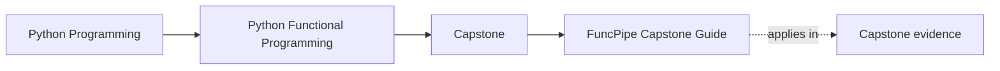
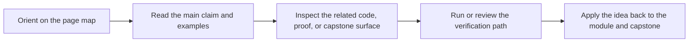

# FuncPipe Capstone Guide

<!-- page-maps:start -->
## Page Maps

<!-- page-maps:end -->

The FuncPipe RAG capstone is the course's executable proof. It shows what functional
Python looks like once purity, typed failures, effect boundaries, and async coordination
have to survive contact with a real repository.

This guide is the entry surface for the shelf. Use it to choose the smallest honest route
for the question you have right now, then stop once one file, guide, or proof surface is
clearly enough.

## What this capstone proves

- pure transforms stay separate from effectful shells
- failure modelling can stay explicit instead of disappearing into ad hoc exceptions
- protocols and adapters can keep infrastructure replaceable without hiding ownership
- async pressure can remain inspectable and testable instead of becoming ambient runtime magic

## Choose the right capstone route

| If your question is... | Best page |
| --- | --- |
| Which capstone surface matches the current module? | [Capstone Map](capstone-map.md) |
| Which files should I read first? | [Capstone File Guide](capstone-file-guide.md) |
| Where do package and effect boundaries live? | [Capstone Architecture Guide](capstone-architecture-guide.md) |
| Which proof route or test group fits this claim? | [Capstone Proof Guide](capstone-proof-guide.md) |
| How should I review the design as a steward? | [Capstone Review Worksheet](capstone-review-worksheet.md) |
| Where should a new change land? | [Capstone Extension Guide](capstone-extension-guide.md) |

## Start by module range

| Module range | Best capstone focus |
| --- | --- |
| Modules 01-03 | pure transforms, explicit configuration, and lazy dataflow |
| Modules 04-06 | result types, validation paths, and lawful composition |
| Modules 07-08 | capability protocols, adapters, async boundaries, and orchestration pressure |
| Modules 09-10 | interop, sustainment, review surfaces, and extension seams |

## Core commands

| If you need... | From the repository root | From the capstone directory |
| --- | --- | --- |
| the guided walkthrough | `make PROGRAM=python-programming/python-functional-programming capstone-walkthrough` | `make demo` |
| the pytest suite only | `make PROGRAM=python-programming/python-functional-programming capstone-test` | `make test` |
| the course-level proof route | `make PROGRAM=python-programming/python-functional-programming test` | `make confirm` |

## Guide set

- [Capstone Map](capstone-map.md)
- [Capstone Walkthrough](capstone-walkthrough.md)
- [Command Guide](command-guide.md)
- [Capstone File Guide](capstone-file-guide.md)
- [Capstone Architecture Guide](capstone-architecture-guide.md)
- [Capstone Proof Guide](capstone-proof-guide.md)
- [Capstone Review Worksheet](capstone-review-worksheet.md)
- [Capstone Extension Guide](capstone-extension-guide.md)
- [Glossary](glossary.md)

## Review questions

- Which packages stay pure, and which ones are responsible for effects?
- Where does the code choose to materialize data, and why there?
- Which guarantees are proved by tests and bundles instead of commentary alone?

## Stop here when

- you know which capstone page answers the current course question
- you know whether your next move is code reading, proof reading, or execution
- you know the smallest command that fits that move
