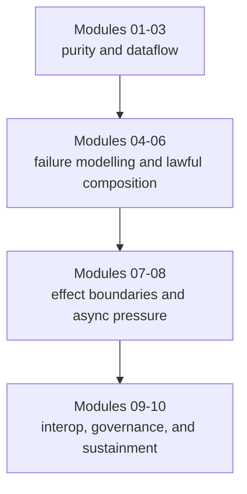

# Course Guide

<!-- page-maps:start -->
## Page Maps

<!-- page-maps:end -->

This guide explains how the course is shaped and why the sequence matters. The course is
not a pile of functional programming topics. It is a route from local reasoning to
systems that remain testable and reviewable under operational pressure.

## The four arcs

## Purity and dataflow

Modules 01 to 03 establish the semantic floor:

- what purity really buys you
- how data-first APIs change refactoring pressure
- how lazy pipelines remain understandable without hidden execution

Without this floor, later abstractions feel clever instead of necessary.

## Failure and modelling

Modules 04 to 06 turn pipelines into something survivable:

- failures become typed values instead of scattered exception paths
- domain states and validations become explicit shapes
- chained flows keep context visible instead of implicit

## Effects and async pressure

Modules 07 to 08 move the course from local transforms to real systems:

- capabilities, ports, and adapters define what effectful code may do
- retries, resources, and transactions become reviewable policy choices
- async work gains explicit pressure-control and testable boundaries

## Interop and sustainment

Modules 09 to 10 ask whether the design can survive a team and a production lifecycle:

- can the functional core coexist with normal Python libraries
- can performance and observability be improved without blurring boundaries
- can the codebase evolve without turning the functional vocabulary into ceremony

## How the capstone fits the arc

- Modules 01 to 03 explain the capstone's pure helpers, configuration shapes, and stream stages.
- Modules 04 to 06 explain its failure containers, modelling choices, and compositional pipeline style.
- Modules 07 to 08 explain its shells, adapters, policies, and async coordination layers.
- Modules 09 to 10 explain its interop surfaces, review workflow, and sustainment story.

## Honest expectation

If you rush, the course will feel heavier than necessary. If you read it in order and
keep the capstone in view, the later modules should feel like consequences of earlier
boundary decisions instead of unrelated advanced techniques.

Use [Module Dependency Map](module-dependency-map.md) when you need to understand why the
sequence is shaped this way, and use [Practice Map](practice-map.md) to keep each module
tied to code and verification.
