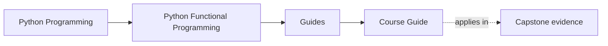
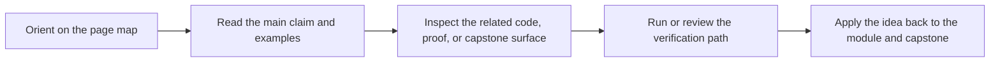

# Course Guide

<!-- page-maps:start -->
## Page Maps

<!-- page-maps:end -->

Read the first diagram as a timing map: this guide explains the course spine, not every
support page in equal detail. Read the second diagram as the guide loop: arrive with one
question about sequence or scope, then leave knowing which arc, proof surface, or
capstone route to open next.

This guide explains how the course is shaped and why the sequence matters. The course is
not a pile of functional programming topics. It is a route from local reasoning to
systems that remain testable and reviewable under operational pressure.

## Choose the right surface

| If you need... | Best page |
| --- | --- |
| the shortest entry route | [Start Here](start-here.md) |
| the promise and evidence route for one module | [Module Promise Map](module-promise-map.md) |
| the sequence justified | [Module Dependency Map](../reference/module-dependency-map.md) |
| an honest bar for moving on | [Module Checkpoints](module-checkpoints.md) |
| the capstone route kept explicit | [FuncPipe Capstone Guide](../capstone/index.md) and [Capstone Map](../capstone/capstone-map.md) |
| the proof route from claim to evidence | [Proof Matrix](proof-matrix.md) |

## The Four Arcs

### Purity and dataflow

Modules 01 to 03 establish the semantic floor:

- what purity really buys you
- how data-first APIs change refactoring pressure
- how lazy pipelines remain understandable without hidden execution

Without this floor, later abstractions feel clever instead of necessary.

### Failure and modelling

Modules 04 to 06 turn pipelines into something survivable:

- failures become typed values instead of scattered exception paths
- domain states and validations become explicit shapes
- chained flows keep context visible instead of implicit

### Effects and async pressure

Modules 07 to 08 move the course from local transforms to real systems:

- capabilities, ports, and adapters define what effectful code may do
- retries, resources, and transactions become reviewable policy choices
- async work gains explicit pressure-control and testable boundaries

### Interop and sustainment

Modules 09 to 10 ask whether the design can survive a team and a production lifecycle:

- can the functional core coexist with normal Python libraries
- can performance and observability be improved without blurring boundaries
- can the codebase evolve without turning the functional vocabulary into ceremony

## What each arc should unlock

| Arc | What should feel more possible after it | Best capstone mirror |
| --- | --- | --- |
| Modules 01 to 03 | separating pure transforms, explicit configuration, and lazy execution | `fp/`, `result/`, `streaming/`, pipeline core |
| Modules 04 to 06 | modelling failure and context without hiding control flow | result containers, validations, configured flows |
| Modules 07 to 08 | drawing effect boundaries and surviving async pressure honestly | capabilities, adapters, async coordination layers |
| Modules 09 to 10 | evolving the system without dissolving its contracts | interop surfaces, proof routes, review surfaces |

## How The Capstone Fits

- Modules 01 to 03 explain the capstone's pure helpers, configuration shapes, and stream stages.
- Modules 04 to 06 explain its failure containers, modelling choices, and compositional pipeline style.
- Modules 07 to 08 explain its shells, adapters, policies, and async coordination layers.
- Modules 09 to 10 explain its interop surfaces, review workflow, and sustainment story.

## Use these pages at the right moment

| Moment | Best page |
| --- | --- |
| before you start Module 01 | [Learning Contract](learning-contract.md) |
| when a module title sounds familiar but the promise is fuzzy | [Module Promise Map](module-promise-map.md) |
| when your pressure is concrete and engineering-shaped | [Pressure Routes](pressure-routes.md) |
| when you want the rehearsal loop in one place | [Practice Map](../reference/practice-map.md) |
| when you need executable proof | [Proof Matrix](proof-matrix.md) |
| when you need generated history comparisons | [Proof Ladder](proof-ladder.md) |

## Honest Expectation

If you rush, the course will feel heavier than necessary. If you read it in order and
keep the capstone in view, the later modules should feel like consequences of earlier
boundary decisions instead of unrelated advanced techniques.

## Stop here when

- you know which arc you are entering next
- you know which support page owns your current pressure
- you can name the capstone mirror for the current module range
