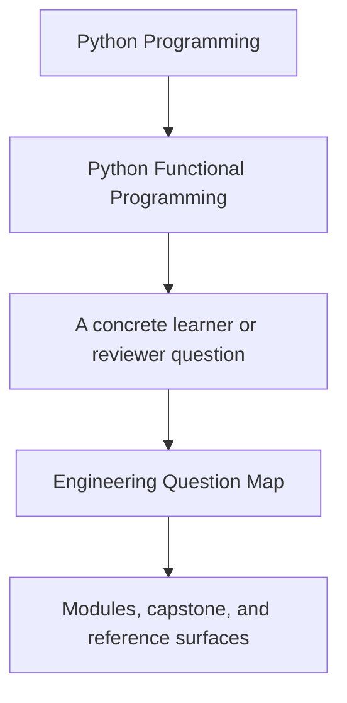
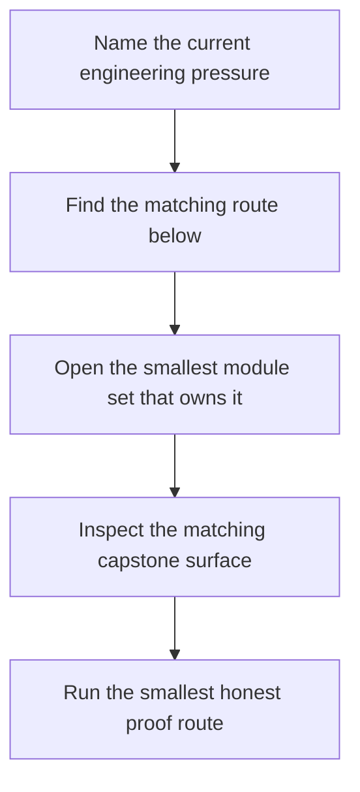

# Engineering Question Map

<!-- page-maps:start -->
## Guide Fit

<!-- page-maps:end -->

Use this page when your question is practical but you are not sure which module name owns
it. The course is easier to use when you enter through the design pressure instead of
guessing from terminology.

## Route by question

### "Why is this helper still hard to reason about?"

Start with:

- Module 01 for purity and substitution
- Module 02 for data-first API shape

Then inspect:

- `capstone/src/funcpipe_rag/fp/core.py`
- `capstone/src/funcpipe_rag/pipelines/configured.py`

### "We keep materializing too early or too often"

Start with:

- Module 03 for laziness and streaming dataflow
- Module 07 if the materialization pressure is caused by boundary placement

Then inspect:

- `capstone/src/funcpipe_rag/streaming/`
- `capstone/tests/unit/streaming/test_streaming.py`

### "Our failure handling is scattered between exceptions, flags, and retries"

Start with:

- Module 04 for Result-style failures, folds, and retry policy
- Module 05 if the problem is really missing domain states
- Module 06 if the flow hides too much context

Then inspect:

- `capstone/src/funcpipe_rag/result/`
- `capstone/src/funcpipe_rag/policies/retries.py`
- `capstone/tests/unit/result/`

### "Validation rules are leaking everywhere"

Start with:

- Module 05 for algebraic modelling and smart construction
- Module 02 if configuration data is still implicit

Then inspect:

- `capstone/src/funcpipe_rag/fp/validation.py`
- `capstone/src/funcpipe_rag/rag/domain/`

### "Adapters and orchestration are eroding the core design"

Start with:

- Module 07 for capability protocols and effect boundaries
- Module 09 for interop pressure

Then inspect:

- `capstone/src/funcpipe_rag/boundaries/`
- `capstone/src/funcpipe_rag/domain/capabilities.py`
- `capstone/src/funcpipe_rag/interop/`

### "Async coordination works, but nobody can explain it cleanly"

Start with:

- Module 08 for backpressure, fairness, and deterministic async testing
- Module 10 if the issue is now reviewability and proof discipline

Then inspect:

- `capstone/src/funcpipe_rag/domain/effects/async_/`
- `capstone/tests/unit/domain/test_async_backpressure.py`
- `capstone/tests/unit/domain/test_async_law_properties.py`

### "We need to refactor or integrate without losing the functional boundary"

Start with:

- Module 09 for ecosystem interop
- Module 10 for sustainment, observability, and governance

Then inspect:

- `capstone/ARCHITECTURE.md`
- `capstone/PROOF_GUIDE.md`
- `capstone/WALKTHROUGH_GUIDE.md`

## Use this map well

- Start with the smallest route that owns the pressure.
- Escalate to later modules only when the earlier discipline is already stable.
- Keep one capstone file and one proof surface open while reading.
- Leave with one boundary statement you can explain in plain Python engineering language.

## Best companion pages

- `module-promise-map.md`
- `module-checkpoints.md`
- `proof-matrix.md`
- `capstone-map.md`
