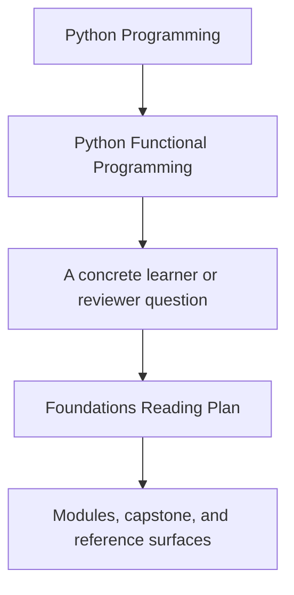
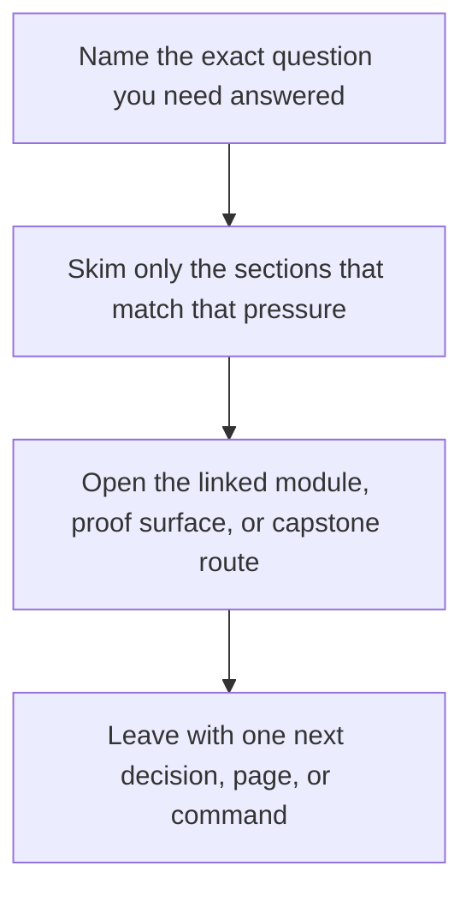

# Foundations Reading Plan

<!-- page-maps:start -->
## Guide Fit

<!-- page-maps:end -->

Read the first diagram as a timing map: this guide is for a named pressure, not for wandering the whole course-book. Read the second diagram as the guide loop: arrive with a concrete question, use only the matching sections, then leave with one smaller and more honest next move.

Use this guide when Modules 01 to 03 feel dense on first contact. The goal is not to
skip material. The goal is to control the pace so purity, configuration, and laziness
become durable habits before the later modules start composing them together.

## How to use this plan

- Read one slice at a time instead of trying to clear a whole module in one sitting.
- Keep the capstone open, but only inspect the named files and tests for the current slice.
- End each slice with a short retrieval check before reading farther.
- Move on only when you can explain the current contract without rereading examples line by line.

## Module 01: Purity and substitution

### Slice 1: local reasoning

- Read `imperative-vs-functional.md`
- Read `pure-functions-and-contracts.md`
- Read `immutability-and-value-semantics.md`
- Inspect `capstone/src/funcpipe_rag/fp/core.py`
- Inspect `capstone/tests/unit/fp/test_core_chunk_roundtrip.py`

Checkpoint:
Can you explain which behavior stays locally substitutable and which behavior still leaks hidden state?

### Slice 2: composition

- Read `higher-order-composition.md`
- Read `small-combinator-library.md`
- Read `typed-pipelines.md`
- Inspect `capstone/src/funcpipe_rag/fp/combinators.py`
- Inspect `capstone/tests/unit/fp/test_core_state_machine.py`

Checkpoint:
Can you explain why the combinator layer reduces branching instead of only renaming it?

### Slice 3: review and refactor

- Read `combinator-laws-and-tradeoffs.md`
- Read `isolating-side-effects.md`
- Read `equational-reasoning.md`
- Read `idempotent-transforms.md`
- Read `refactoring-guide.md`
- Review `course-book/reference/review-checklist.md`

Checkpoint:
Can you name one safe refactor and one unsafe refactor in the module's style?

## Module 02: data-first APIs and expression style

### Slice 1: explicit inputs

- Read `closures-and-partials.md`
- Read `expression-oriented-python.md`
- Read `fp-friendly-apis.md`
- Inspect `capstone/src/funcpipe_rag/pipelines/specs.py`
- Inspect `capstone/tests/unit/pipelines/test_specs_roundtrip.py`

Checkpoint:
Can you explain how the API stays configurable without pulling state from globals?

### Slice 2: boundaries and configuration

- Read `effect-boundaries.md`
- Read `configuration-as-data.md`
- Read `configuration-review-and-validation.md`
- Inspect `capstone/src/funcpipe_rag/pipelines/configured.py`
- Inspect `capstone/tests/unit/pipelines/test_configured_pipeline.py`

Checkpoint:
Can you explain where configuration stops being data and starts becoming runtime choice?

### Slice 3: expression cleanup

- Read `callbacks-to-combinators.md`
- Read `tiny-function-dsls.md`
- Read `debugging-compositions.md`
- Read `imperative-to-fp-refactor.md`
- Read `refactoring-guide.md`

Checkpoint:
Can you describe the thinnest acceptable boundary script after the refactor?

## Module 03: iterators and lazy dataflow

### Slice 1: laziness mechanics

- Read `iterator-protocol-and-generators.md`
- Read `generators-vs-comprehensions.md`
- Read `itertools-composition.md`
- Inspect `capstone/src/funcpipe_rag/streaming/`
- Inspect `capstone/tests/unit/streaming/test_streaming.py`

Checkpoint:
Can you explain when the pipeline computes and what actually triggers materialization?

### Slice 2: shaped traversal

- Read `chunking-and-windowing.md`
- Read `reusable-pipeline-stages.md`
- Read `fan-in-and-fan-out.md`
- Read `custom-iterators.md`

Checkpoint:
Can you explain which traversal shape the code is promising and why that shape matters downstream?

### Slice 3: lifecycle and pressure

- Read `infinite-sequences-safely.md`
- Read `time-aware-streaming.md`
- Read `iterator-lifecycle-and-cleanup.md`
- Read `streaming-observability.md`
- Read `refactoring-guide.md`

Checkpoint:
Can you explain where laziness stops being a win and starts needing explicit cleanup, bounds, or observability?

## Best companion pages

- [Start Here](start-here.md)
- [Course Guide](course-guide.md)
- [Capstone Map](../capstone/capstone-map.md)
- [Proof Matrix](proof-matrix.md)
- [Functional Glossary](../reference/glossary.md)
