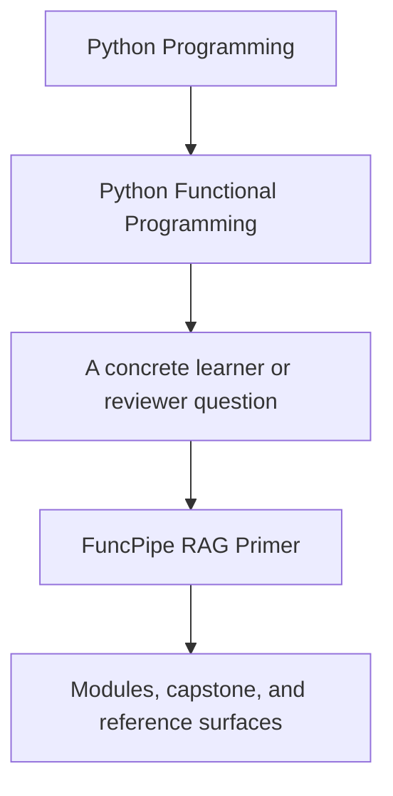
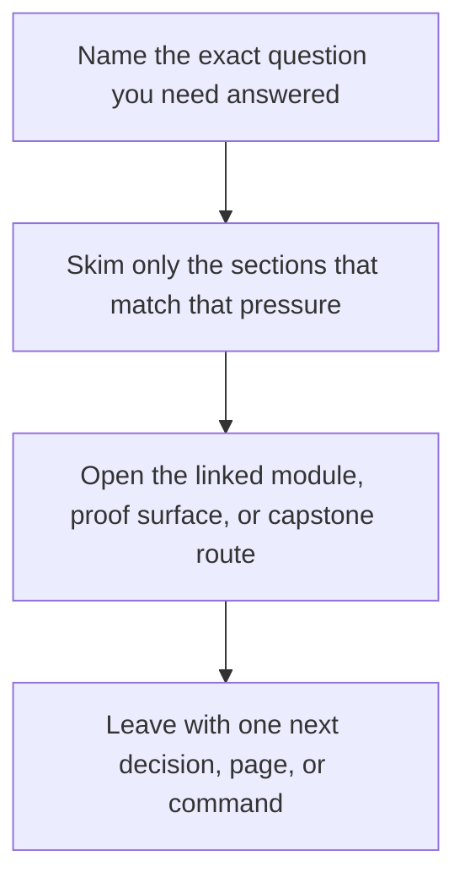

# FuncPipe RAG Primer

<!-- page-maps:start -->
## Guide Fit

<!-- page-maps:end -->

Read the first diagram as a timing map: this guide is for a named pressure, not for wandering the whole course-book. Read the second diagram as the guide loop: arrive with a concrete question, use only the matching sections, then leave with one smaller and more honest next move.

Use this guide when the capstone's retrieval-augmented generation domain starts competing
with the functional-programming lesson. The capstone is not trying to make you an expert
in search systems. It is using a bounded document-processing domain to make functional
boundaries inspectable.

## The shortest honest definition

FuncPipe RAG is a small document-processing system with four repeating concerns:

- load source documents
- clean and split them into chunks
- attach embeddings or other retrieval-ready metadata
- serve or review the resulting artifacts through explicit boundaries

That is enough domain surface to exercise configuration, laziness, failures, effect
boundaries, and async coordination without pretending the course is really about LLM
product design.

## Vocabulary that matters in this course

| Term | Meaning in this repository | Why the course uses it |
| --- | --- | --- |
| document | a source record that enters the pipeline | gives the course a stable input shape |
| chunk | a smaller unit derived from a document | makes streaming, batching, and retry boundaries visible |
| embedding | vector-like metadata attached to a chunk | creates a realistic effect boundary without changing the course's FP center |
| retrieval | finding relevant chunks later | motivates explicit data contracts and adapter seams |
| pipeline spec | the declared configuration for a run | anchors Module 02 and later proof routes |
| boundary shell | CLI, file, or service edge around the pure core | keeps side effects local and reviewable |

## What is intentionally simplified

- Ranking quality is not the course's proof target.
- Model choice is not the course's proof target.
- Prompt engineering is not the course's proof target.
- Distributed serving is not the course's proof target.
- Real networked integrations are represented through explicit adapters or extension seams, not treated as default learner obligations.

If a question mostly asks whether the retrieval system is state of the art, it is outside
the center of this course. If a question asks whether the pipeline remains pure,
configurable, reviewable, and well-bounded while touching retrieval concerns, it belongs
here.

## The capstone surfaces worth learning first

Start with these before browsing the whole repository:

- `capstone/src/funcpipe_rag/pipelines/` for configured workflow assembly
- `capstone/src/funcpipe_rag/fp/` for the pure helper layer
- `capstone/src/funcpipe_rag/result/` for visible failure modelling
- `capstone/src/funcpipe_rag/boundaries/` for shells and adapter edges
- `capstone/tests/unit/` for proof that the abstractions hold under change

## How the domain maps to the course

| Course area | Domain question | Design question the course is really teaching |
| --- | --- | --- |
| Modules 01 to 03 | how do documents become chunks through explicit transforms | what stays pure, lazy, and substitutable |
| Modules 04 to 06 | what happens when validation, failures, and context enter | how does the pipeline model failure and law-guided composition |
| Modules 07 to 08 | where do files, services, clocks, and async work begin | how are effects isolated and controlled |
| Modules 09 to 10 | how do CLI, interop, and sustainment touch the system | how does the architecture stay honest under integration pressure |

## When to leave this primer

Move on once you can explain these three points:

- The capstone domain is a vehicle for FP discipline, not the course's main subject.
- A chunk pipeline is useful here because it makes laziness, retries, and batching concrete.
- The interesting review questions are about contracts and boundaries, not about RAG novelty.

## Best companion pages

- [FuncPipe Capstone Guide](../capstone/index.md)
- [Capstone Map](../capstone/capstone-map.md)
- [Proof Matrix](proof-matrix.md)
- [Functional Glossary](../reference/glossary.md)
