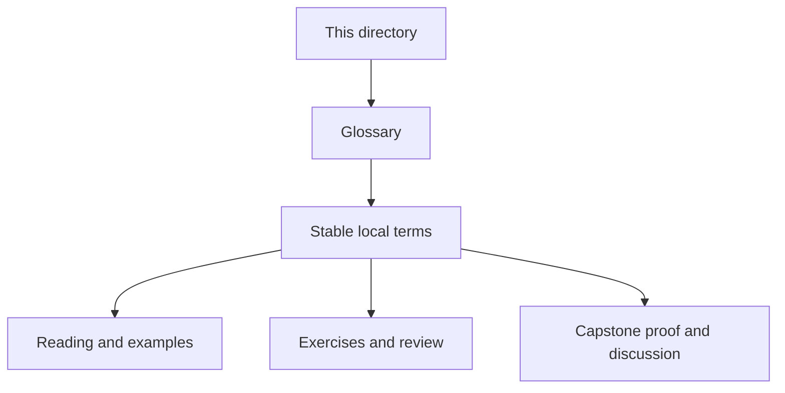
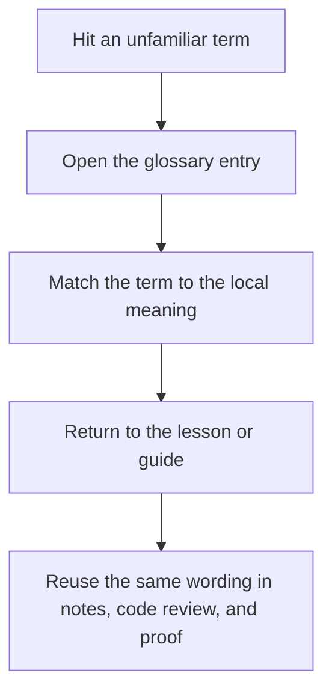

# Guides Glossary

<!-- page-maps:start -->
## Glossary Fit

<!-- page-maps:end -->

This glossary belongs to **Guides** in **Python Functional Programming**. It keeps the language of this directory stable so the same ideas keep the same names across reading, practice, review, and capstone proof.

## How to use this glossary

Read the directory index first, then return here whenever a page, command, or review discussion starts to feel more vague than the course intends. The goal is stable language, not extra theory.

## Terms in this directory

| Term | Meaning in this directory |
| --- | --- |
| Course Guide | the guided support surface for course guide, used to study or review the course without wandering. |
| Pressure Routes | the routing surface for practical engineering pressure, used when the learner needs the next honest page, exercise, or proof step instead of a full reread. |
| Foundations Reading Plan | the routing surface for foundations reading plan, used when the learner needs the next honest page, exercise, or proof step instead of a full reread. |
| FuncPipe RAG Primer | the guided support surface for funcpipe rag primer, used to study or review the course without wandering. |
| History Guide | the guided support surface for history guide, used to study or review the course without wandering. |
| Learning Contract | the stable study contract for the course, used to define what the learner owes the material and what the proof route should show. |
| Module Checkpoints | the exit bar for moving between modules, used to keep pace honest instead of guessing readiness. |
| Module Dependency Map | the routing surface for module dependency map, used when the learner needs the next honest page, exercise, or proof step instead of a full reread. |
| Module Promise Map | the routing surface for module promise map, used when the learner needs the next honest page, exercise, or proof step instead of a full reread. |
| Outcomes and Proof Map | the evidence-routing surface for outcomes and proof map, used to connect course claims to the right practice, review, or capstone proof. |
| Practice Map | the routing surface for practice map, used when the learner needs the next honest page, exercise, or proof step instead of a full reread. |
| Proof Matrix | the evidence-routing surface for proof matrix, used to connect course claims to the right practice, review, or capstone proof. |
| Start Here | the durable learner-support surface for start here, used to keep the course route and proof route readable under pressure. |
