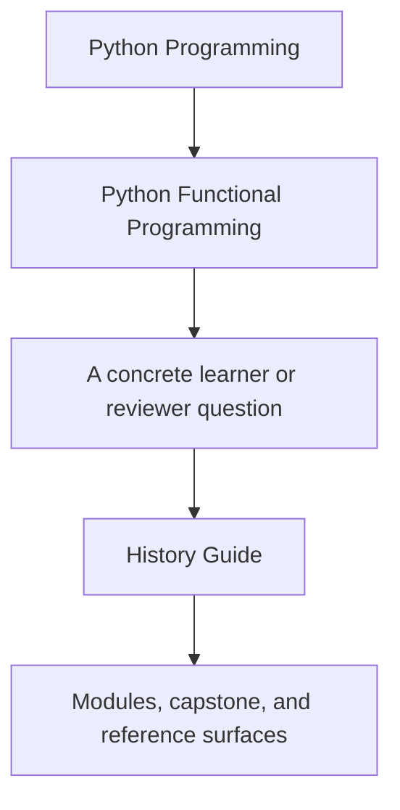
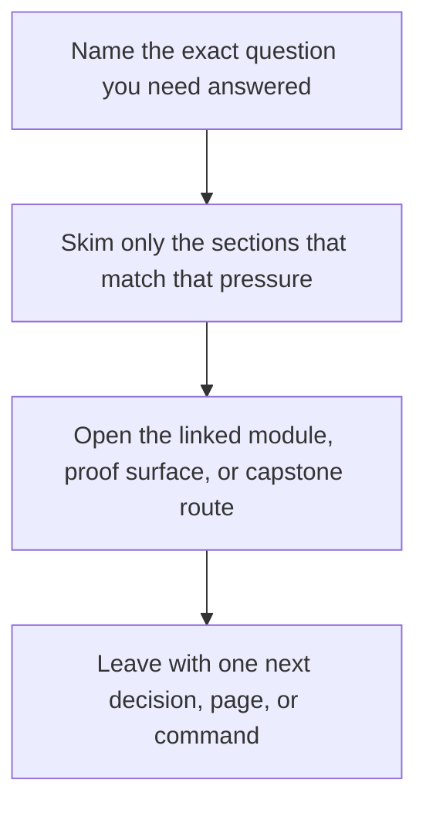

# History Guide


<!-- page-maps:start -->
## Guide Fit




<!-- page-maps:end -->

Read the first diagram as a timing map: this guide is for a named pressure, not for wandering the whole course-book. Read the second diagram as the guide loop: arrive with a concrete question, use only the matching sections, then leave with one smaller and more honest next move.

This guide explains the honest module-history contract for the course. The generated
`_history/` directory is for local comparison only. The tracked source of truth lives in
`capstone/module-reference-states/` for Modules 01 to 09 and in the live capstone for
Module 10.

## Why this route exists

The course keeps asking you to compare your code with the end-of-module codebase. That
comparison should not depend on stale copied folders or on guessing which lesson excerpt
still matches the runnable repository. The stable route is:

1. run `make PROGRAM=python-programming/python-functional-programming history-refresh`
2. open `_history/worktrees/module-XX`
3. compare your code or notes with the matching module worktree
4. keep the comparison local to the current module before moving forward

## What is tracked and what is generated

- `capstone/module-reference-states/module-01` through `module-09` are tracked source states for earlier module endpoints
- `capstone/_history/` is generated locally and ignored by git
- `python-functional-programming-module-01` through `python-functional-programming-module-10` are local tags regenerated from the current tracked sources
- `capstone/_history/worktrees/module-10` is generated from the live capstone so the final module stays aligned with the current course endpoint
- `history-clean` removes the generated `_history/` directory, the local module tags, and the generated history branch

## Which surface to use

| Question | Surface to trust first | Why |
| --- | --- | --- |
| what is the tracked end-of-module source of truth | `capstone/module-reference-states/` | it is versioned in git and stable across machines |
| what should I compare against while studying locally | `capstone/_history/worktrees/module-XX/` after `history-refresh` | it is the generated learner-facing comparison surface |
| what is the Module 10 endpoint | the live capstone plus `capstone/_history/worktrees/module-10/` | Module 10 is anchored to the current repository state |
| what can I delete and regenerate safely | `capstone/_history/` and the local history tags | those are derived surfaces, not tracked reference content |

The short rule is simple: `module-reference-states/` is the repository's memory,
`_history/worktrees/` is the learner's local comparison lens.

## Stable commands

From the repository root:

```bash
make PROGRAM=python-programming/python-functional-programming history-refresh
make PROGRAM=python-programming/python-functional-programming history-clean
make PROGRAM=python-programming/python-functional-programming history-freeze-code
```

From the course directory:

```bash
make history-refresh
make history-clean
make history-freeze-code
```

## Reading older lesson labels honestly

Some older lesson excerpts still use labels like `module-01/funcpipe-rag-01/...` inside
examples. Treat those labels as narrative markers for the module endpoint, not as the
current filesystem route. The runnable comparison surface is the generated worktree under
`capstone/_history/worktrees/module-XX/` after `history-refresh`.

## Best use at the end of a module

- Read the module's `refactoring-guide.md`.
- Refresh `_history/` if the course or capstone changed.
- Compare the boundary that module was teaching, not the whole repository at once.
- Write one sentence that starts with: `I can preserve this module's boundary by...`
- Only then move to the next module.
