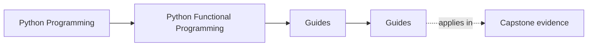
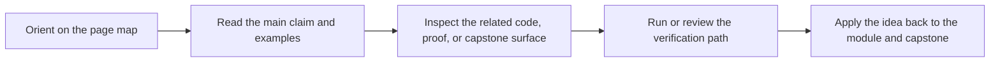

# Guides

<!-- page-maps:start -->
## Page Maps

<!-- page-maps:end -->

Read the first diagram as a timing map: this guide shelf exists to answer a named
pressure, not to become a second table of contents. Read the second diagram as the guide
loop: arrive with one question, open the matching route, then leave with one smaller and
more honest next move.

This directory collects the durable study guides for the course. Use it when the course
home tells you the promise, but you still need help choosing the right pace, proof
surface, or capstone bridge.

## Choose one lane

| If your pressure is... | Best page | Then go to... |
| --- | --- | --- |
| I need the shortest honest entry route. | [Start Here](start-here.md) | [Course Guide](course-guide.md) |
| I want a lighter first pass through the semantic floor. | [Start Here](start-here.md) | [Module Promise Map](module-promise-map.md) |
| I need to know what each module is supposed to change. | [Module Promise Map](module-promise-map.md) | [Module Checkpoints](module-checkpoints.md) |
| My question is already practical. | [Pressure Routes](pressure-routes.md) | the owning module or [Proof Matrix](proof-matrix.md) |
| I need to connect learning goals to proof. | [Proof Matrix](proof-matrix.md) | [Proof Ladder](proof-ladder.md) |
| The capstone domain still feels unfamiliar. | [Start Here](start-here.md) | [Capstone](../capstone/index.md) |
| I am resuming after a break. | [Mid-Course Map](../module-00-orientation/mid-course-map.md) | [Proof Ladder](proof-ladder.md) |

## Use the shelf by job

| Job | Best page |
| --- | --- |
| understand the module arc and support-page roles | [Course Guide](course-guide.md) |
| see the sequence justified | [Module Dependency Map](../reference/module-dependency-map.md) |
| check the promise and evidence route for one module | [Module Promise Map](module-promise-map.md) |
| decide whether you are ready to move on | [Module Checkpoints](module-checkpoints.md) |
| rehearse the module-to-proof loop | [Practice Map](../reference/practice-map.md) |
| route a claim to executable evidence | [Proof Matrix](proof-matrix.md) |
| compare current work with generated history surfaces | [Proof Ladder](proof-ladder.md) |
| confirm the local environment before public commands | [Platform Setup](platform-setup.md) |
| hold the course bar steady | [Learning Contract](learning-contract.md) |

## Cross into the capstone deliberately

| If you need... | Best page |
| --- | --- |
| the capstone's role in the course | [Capstone](../capstone/index.md) |
| the module-to-repository route | [Capstone Map](../capstone/capstone-map.md) |
| a bounded first pass through the repository | [Capstone Walkthrough](../capstone/capstone-walkthrough.md) |
| file ownership and package roles | [Capstone File Guide](../capstone/capstone-file-guide.md) |
| boundary ownership and package roles | [Capstone Architecture Guide](../capstone/capstone-architecture-guide.md) |
| verification depth and saved proof | [Capstone Proof Guide](../capstone/capstone-proof-guide.md) |
| review prompts and extension placement | [Capstone Review Worksheet](../capstone/capstone-review-worksheet.md) and [Capstone Extension Guide](../capstone/capstone-extension-guide.md) |

## Keep The Layout Stable

- `index.md` stays the course home
- `guides/` stays the study route and proof shelf
- `capstone/` stays the capstone-specific reading, proof, and review shelf
- `reference/` stays the durable standards and checklist shelf
- `module-00-orientation/` plus Modules `01` to `10` stay the study arc

## Stop here when

- you can name the one guide that matches your current pressure
- you know whether your next move is module reading, capstone reading, or proof
- you have resisted opening five support pages at once

## Directory glossary

Use [Glossary](../reference/glossary.md) when you want the recurring language in this shelf kept stable while you move between study routes, proof routes, and support pages.
