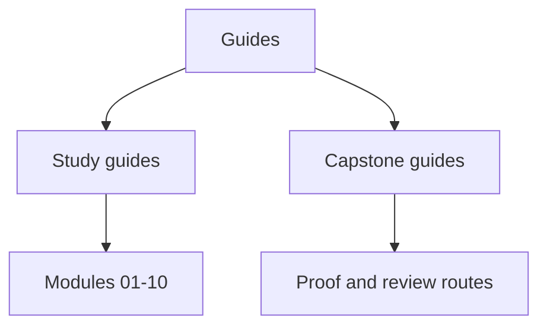

# Guides

<!-- page-maps:start -->
## Page Maps

<!-- page-maps:end -->

This directory collects the durable learner guides for the course. The course home
explains what the course teaches. The guides explain how to study it, how to compare your
work with the reference states, and how to inspect the capstone without guessing.

## Study guides

- [Start Here](start-here.md) for the shortest honest entry route
- [Course Guide](course-guide.md) for the learning arc and module order
- [Learning Contract](learning-contract.md) for learner expectations
- [Module Dependency Map](module-dependency-map.md) for sequence reasoning
- [Practice Map](practice-map.md) for the rehearsal loop
- [Command Guide](command-guide.md) for the executable surface
- [History Guide](history-guide.md) for `_history` and module worktrees
- [Proof Matrix](proof-matrix.md) for claim-to-evidence routing

## Capstone guides

- [FuncPipe Capstone Guide](capstone.md) for the capstone’s role in the course
- [Capstone Map](capstone-map.md) for the reading route
- [Capstone File Guide](capstone-file-guide.md) for package-first reading
- [Capstone Test Guide](capstone-test-guide.md) for test-first reading
- [Capstone Review Worksheet](capstone-review-worksheet.md) for review prompts
- [Capstone Architecture Guide](capstone-architecture-guide.md) for boundary ownership
- [Capstone Walkthrough](capstone-walkthrough.md) for the human review story
- [Capstone Proof Guide](capstone-proof-guide.md) for verification depth
- [Capstone Extension Guide](capstone-extension-guide.md) for change placement

## Layout rule

The course-book root should stay predictable:

- `index.md` for the course home
- `guides/` for essential learner guides
- `module-00-orientation/` plus Modules `01` to `10` for the teaching sequence
- `reference/` for long-lived standards and checklists
