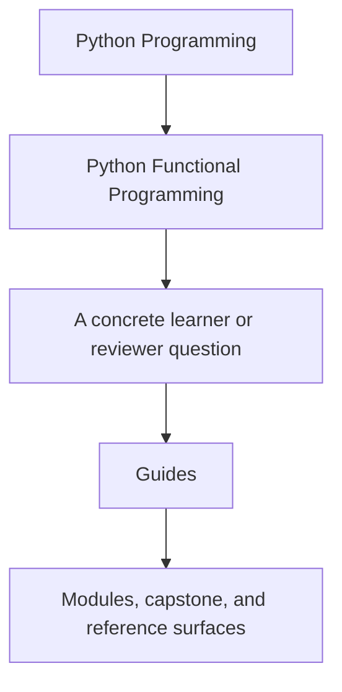
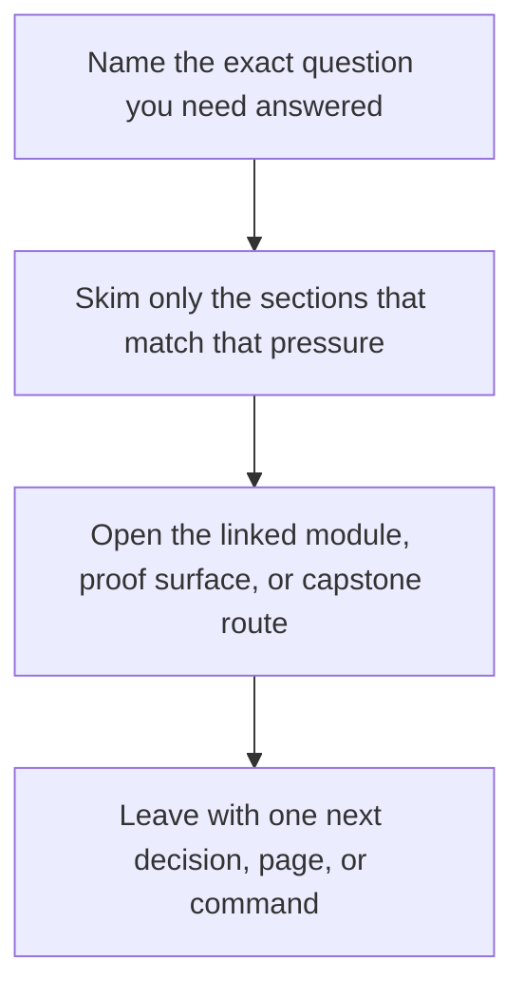

# Guides

<!-- page-maps:start -->
## Guide Fit

<!-- page-maps:end -->

Read the first diagram as a timing map: this guide is for a named pressure, not for wandering the whole course-book. Read the second diagram as the guide loop: arrive with a concrete question, use only the matching sections, then leave with one smaller and more honest next move.

This directory collects the durable learner guides for the course. The course home
explains what the course teaches. The guides explain how to study it, how to compare your
work with the reference states, and when to cross into the dedicated `capstone/` shelf
without guessing.

## Read These First

- [Start Here](start-here.md) for the shortest honest entry route
- [Course Guide](course-guide.md) for the module arc and support-page roles
- [Foundations Reading Plan](foundations-reading-plan.md) for a lower-density route through Modules 01 to 03
- [FuncPipe RAG Primer](funcpipe-rag-primer.md) for the smallest capstone-domain vocabulary needed to study the course
- [Outcomes and Proof Map](outcomes-and-proof-map.md) for the explicit course alignment between learning goals, activities, and proof
- [Learning Contract](learning-contract.md) for the teaching bar and proof expectations
- [Orientation Overview](../module-00-orientation/index.md) for the full course shape
- [Course Orientation](../module-00-orientation/course-orientation.md) and [How to Study This Course](../module-00-orientation/how-to-study-this-course.md) for the reading rhythm

## Use These For Study Planning

- [Module Dependency Map](module-dependency-map.md) when you need the sequence explained
- [Module Promise Map](module-promise-map.md) when you want the promise and evidence route for each module
- [Module Checkpoints](module-checkpoints.md) when you need an honest bar for moving on
- [Engineering Question Map](engineering-question-map.md) when your pressure is practical and you need the owning module route
- [Practice Map](practice-map.md) when you want the rehearsal loop in one place
- [History Guide](history-guide.md) when you want `_history` and module worktree comparisons

## Use These For Commands And Proof

- [Command Guide](../capstone/command-guide.md) for the executable surface
- [Proof Matrix](proof-matrix.md) for routing a claim to the right evidence
- [Review Checklist](../reference/review-checklist.md), [Functional Anti-Pattern Atlas](../reference/anti-pattern-atlas.md), [Boundary Review Prompts](../reference/boundary-review-prompts.md), and [Self-Review Prompts](../reference/self-review-prompts.md) when you need a stable review bar

## Use These For Capstone Reading

- [FuncPipe Capstone Guide](../capstone/index.md) for the capstone’s role in the course
- [Capstone Map](../capstone/capstone-map.md) for the module-to-repository route
- [Capstone File Guide](../capstone/capstone-file-guide.md) for package-first reading
- [Capstone Test Guide](../capstone/capstone-test-guide.md) for test-first reading
- [Capstone Review Worksheet](../capstone/capstone-review-worksheet.md) for review prompts
- [Capstone Architecture Guide](../capstone/capstone-architecture-guide.md) for boundary ownership
- [Capstone Walkthrough](../capstone/capstone-walkthrough.md) for the human review story
- [Capstone Proof Guide](../capstone/capstone-proof-guide.md) for verification depth
- [Capstone Extension Guide](../capstone/capstone-extension-guide.md) for change placement

## Keep The Layout Stable

- `index.md` stays the course home
- `guides/` stays the learner route and proof shelf
- `capstone/` stays the capstone-specific reading, proof, and review shelf
- `reference/` stays the durable standards and checklist shelf
- `module-00-orientation/` plus Modules `01` to `10` stay the teaching arc
