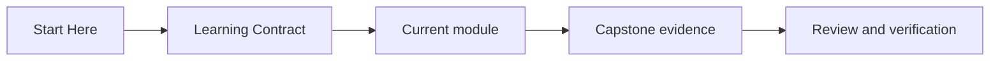
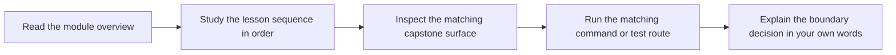

# Learning Contract

<!-- page-maps:start -->
## Page Maps

<!-- page-maps:end -->

This course asks for deliberate reading. The lessons are designed to improve judgment,
not only recall. That only works if you keep the prose, code, and verification surface
tied together.

## Commitments the course makes to you

- the modules build from local purity to harder system boundaries
- the capstone gives one stable codebase so the abstractions stay grounded
- the prose tries to name trade-offs, limits, and failure modes directly

## Commitments the learner should make back

- read module overviews before the lesson pages
- do not skip the law, refactor, or review chapters
- keep asking what is still pure and what has become explicit effect
- inspect the capstone and tests when a lesson makes a design claim
- revisit earlier modules when a later abstraction starts to feel ceremonial

## What progress looks like

Progress in this course is not "I know the vocabulary." Progress is:

- you can reject hidden effects with confidence
- you can explain why a lazy boundary should materialize where it does
- you can describe a failure path as data instead of hand-waving through control flow
- you can predict where a new integration should enter the capstone without blurring the core

## What failure looks like

- copying functional terminology without changing effect design
- reading lessons as theory detached from the code and proof surface
- treating the capstone as a sample app instead of a design argument

## Recovery route

1. Return to the module overview.
2. Reduce the problem to one boundary decision.
3. Inspect the matching capstone file or guide.
4. Re-run the matching proof command and compare the evidence to the claim.
