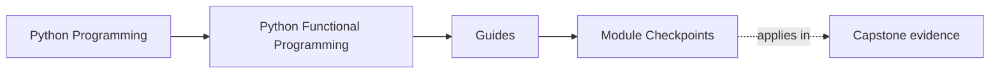
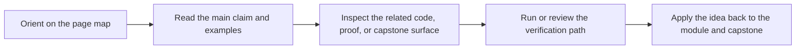

# Module Checkpoints

<!-- page-maps:start -->
## Page Maps

<!-- page-maps:end -->

Use this page when you want a clear bar for moving from one module to the next. The
course is dense enough that "I read it" is not a reliable checkpoint. These prompts are
meant to test design judgment, not memorization.

## Module checkpoints

### Module 00

- Can you name the course arc that matches your current pressure?
- Can you name the first proof route you would use without guessing?

### Module 01

- Can you explain why one helper in your own code is substitutable and another is not?
- Can you point to one FuncPipe surface where purity is treated as a contract instead of a style preference?

### Module 02

- Can you show where configuration moved into explicit data instead of hidden branching?
- Can you explain when data-first APIs clarify the code and when they only move complexity around?

### Module 03

- Can you name where a pipeline stays lazy and where it intentionally materializes?
- Can you explain the debugging cost of delaying execution too far?

### Module 04

- Can you explain when a Result-style value is clearer than an exception path?
- Can you point to one retry or streaming-failure policy whose trade-off you now understand better?

### Module 05

- Can you explain what illegal state this module taught you to make harder to construct?
- Can you show where validation belongs in the model instead of in scattered callers?

### Module 06

- Can you explain what context is staying visible in a composed flow?
- Can you justify one layered container as clarifying rather than ceremonial?

### Module 07

- Can you name one boundary where effectful work is allowed and one where it is not?
- Can you explain why the capability surface is easier to review than a direct infrastructure call?

### Module 08

- Can you explain how backpressure or fairness is represented instead of left to hope?
- Can you name the smallest async proof route that would challenge your current understanding?

### Module 09

- Can you explain how a library or framework is being kept outside the functional core?
- Can you name one place where interop pressure could silently erode the design?

### Module 10

- Can you explain how a refactor, performance change, or proof route still preserves the design contract?
- Can you name which evidence route you would use in review before claiming the design still holds?

## When not to move on yet

Pause and revisit the owning material when:

- you can define the term but not name the boundary it protects
- you can describe the pattern but not its failure mode
- you can point to a module but not to a capstone file or proof surface
- you are relying on a later module to rescue an earlier discipline that still feels optional

## Best companion pages

- `module-promise-map.md`
- `../reference/practice-map.md`
- `proof-matrix.md`
- `../reference/self-review-prompts.md`
