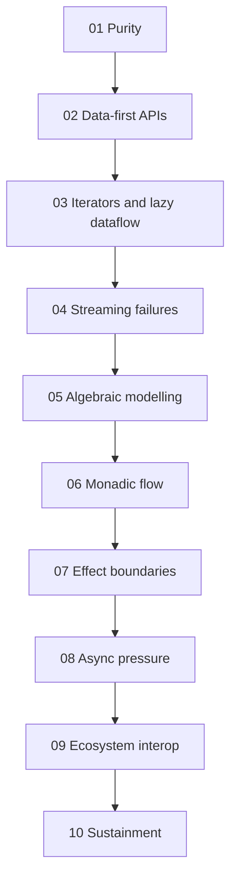
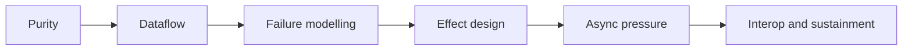

# Module Dependency Map

<!-- page-maps:start -->
## Page Maps

<!-- page-maps:end -->

This map exists to prevent a common failure mode: reading a later lesson without the
earlier concept that makes it necessary.

## What depends on what

- Module 01 is the semantic floor. Nothing later is persuasive without it.
- Module 02 depends on Module 01 because data-first APIs only help after purity and substitution are clear.
- Module 03 depends on Modules 01 and 02 because laziness only helps if dataflow remains inspectable.
- Modules 04 to 06 depend on that earlier floor because failure modelling and lawful chaining need stable dataflow and explicit boundaries.
- Modules 07 to 08 depend on Modules 01 to 06 because effect boundaries and async pressure are audits of whether the earlier functional story survives contact with reality.
- Modules 09 to 10 depend on everything before them because interop and sustainment are long-horizon reviews of the full design.

## How to use this map

- If a lesson feels abstract, move one step left and review its prerequisite.
- If a lesson feels repetitive, ask what new pressure it adds to the same pipeline model.
- If the capstone feels dense, match the confusion to the earliest module that explains the boundary.
