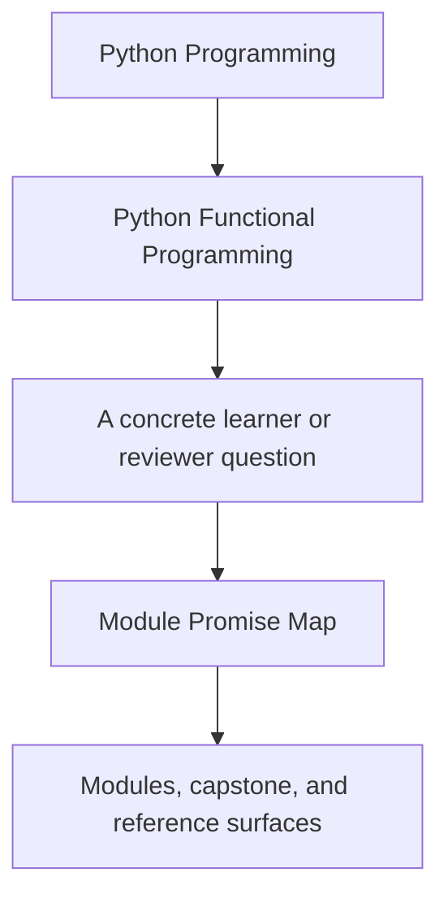
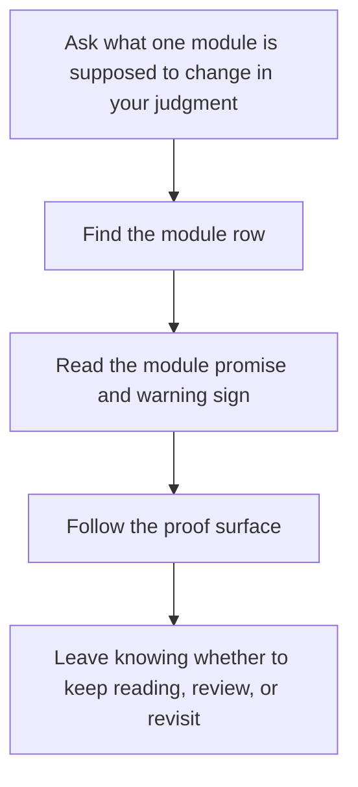

# Module Promise Map

<!-- page-maps:start -->
## Guide Fit

<!-- page-maps:end -->

Use this page when module titles sound familiar but you want the real teaching promise,
not just the topic list. A good module promise answers three questions clearly: what
pressure the module owns, what should feel different after reading it, and where that
claim becomes inspectable.

| Module | Main promise | What should feel more possible after it | Best evidence route |
| --- | --- | --- | --- |
| `00` Orientation and Study Practice | You can enter the course deliberately instead of wandering it. | You can name the right reading route and proof surface before starting the modules. | `module-00-orientation/course-map.md`, `module-00-orientation/first-contact-map.md`, `guides/start-here.md` |
| `01` Purity, Substitution, and Local Reasoning | You can separate pure transforms from hidden coordination. | You can explain why one helper is safe to substitute and another is not. | `module-01-purity-substitution-local-reasoning/index.md`, `capstone/src/funcpipe_rag/fp/core.py`, `capstone/tests/unit/fp/test_core_state_machine.py` |
| `02` Data-First APIs and Expression Style | You can turn helpers into configurable pipeline pieces without hiding state. | You can move configuration into explicit data and explain the trade-offs. | `module-02-data-first-apis-expression-style/index.md`, `capstone/src/funcpipe_rag/pipelines/configured.py`, `capstone/tests/unit/pipelines/test_configured_pipeline.py` |
| `03` Iterators, Laziness, and Streaming Dataflow | You can control when work happens instead of materializing by accident. | You can describe lazy and eager edges in one pipeline. | `module-03-iterators-laziness-streaming-dataflow/index.md`, `capstone/src/funcpipe_rag/streaming/`, `capstone/tests/unit/streaming/test_streaming.py` |
| `04` Streaming Resilience and Failure Handling | You can model recoverable failure without turning control flow opaque. | You can choose between exceptions, Result-style values, retries, and folds more honestly. | `module-04-streaming-resilience-failure-handling/index.md`, `capstone/src/funcpipe_rag/result/`, `capstone/tests/unit/policies/test_retries.py` |
| `05` Algebraic Data Modelling and Validation | You can represent legal and illegal states as explicit value shapes. | You can make validation rules visible in the model instead of scattered across callers. | `module-05-algebraic-data-modelling-validation/index.md`, `capstone/src/funcpipe_rag/fp/validation.py`, `capstone/tests/unit/rag/test_stages.py` |
| `06` Monadic Flow and Explicit Context | You can compose dependent work while keeping context and failure readable. | You can explain why a layered container clarifies the flow instead of making it ceremonial. | `module-06-monadic-flow-explicit-context/index.md`, `capstone/src/funcpipe_rag/fp/effects/`, `capstone/tests/unit/fp/test_layering.py` |
| `07` Effect Boundaries and Resource Safety | You can move effects behind contracts and capability surfaces. | You can explain where domain logic ends and adapter ownership begins. | `module-07-effect-boundaries-resource-safety/index.md`, `capstone/src/funcpipe_rag/boundaries/`, `capstone/tests/unit/domain/test_session.py` |
| `08` Async Pipelines, Backpressure, and Fairness | You can add async pressure without losing debuggability. | You can explain how fairness, timeouts, and bounded coordination stay visible. | `module-08-async-pipelines-backpressure-fairness/index.md`, `capstone/src/funcpipe_rag/domain/effects/async_/`, `capstone/tests/unit/domain/test_async_backpressure.py` |
| `09` Ecosystem Interop and Boundary Discipline | You can work with normal Python tools without dissolving the functional core. | You can choose where framework interop stops and core contracts remain stable. | `module-09-ecosystem-interop-boundary-discipline/index.md`, `capstone/src/funcpipe_rag/interop/`, `capstone/tests/unit/interop/test_stdlib_fp.py` |
| `10` Refactoring, Performance, and Sustainment | You can govern and evolve the system without turning the design into theater. | You can justify a refactor, a performance change, or a proof route with evidence. | `module-10-refactoring-performance-sustainment/index.md`, `capstone/docs/PROOF_GUIDE.md`, `capstone/docs/TOUR.md` |

## Warning signs that you have not really absorbed the module yet

- You can repeat the terminology but cannot name one capstone file where the boundary matters.
- You can describe the abstraction but not the production pressure it is meant to survive.
- You keep reaching for later modules because the earlier discipline still feels optional.
- You cannot name the smallest proof route that would challenge your current understanding.

## Best companion pages

- `module-dependency-map.md`
- `outcomes-and-proof-map.md`
- `practice-map.md`
- `../reference/self-review-prompts.md`
