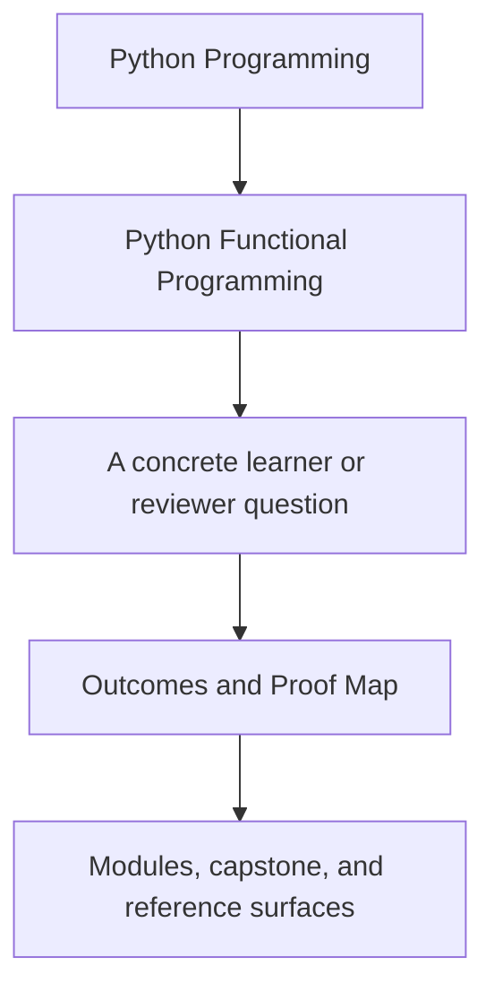
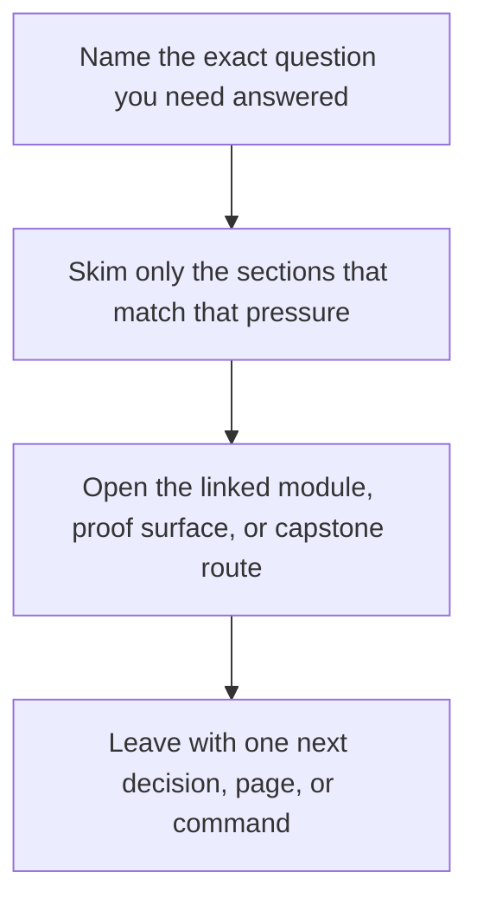

# Outcomes and Proof Map

<!-- page-maps:start -->
## Guide Fit

<!-- page-maps:end -->

Read the first diagram as a timing map: this guide is for a named pressure, not for wandering the whole course-book. Read the second diagram as the guide loop: arrive with a concrete question, use only the matching sections, then leave with one smaller and more honest next move.

Use this page when you want the course contract written out explicitly: what the learner
should become able to do, what work builds that ability, and what repository surface
proves it well enough to review honestly.

## Alignment map

| Course outcome | Main learning activities | Primary capstone evidence | Best first route |
| --- | --- | --- | --- |
| separate pure transforms from effectful boundaries in ordinary Python systems | Modules 01, 02, and 07; refactoring guides; architecture review | `src/funcpipe_rag/fp/`, `src/funcpipe_rag/boundaries/`, `tests/unit/fp/`, `tests/unit/domain/` | [Capstone Architecture Guide](../capstone/capstone-architecture-guide.md) |
| design pipelines that stay configurable, lazy, and testable under growth | Modules 02, 03, and 06; foundations reading slices; proof matrix review | `src/funcpipe_rag/pipelines/`, `src/funcpipe_rag/streaming/`, `tests/unit/pipelines/`, `tests/unit/streaming/` | `make PROGRAM=python-programming/python-functional-programming test` |
| model expected failures and domain states as data instead of tangled control flow | Modules 04, 05, and 06; review checklist; module refactoring guides | `src/funcpipe_rag/result/`, `src/funcpipe_rag/fp/validation.py`, `tests/unit/result/`, `tests/unit/fp/laws/` | [Proof Matrix](proof-matrix.md) |
| move infrastructure behind explicit protocols, adapters, and async coordination layers | Modules 07 and 08; capstone map; extension guide | `src/funcpipe_rag/domain/`, `src/funcpipe_rag/infra/`, `src/funcpipe_rag/domain/effects/async_/`, `tests/unit/infra/adapters/` | [Capstone Map](../capstone/capstone-map.md) |
| sustain a long-lived codebase with evidence, review standards, and migration discipline | Modules 09 and 10; proof guide; history guide; review worksheet | `PROOF_GUIDE.md`, `ARCHITECTURE.md`, `TOUR.md`, `module-reference-states/`, `_history/` | `make PROGRAM=python-programming/python-functional-programming proof` |

## What counts as learning activity here

The course is aligned around three repeated actions:

- read the module lesson until the design claim is legible
- inspect the matching code and tests so the claim becomes executable
- use a review or proof route to decide whether the claim is actually supported

If any one of those is missing, the learner may still remember terminology but the course
has not finished its job.

## Module arc by proof shape

| Module range | Main learner move | Main evidence shape |
| --- | --- | --- |
| Modules 01 to 03 | local reasoning, explicit inputs, deliberate laziness | pure helper tests, pipeline tests, streaming tests |
| Modules 04 to 06 | visible failures, modelling choices, lawful composition | Result tests, law suites, configured-flow tests |
| Modules 07 to 08 | explicit effect ownership and bounded async pressure | architecture boundaries, adapter tests, async domain tests |
| Modules 09 to 10 | interop judgment, review discipline, long-term stewardship | proof bundles, review guides, history surfaces, extension rules |

## Honest review rule

When a learner says "I understood this module," the next useful question is:

> Which capstone surface proves the understanding changed your judgment?

If the learner cannot name the surface, the right next step is usually not another page.
It is a return to the proof route.

## Best companion pages

- [Course Guide](course-guide.md)
- [Proof Matrix](proof-matrix.md)
- [Capstone Map](../capstone/capstone-map.md)
- [Capstone Review Worksheet](../capstone/capstone-review-worksheet.md)
