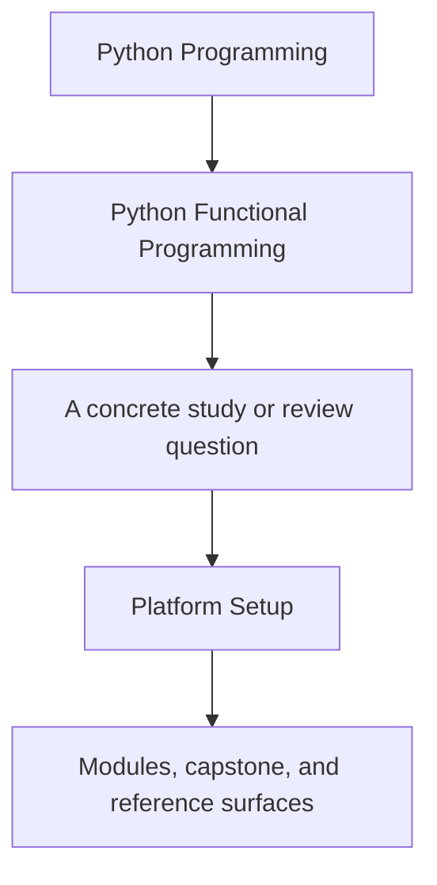
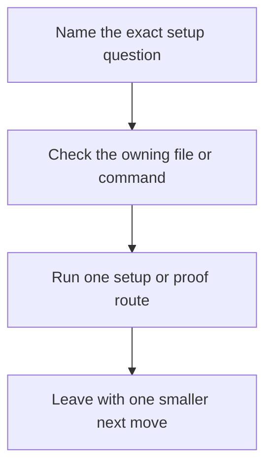

# Platform Setup

<!-- page-maps:start -->
## Guide Fit




<!-- page-maps:end -->

Read the first diagram as a timing map: this page exists for setup pressure, not for
general course reading. Read the second diagram as the setup loop: check the owning
surface, run one route, then stop once the environment contract is visible.

Python Functional Programming assumes a small but explicit toolchain. The course is about
design judgment, not about fighting local environment drift before you can inspect the
capstone honestly.

## Minimum tooling

You need:

- Python 3.10 or newer
- Git on the command line
- a writable local filesystem for `artifacts/`
- the capstone-managed virtual environment created through `make install`

## Supported toolchain contract

The support promise is tied to the capstone-managed environment, not to whichever
packages happen to be installed globally.

Use these surfaces as the authoritative setup contract:

| Surface | What it tells you |
| --- | --- |
| `capstone/pyproject.toml` | supported Python floor and development dependencies |
| `capstone/Makefile` `install` target | how the supported virtual environment is built |
| `capstone/Makefile` `lint`, `test`, and `proof` targets | whether the current environment still honors the course contract |
| [Command Guide](../capstone/command-guide.md) | which route to run once setup is stable |

## Repository-root setup

From the repository root:

```bash
make PROGRAM=python-programming/python-functional-programming install
make PROGRAM=python-programming/python-functional-programming test
make PROGRAM=python-programming/python-functional-programming docs-build
```

Use `install` for first setup or after Python changed. Use `test` when you want the
strongest course-level confirmation route. Use `docs-build` when you need the course-book
rendered locally.

## Capstone setup

From `capstone/`:

```bash
make install
make test
make inspect
make proof
```

That sequence creates the virtual environment, installs the capstone plus its
development tools, checks the test suite, and confirms that the guided bundles
still build.

## What to verify before deeper proof

Check these in order:

1. `make install` finishes without recreating a broken environment repeatedly.
2. `make test` runs the raw executable suite.
3. `make inspect` writes the guided inventory bundle into `artifacts/inspect/...`.
4. `make proof` completes when you need the full sanctioned route.

If setup fails before step 2, the right next move is environment repair, not capstone
reading.

## Common setup failures

| Symptom | Likely cause | Fix |
| --- | --- | --- |
| `python` or virtualenv creation fails | unsupported Python on the path | install Python 3.10+ and rerun `make install` |
| `ruff`, `mypy`, or `pytest` are missing after install | partially built virtual environment | rerun `make rebuild-venv` inside `capstone/`, then `make install` |
| `docs-build` fails while tests pass | docs dependencies were not installed yet | rerun repository-root `make ... install` and then `docs-build` |
| proof bundles are missing under `artifacts/` | commands ran from the wrong directory or a stale environment | rerun the documented route from the repository root or `capstone/` exactly |

## Drift signals

Treat these as reasons to re-check the setup contract:

- Python changed locally and the virtual environment was not rebuilt
- `make test` starts passing in one shell and failing in another
- a global package upgrade changed behavior without touching the capstone environment
- the commands in [Command Guide](../capstone/command-guide.md) no longer match the Makefile

## What this page does not promise

- It does not promise support for arbitrary global package installs.
- It does not treat “the command exists” as enough; the proof routes still decide whether
  the environment is trustworthy.
- It does not replace [Proof Ladder](proof-ladder.md) when the real question is evidence
  depth rather than setup.
