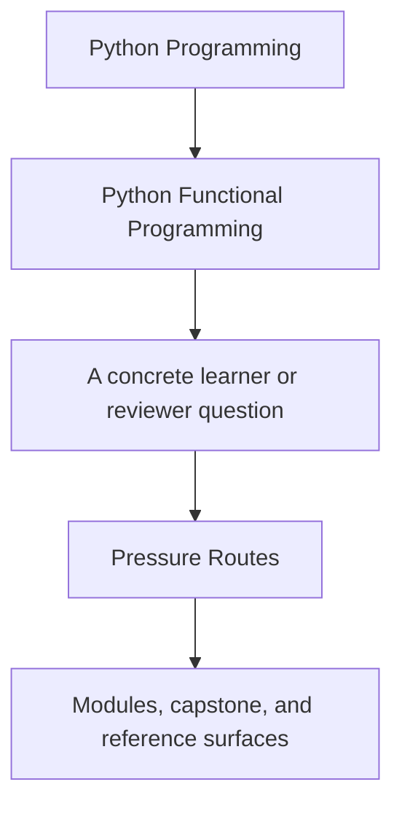
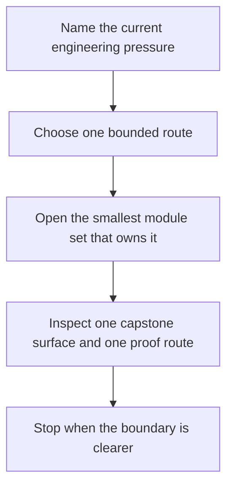

# Pressure Routes

<!-- page-maps:start -->
## Guide Fit

<!-- page-maps:end -->

Read the first diagram as a timing map: this page is for pressure-shaped entry, not for
wandering the whole shelf. Read the second diagram as the loop: name the pressure, use
one bounded route, inspect one capstone surface, then stop once the owning boundary is
clearer.

Use this page when your question is practical but you are not yet sure which module name
owns it.

## Route by pressure

| Pressure | Start here | Then inspect | Stop when you can explain... |
| --- | --- | --- | --- |
| a helper is still hard to reason about | Module 01, then Module 02 | `capstone/src/funcpipe_rag/fp/core.py`, `capstone/src/funcpipe_rag/pipelines/configured.py` | which behavior is pure and which behavior is hiding coordination |
| work materializes too early or too often | Module 03, then Module 07 if boundary placement is the cause | `capstone/src/funcpipe_rag/streaming/`, `capstone/tests/unit/streaming/test_streaming.py` | where laziness ends and why that eager edge is acceptable |
| failure handling is scattered across exceptions, flags, and retries | Modules 04 to 06 | `capstone/src/funcpipe_rag/result/`, `capstone/src/funcpipe_rag/policies/retries.py`, `capstone/tests/unit/result/` | which failures are values, which are policy, and which still stop the pipeline |
| validation rules keep leaking everywhere | Module 05, with Module 02 if configuration is still implicit | `capstone/src/funcpipe_rag/fp/validation.py`, `capstone/src/funcpipe_rag/rag/domain/` | which rules belong in construction and which rules belong at the boundary |
| adapters and orchestration are eroding the core design | Module 07, then Module 09 | `capstone/src/funcpipe_rag/boundaries/`, `capstone/src/funcpipe_rag/domain/capabilities.py`, `capstone/src/funcpipe_rag/interop/` | where the core ends and where adapters are allowed to begin |
| async coordination works but nobody can explain it cleanly | Module 08, then Module 10 if the issue is now reviewability | `capstone/src/funcpipe_rag/domain/effects/async_/`, `capstone/tests/unit/domain/test_async_backpressure.py`, `capstone/tests/unit/domain/test_async_law_properties.py` | which fairness, timeout, or pressure rule the code is actually promising |
| refactoring or integration pressure is threatening the functional boundary | Modules 09 to 10 | [Capstone Architecture Guide](../capstone/capstone-architecture-guide.md), [Capstone Proof Guide](../capstone/capstone-proof-guide.md), [Capstone Walkthrough](../capstone/capstone-walkthrough.md) | which boundary must stay stable while the surrounding code changes |

## Good use of this page

- Start with the smallest route that owns the pressure.
- Escalate to later modules only when the earlier discipline is already stable.
- Keep one capstone file and one proof surface open while reading.
- Leave with one boundary statement you can explain in plain Python engineering language.

## Best companion pages

- [Module Promise Map](module-promise-map.md)
- [Module Checkpoints](module-checkpoints.md)
- [Proof Matrix](proof-matrix.md)
- [Proof Ladder](proof-ladder.md)
- [Capstone Map](../capstone/capstone-map.md)
