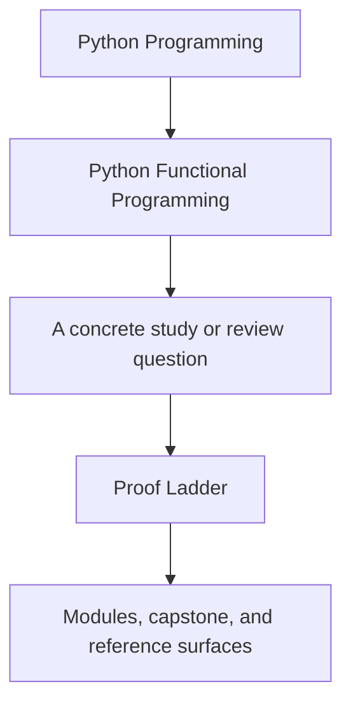
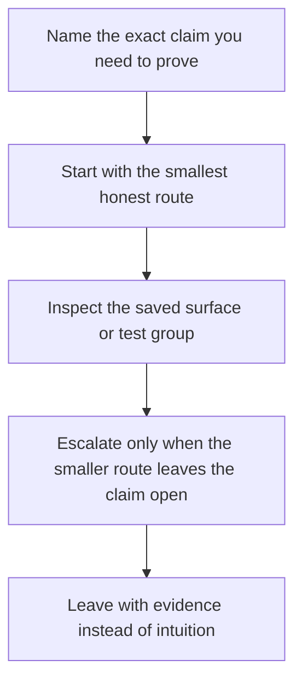

# Proof Ladder

<!-- page-maps:start -->
## Guide Fit

<!-- page-maps:end -->

Read the first diagram as a timing map: this guide exists for proof-sizing pressure, not
for broad course browsing. Read the second diagram as the loop: start small, inspect the
evidence, then escalate only when the smaller route is no longer honest.

Python Functional Programming gets harder when every question is answered with the
strongest command. The point of this ladder is to keep proof proportional to the claim.

## Two kinds of proof pressure

- Human-review pressure: use the early levels when the question is whether you can
  inspect or review the design honestly.
- Executable-confidence pressure: use the later levels when the question is whether the
  runnable capstone still satisfies the strongest published route.

## Proof ladder

| Level | Use this when you need to prove... | Route | Evidence you get |
| --- | --- | --- | --- |
| 1. Reading route | which package, test family, or guide owns the claim | [Proof Matrix](proof-matrix.md) and [Capstone Map](../capstone/capstone-map.md) | the smallest file and test surfaces worth opening |
| 2. Inspection route | how the repository is grouped before deeper proof | `make PROGRAM=python-programming/python-functional-programming inspect` | saved package, test, and proof-route inventory |
| 3. Raw executable route | whether the capstone test suite still holds | `make PROGRAM=python-programming/python-functional-programming capstone-test` | direct pytest output without the wider guided bundles |
| 4. Course confirmation route | whether the program-approved executable route still holds | `make PROGRAM=python-programming/python-functional-programming test` | course-level confirmation anchored to the capstone test surface |
| 5. Guided walkthrough route | how the package and test trees connect for a human reviewer | `make PROGRAM=python-programming/python-functional-programming capstone-walkthrough` | guided walkthrough bundle and route notes |
| 6. Saved verification route | whether executed tests and saved review surfaces still agree | `make PROGRAM=python-programming/python-functional-programming capstone-verify-report` | pytest output plus saved review summaries |
| 7. Guided proof route | whether the published reading and proof bundle is still coherent | `make PROGRAM=python-programming/python-functional-programming capstone-tour` | package tree, test tree, focus areas, and review route |
| 8. Sanctioned full route | whether the official guided route still builds end to end | `make PROGRAM=python-programming/python-functional-programming proof` | the sanctioned course bundle route |
| 9. Strongest capstone route | whether the capstone survives its strictest local confirmation bar | `make PROGRAM=python-programming/python-functional-programming capstone-confirm` | lint, build, saved bundles, and executable confirmation together |

## Module comparison routes

Use these when the question is not “does the current repository pass?” but “what changed
between module endpoints, and which surface is tracked truth versus generated study
state?”

| Need | Route | Surface |
| --- | --- | --- |
| rebuild the guided module comparison surface | `make PROGRAM=python-programming/python-functional-programming history-refresh` | `capstone/_history/worktrees/module-XX/` plus per-module manifests |
| verify the generated comparison surface against tracked snapshot sources | `make PROGRAM=python-programming/python-functional-programming history-verify` | `capstone/module-reference-states/` and `_history/manifests/module-XX.json` |
| remove generated comparison state before rebuilding cleanly | `make PROGRAM=python-programming/python-functional-programming history-clean` | local `_history/` worktrees, tags, and generated history metadata |

## Start with the smallest honest route

### Start at level 1 or 2 when the question is about ownership

Use these when the question sounds like:

- Which package owns this module claim?
- Which tests should I open before I run commands?
- Which proof surface matters before I touch the capstone?

### Start at level 3 or 4 when the question is about current behavior

Use these when the question sounds like:

- Does the raw suite still pass?
- Did the latest change preserve the current functional boundary?
- Do I need executable confidence without the wider walkthrough bundle?

### Start at level 5 to 7 when the question is about human review

Use these when the question sounds like:

- How should I read this repository honestly?
- Which saved artifacts should another reviewer inspect first?
- How do the package tree and test tree support the claim?

### Start at level 8 or 9 when the question is about full-system trust

Use these when the question sounds like:

- Does the full sanctioned route still hold?
- Am I ready for the strongest local confirmation before merging or publishing?

## Escalation rules

- Do not jump to `capstone-confirm` when [Proof Matrix](proof-matrix.md) or `inspect`
  would settle the question.
- Do not jump to `proof` when the real question is only whether the raw suite still
  passes.
- Escalate from `capstone-test` to `capstone-verify-report` when you need durable
  evidence instead of terminal output.
- Escalate from `capstone-walkthrough` to `capstone-tour` when you need the fuller
  guided bundle instead of the first-pass route.
- Use the history routes only when the question is about module-to-module comparison,
  not as a substitute for understanding the current claim first.

## Success signal

You are using the ladder well if you can say:

- which claim you were trying to prove
- why the chosen route was the smallest honest one
- which saved file, test family, or command output actually settled the claim
- what stronger route you deliberately chose not to run
