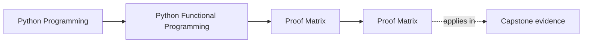
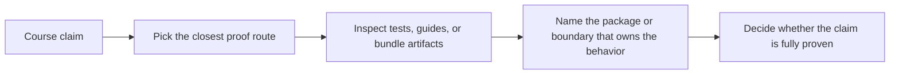

# Proof Matrix

<!-- page-maps:start -->
## Page Maps

<!-- page-maps:end -->

This page maps the course's main design claims to the capstone surface that proves them.
Use it whenever a module makes an important claim and you want the shortest honest route
to evidence instead of browsing the repository at random.

## Core design claims

| Claim | Best first route | Best first surface |
| --- | --- | --- |
| purity is a local reasoning contract, not just a style preference | `make PROGRAM=python-programming/python-functional-programming test` | `tests/unit/fp/`, `tests/unit/result/`, `src/funcpipe_rag/fp/` |
| laziness and streaming stay deliberate under pressure | `make PROGRAM=python-programming/python-functional-programming test` | `tests/unit/streaming/`, `src/funcpipe_rag/streaming/` |
| failure modelling is visible as data instead of hidden control flow | `make PROGRAM=python-programming/python-functional-programming test` | `tests/unit/result/`, `tests/unit/policies/`, `src/funcpipe_rag/result/` |
| configured pipelines preserve explicit composition boundaries | `make PROGRAM=python-programming/python-functional-programming test` | `tests/unit/pipelines/`, `src/funcpipe_rag/pipelines/` |
| effect boundaries stay visible instead of leaking into the core | inspect [`capstone-architecture-guide.md`](capstone-architecture-guide.md) | `src/funcpipe_rag/domain/`, `src/funcpipe_rag/boundaries/`, `src/funcpipe_rag/infra/` |
| async coordination remains bounded and reviewable | `make PROGRAM=python-programming/python-functional-programming test` | `tests/unit/domain/`, `src/funcpipe_rag/domain/effects/async_/` |

## Capstone review claims

| Review question | Best first route | Best first surface |
| --- | --- | --- |
| where should I start reading the capstone | inspect [`capstone-file-guide.md`](capstone-file-guide.md) | `tests/`, then `src/funcpipe_rag/fp/`, `rag/`, and `pipelines/` |
| which package owns the idea from the module I just read | inspect [`capstone-map.md`](capstone-map.md) | the matching package group in `src/funcpipe_rag/` |
| what is the strongest learner-facing proof route | `make PROGRAM=python-programming/python-functional-programming proof` | `capstone/PROOF_GUIDE.md`, `artifacts/tour/python-programming/python-functional-programming/` |
| what lets a human reviewer inspect the repository quickly | `make PROGRAM=python-programming/python-functional-programming capstone-tour` | `capstone/TOUR.md`, `package-tree.txt`, `test-tree.txt` |
| which review questions should I carry into a change | inspect [`capstone-review-worksheet.md`](capstone-review-worksheet.md) | the matching code and test folders |

## Module-to-proof bridge

| Module range | Main learner question | Best proof surfaces |
| --- | --- | --- |
| Modules 01 to 03 | what stays pure and lazy | `tests/unit/fp/`, `tests/unit/result/`, `tests/unit/streaming/`, `src/funcpipe_rag/fp/`, `streaming/` |
| Modules 04 to 06 | how failures, laws, and explicit context stay reviewable | `tests/unit/fp/laws/`, `tests/unit/policies/`, `src/funcpipe_rag/result/`, `fp/effects/`, `policies/` |
| Modules 07 to 08 | where effects and async pressure enter | `tests/unit/domain/`, `tests/unit/infra/adapters/`, `src/funcpipe_rag/domain/`, `boundaries/`, `infra/` |
| Modules 09 to 10 | how interop, review, and sustainment stay honest | `tests/unit/interop/`, `capstone/TOUR.md`, `capstone/ARCHITECTURE.md`, `course-book/capstone-review-worksheet.md` |

## Best companions

- [`command-guide.md`](command-guide.md)
- [`capstone-proof-guide.md`](capstone-proof-guide.md)
- [`capstone-review-worksheet.md`](capstone-review-worksheet.md)
- [`capstone-architecture-guide.md`](capstone-architecture-guide.md)
- [`capstone-file-guide.md`](capstone-file-guide.md)
