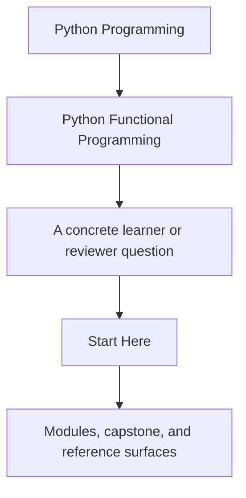
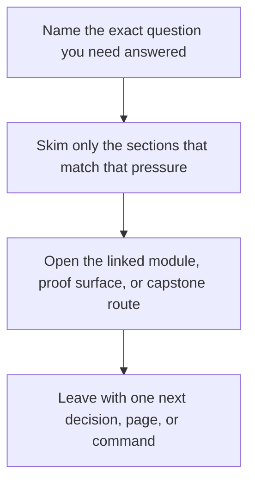

# Start Here

<!-- page-maps:start -->
## Guide Fit

<!-- page-maps:end -->

Read the first diagram as a timing map: this guide is the first-pass entry route, not a
second course catalog. Read the second diagram as the guide loop: arrive with one
question, use only the matching sections, then leave with one smaller and more honest
next move.

This is the shortest honest route into the course. Read it before you start browsing
module pages. The subject is not functional syntax by itself. The subject is how to make
Python codebases easier to reason about by turning purity, dataflow, failures, and
effects into explicit contracts.

## Use This Course If

- you build Python services, automation, pipelines, or tooling that need clearer reasoning boundaries
- you want stronger criteria for purity, error handling, and effect placement during review
- you need async or effect-heavy code to become more testable instead of more magical

## Do Not Start Here If

- you only want a beginner introduction to `lambda`, `map`, or list comprehensions
- you want functional vocabulary without changing hidden state or effect design
- you want abstractions before you understand the contracts they are supposed to protect

## Best first pass

1. Read [Course Home](../index.md) for the course promise and the module arc.
2. Read [Course Guide](course-guide.md) for the meaning of each part of the shelf.
3. Read [Learning Contract](learning-contract.md) before you start Module 01.
4. Choose one pace:
   - use the lower-density route below if you want Modules 01 to 03 broken into smaller slices
   - [Functional Programming Course Map](../module-00-orientation/course-map.md) if you want the full route visible at once
5. Read [FuncPipe RAG Primer](funcpipe-rag-primer.md) if the capstone domain is unfamiliar.
6. Read [Platform Setup](platform-setup.md) before your first proof command or after any Python-toolchain drift.
7. Keep [FuncPipe Capstone Guide](../capstone/index.md) nearby so each module has an executable mirror.

## Lower-density route through Modules 01 to 03

Use this route when the semantic floor feels dense on first contact. The goal is not to
skip material. The goal is to control the pace so purity, configuration, and laziness
become durable habits before the later modules start composing them together.

### How to use the route

- Read one slice at a time instead of trying to clear a whole module in one sitting.
- Keep the capstone open, but only inspect the named files and tests for the current slice.
- End each slice with a short retrieval check before reading farther.
- Move on only when you can explain the current contract without rereading examples line by line.

### Module 01: Purity and substitution

Slice 1: local reasoning

- Read `imperative-vs-functional.md`
- Read `pure-functions-and-contracts.md`
- Read `immutability-and-value-semantics.md`
- Inspect `capstone/src/funcpipe_rag/fp/core.py`
- Inspect `capstone/tests/unit/fp/test_core_chunk_roundtrip.py`

Checkpoint:
Can you explain which behavior stays locally substitutable and which behavior still leaks hidden state?

Slice 2: composition

- Read `higher-order-composition.md`
- Read `small-combinator-library.md`
- Read `typed-pipelines.md`
- Inspect `capstone/src/funcpipe_rag/fp/combinators.py`
- Inspect `capstone/tests/unit/fp/test_core_state_machine.py`

Checkpoint:
Can you explain why the combinator layer reduces branching instead of only renaming it?

Slice 3: review and refactor

- Read `combinator-laws-and-tradeoffs.md`
- Read `isolating-side-effects.md`
- Read `equational-reasoning.md`
- Read `idempotent-transforms.md`
- Read `refactoring-guide.md`
- Review `course-book/reference/review-checklist.md`

Checkpoint:
Can you name one safe refactor and one unsafe refactor in the module's style?

### Module 02: data-first APIs and expression style

Slice 1: explicit inputs

- Read `closures-and-partials.md`
- Read `expression-oriented-python.md`
- Read `fp-friendly-apis.md`
- Inspect `capstone/src/funcpipe_rag/pipelines/specs.py`
- Inspect `capstone/tests/unit/pipelines/test_specs_roundtrip.py`

Checkpoint:
Can you explain how the API stays configurable without pulling state from globals?

Slice 2: boundaries and configuration

- Read `effect-boundaries.md`
- Read `configuration-as-data.md`
- Read `configuration-review-and-validation.md`
- Inspect `capstone/src/funcpipe_rag/pipelines/configured.py`
- Inspect `capstone/tests/unit/pipelines/test_configured_pipeline.py`

Checkpoint:
Can you explain where configuration stops being data and starts becoming runtime choice?

Slice 3: expression cleanup

- Read `callbacks-to-combinators.md`
- Read `tiny-function-dsls.md`
- Read `debugging-compositions.md`
- Read `imperative-to-fp-refactor.md`
- Read `refactoring-guide.md`

Checkpoint:
Can you describe the thinnest acceptable boundary script after the refactor?

### Module 03: iterators and lazy dataflow

Slice 1: laziness mechanics

- Read `iterator-protocol-and-generators.md`
- Read `generators-vs-comprehensions.md`
- Read `itertools-composition.md`
- Inspect `capstone/src/funcpipe_rag/streaming/`
- Inspect `capstone/tests/unit/streaming/test_streaming.py`

Checkpoint:
Can you explain when the pipeline computes and what actually triggers materialization?

Slice 2: shaped traversal

- Read `chunking-and-windowing.md`
- Read `reusable-pipeline-stages.md`
- Read `fan-in-and-fan-out.md`
- Read `custom-iterators.md`

Checkpoint:
Can you explain which traversal shape the code is promising and why that shape matters downstream?

Slice 3: lifecycle and pressure

- Read `infinite-sequences-safely.md`
- Read `time-aware-streaming.md`
- Read `iterator-lifecycle-and-cleanup.md`
- Read `streaming-observability.md`
- Read `refactoring-guide.md`

Checkpoint:
Can you explain where laziness stops being a win and starts needing explicit cleanup, bounds, or observability?

## Choose your next page by pressure

| If your pressure is... | Best next page |
| --- | --- |
| I need the full orientation shelf before Module 01. | [Orientation](../module-00-orientation/index.md) |
| I want the promise and proof route for each module. | [Module Promise Map](module-promise-map.md) |
| I want the course contract stated as outcomes and evidence. | [Outcomes and Proof Map](outcomes-and-proof-map.md) |
| My question is already practical. | [Pressure Routes](pressure-routes.md) |
| I am leaving the semantic floor and entering failures, effects, or async pressure. | [Mid-Course Map](../module-00-orientation/mid-course-map.md) |
| I am returning after a break. | [Return Map](../module-00-orientation/return-map.md) |
| I need to trust the local Python and proof environment first. | [Platform Setup](platform-setup.md) |
| I need the executable route. | [Proof Matrix](proof-matrix.md) and [Capstone Map](../capstone/capstone-map.md) |

## Use The Arcs Deliberately

- Modules 01 to 03 when the main problem is local reasoning, purity, or lazy pipeline design
- Modules 04 to 06 when the main problem is failure modelling, validation, or explicit context
- Modules 07 to 08 when the main problem is effect boundaries, resources, retries, or async pressure
- Modules 09 to 10 when the system already exists and you need interop, governance, and sustainment judgment

## Success Signal

You are using the course correctly if each module helps you answer one question more
clearly in the capstone: what is still pure, where effects begin, and why that boundary
is easier to review than the alternatives.

## Stop here when

- you know whether you are taking the lower-density route or the full route
- you can name the first support page you need after Module 01
- you have one concrete capstone question to carry into the modules
