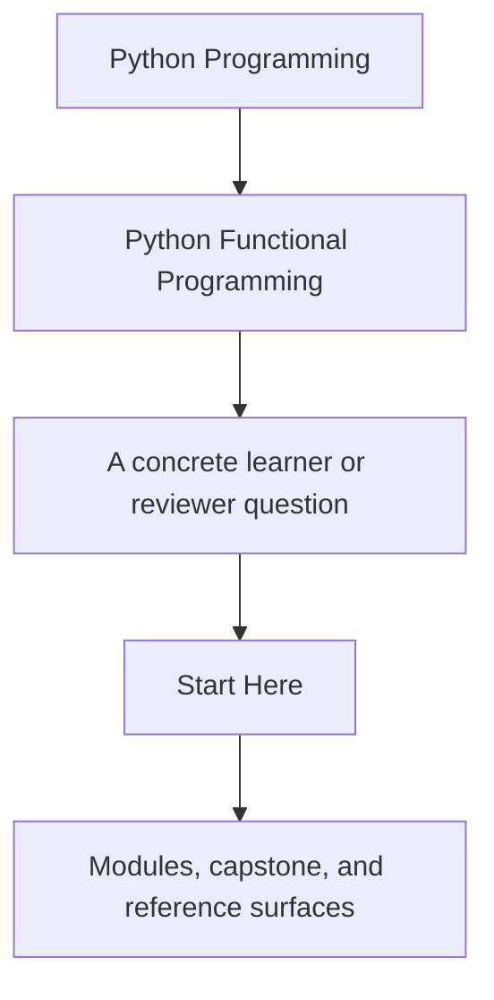
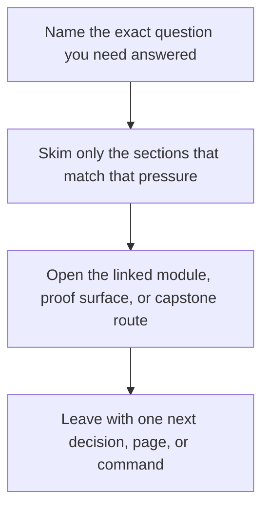

# Start Here

<!-- page-maps:start -->
## Guide Fit

<!-- page-maps:end -->

Read the first diagram as a timing map: this guide is for a named pressure, not for wandering the whole course-book. Read the second diagram as the guide loop: arrive with a concrete question, use only the matching sections, then leave with one smaller and more honest next move.

This is the shortest honest route into the course. Read it before you start browsing
module pages. The subject is not functional syntax by itself. The subject is how to make
Python codebases easier to reason about by turning purity, dataflow, failures, and
effects into explicit contracts.

## Use This Course If

- you build Python services, automation, pipelines, or tooling that need clearer reasoning boundaries
- you want stronger criteria for purity, error handling, and effect placement during review
- you need async or effect-heavy code to become more testable instead of more magical

## Do Not Start Here If

- you only want a beginner introduction to `lambda`, `map`, or list comprehensions
- you want functional vocabulary without changing hidden state or effect design
- you want abstractions before you understand the contracts they are supposed to protect

## Best Reading Route

1. Read [Course Home](../index.md) for the course promise and module arc.
2. Read [Course Guide](course-guide.md) for the module sequence and page roles.
3. Read [Foundations Reading Plan](foundations-reading-plan.md) if you want a paced route through Modules 01 to 03.
4. Read [FuncPipe RAG Primer](funcpipe-rag-primer.md) if the capstone domain is unfamiliar.
5. Read [Outcomes and Proof Map](outcomes-and-proof-map.md) if you want the course contract stated explicitly.
6. Read [Learning Contract](learning-contract.md) before you start Module 01.
7. Read [Orientation](../module-00-orientation/index.md), [Course Orientation](../module-00-orientation/course-orientation.md), and [How to Study This Course](../module-00-orientation/how-to-study-this-course.md).
8. Keep [FuncPipe Capstone Guide](capstone.md) open while reading the full course.
9. Use [Command Guide](command-guide.md), [Proof Matrix](proof-matrix.md), and [Capstone Map](capstone-map.md) when you want the executable route.

## Use The Arcs Deliberately

- Modules 01 to 03 when the main problem is local reasoning, purity, or lazy pipeline design
- Modules 04 to 06 when the main problem is failure modelling, validation, or explicit context
- Modules 07 to 08 when the main problem is effect boundaries, resources, retries, or async pressure
- Modules 09 to 10 when the system already exists and you need interop, governance, and sustainment judgment

## Success Signal

You are using the course correctly if each module helps you answer one question more
clearly in the capstone: what is still pure, where effects begin, and why that boundary
is easier to review than the alternatives.

## First Pages To Keep Open

- [Course Home](../index.md)
- [Course Guide](course-guide.md)
- [Foundations Reading Plan](foundations-reading-plan.md)
- [FuncPipe RAG Primer](funcpipe-rag-primer.md)
- [Outcomes and Proof Map](outcomes-and-proof-map.md)
- [Orientation](../module-00-orientation/index.md)
- [FuncPipe Capstone Guide](capstone.md)
