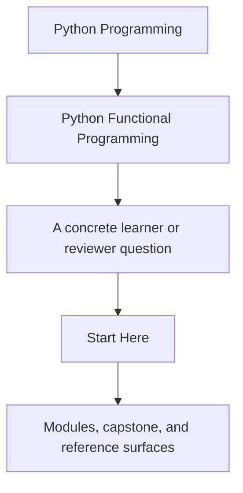
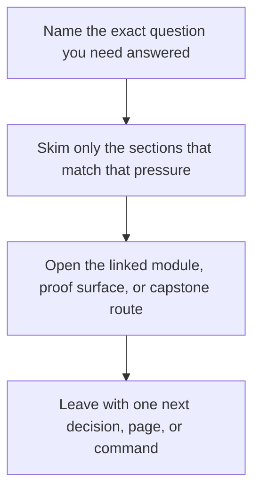

# Start Here

<!-- page-maps:start -->
## Guide Fit

<!-- page-maps:end -->

Read the first diagram as a timing map: this guide is the first-pass entry route, not a
second course catalog. Read the second diagram as the guide loop: arrive with one
question, use only the matching sections, then leave with one smaller and more honest
next move.

This is the shortest honest route into the course. Read it before you start browsing
module pages. The subject is not functional syntax by itself. The subject is how to make
Python codebases easier to reason about by turning purity, dataflow, failures, and
effects into explicit contracts.

## Use This Course If

- you build Python services, automation, pipelines, or tooling that need clearer reasoning boundaries
- you want stronger criteria for purity, error handling, and effect placement during review
- you need async or effect-heavy code to become more testable instead of more magical

## Do Not Start Here If

- you only want a beginner introduction to `lambda`, `map`, or list comprehensions
- you want functional vocabulary without changing hidden state or effect design
- you want abstractions before you understand the contracts they are supposed to protect

## Best first pass

1. Read [Course Home](../index.md) for the course promise and the module arc.
2. Read [Course Guide](course-guide.md) for the meaning of each part of the shelf.
3. Read [Learning Contract](learning-contract.md) before you start Module 01.
4. Choose one pace:
   - [Foundations Reading Plan](foundations-reading-plan.md) if you want a lower-density first pass
   - [Functional Programming Course Map](../module-00-orientation/course-map.md) if you want the full route visible at once
5. Read [FuncPipe RAG Primer](funcpipe-rag-primer.md) if the capstone domain is unfamiliar.
6. Read [Platform Setup](platform-setup.md) before your first proof command or after any Python-toolchain drift.
7. Keep [FuncPipe Capstone Guide](../capstone/index.md) nearby so each module has an executable mirror.

## Choose your next page by pressure

| If your pressure is... | Best next page |
| --- | --- |
| I need the full orientation shelf before Module 01. | [Orientation](../module-00-orientation/index.md) |
| I want the promise and proof route for each module. | [Module Promise Map](module-promise-map.md) |
| I want the course contract stated as outcomes and evidence. | [Outcomes and Proof Map](outcomes-and-proof-map.md) |
| My question is already practical. | [Pressure Routes](pressure-routes.md) |
| I am leaving the semantic floor and entering failures, effects, or async pressure. | [Mid-Course Map](../module-00-orientation/mid-course-map.md) |
| I am returning after a break. | [Return Map](../module-00-orientation/return-map.md) |
| I need to trust the local Python and proof environment first. | [Platform Setup](platform-setup.md) |
| I need the executable route. | [Proof Matrix](proof-matrix.md) and [Capstone Map](../capstone/capstone-map.md) |

## Use The Arcs Deliberately

- Modules 01 to 03 when the main problem is local reasoning, purity, or lazy pipeline design
- Modules 04 to 06 when the main problem is failure modelling, validation, or explicit context
- Modules 07 to 08 when the main problem is effect boundaries, resources, retries, or async pressure
- Modules 09 to 10 when the system already exists and you need interop, governance, and sustainment judgment

## Success Signal

You are using the course correctly if each module helps you answer one question more
clearly in the capstone: what is still pure, where effects begin, and why that boundary
is easier to review than the alternatives.

## Stop here when

- you know whether you are taking the lower-density route or the full route
- you can name the first support page you need after Module 01
- you have one concrete capstone question to carry into the modules
