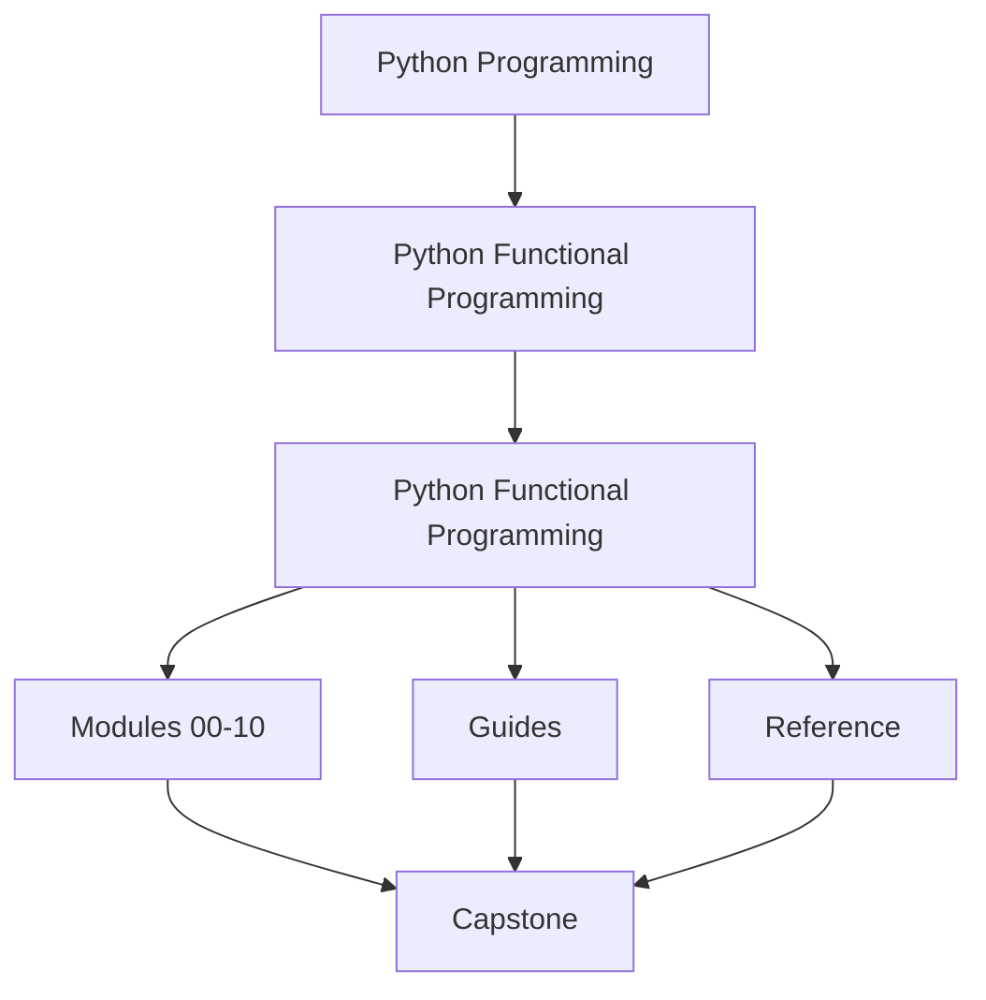
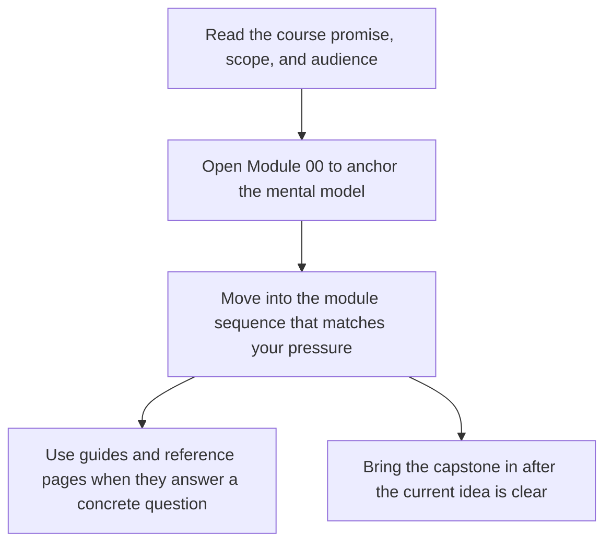

# Python Functional Programming

<!-- page-maps:start -->
## Course Shape

<!-- page-maps:end -->

Read the first diagram as the shape of the whole book: it shows where the home page sits relative to the module sequence, the support shelf, and the capstone. Read the second diagram as the intended entry route so learners do not mistake the capstone or reference pages for the first stop.

This course teaches functional programming in Python as a discipline of explicit dataflow,
controlled effects, and reviewable operational boundaries. The goal is not to imitate a
different language. The goal is to make ordinary Python systems easier to reason about,
refactor, test, and run under production pressure.

## Who this course is for

- Python engineers building services, pipelines, automation, or data tooling
- reviewers who want stronger criteria for purity, boundaries, and error handling
- maintainers who need refactors and async work to become safer instead of riskier

## Who this course is not for

- readers looking for a beginner introduction to `lambda`, `map`, or list comprehensions
- teams that want functional vocabulary without changing hidden state or effect design
- learners who want abstractions before they understand the contracts those abstractions protect

## What you will learn

By the end of the course, you should be able to:

- separate pure transforms from effectful coordination in real Python code
- design pipelines that stay configurable, lazy, and testable under growth
- model expected failures and domain states as data instead of tangled control flow
- move infrastructure behind explicit protocols, adapters, and async coordination layers
- sustain a long-lived codebase with evidence, review standards, and migration discipline

## Start here

- Read [Guides](guides/index.md) when you want the guide space itself to stay organized.
- Read [Start Here](guides/start-here.md) for the shortest stable learner route.
- Continue with [Course Guide](guides/course-guide.md) and [Learning Contract](guides/learning-contract.md).
- Use [Module Promise Map](guides/module-promise-map.md) when you want the promise and evidence route for each module before reading deeply.
- Use [Module Checkpoints](guides/module-checkpoints.md) when you want a clear bar for finishing a module honestly.
- Use [Foundations Reading Plan](guides/foundations-reading-plan.md) when you want a paced route through Modules 01 to 03.
- Use [FuncPipe RAG Primer](guides/funcpipe-rag-primer.md) when the capstone domain is unfamiliar and you want the smallest useful vocabulary set.
- Use [Outcomes and Proof Map](guides/outcomes-and-proof-map.md) when you want the course contract expressed as outcomes, learning work, and evidence.
- Keep [History Guide](guides/history-guide.md) nearby when you want the module-end comparison route.
- Read the [Orientation overview](module-00-orientation/index.md).
- Keep [Proof Matrix](guides/proof-matrix.md) nearby when you want the fastest route from course claims to executable evidence.
- Keep the [FuncPipe Capstone Guide](guides/capstone.md) open from the beginning.
- Work through the modules in order. The sequence is deliberate.

## Module Table of Contents

| Module | Title | Why it matters |
| --- | --- | --- |
| [Module 00](module-00-orientation/index.md) | Orientation and Study Practice | establishes the reading route, proof surfaces, and capstone timing |
| [Module 01](module-01-purity-substitution-local-reasoning/index.md) | Purity, Substitution, and Local Reasoning | creates the semantic floor for explicit state and effect design |
| [Module 02](module-02-data-first-apis-expression-style/index.md) | Data-First APIs and Expression Style | turns pure helpers into configurable, data-driven pipeline pieces |
| [Module 03](module-03-iterators-laziness-streaming-dataflow/index.md) | Iterators, Laziness, and Streaming Dataflow | builds lazy pipelines that materialize deliberately |
| [Module 04](module-04-streaming-resilience-failure-handling/index.md) | Streaming Resilience and Failure Handling | makes retries, folds, cleanup, and typed failures explicit |
| [Module 05](module-05-algebraic-data-modelling-validation/index.md) | Algebraic Data Modelling and Validation | encodes domain states and validation as explicit value shapes |
| [Module 06](module-06-monadic-flow-explicit-context/index.md) | Monadic Flow and Explicit Context | composes dependent work without hiding context or failure |
| [Module 07](module-07-effect-boundaries-resource-safety/index.md) | Effect Boundaries and Resource Safety | moves I/O, adapters, and resource lifecycles behind contracts |
| [Module 08](module-08-async-pipelines-backpressure-fairness/index.md) | Async Pipelines, Backpressure, and Fairness | adds bounded async coordination and deterministic async proof |
| [Module 09](module-09-ecosystem-interop-boundary-discipline/index.md) | Ecosystem Interop and Boundary Discipline | works with frameworks and libraries without losing the core design |
| [Module 10](module-10-refactoring-performance-sustainment/index.md) | Refactoring, Performance, and Sustainment | keeps the system governable under growth, review, and change |

## How the capstone fits

The FuncPipe RAG capstone is the course's executable proof. It is not a side project and
not a graduation appendix. It is the repository the course keeps pointing to when it
talks about purity, laziness, typed failures, effect boundaries, and async orchestration.

Use it to answer practical questions:

- Where does the pure core stop?
- Which abstractions are backed by tests instead of commentary?
- Where is laziness preserved, and where is materialization deliberate?
- Which effects are described as contracts, and which are driven by concrete adapters?

## Study rhythm

- Read each module overview before touching its lessons.
- Work through the lessons in order unless you are deliberately reviewing.
- After every module, read the matching `refactoring-guide.md` and compare against `_history/worktrees/module-XX`.
- Treat `module-reference-states/` as the tracked source of truth and `_history/worktrees/` as the generated local comparison surface.
- Treat refactor, law, and review chapters as checkpoints rather than optional extras.

## Common failure modes this course is trying to prevent

- treating FP as syntax instead of as a contract around state and effects
- mixing pure transforms with logging, retries, or I/O until nothing is locally understandable
- introducing laziness or async work without a clear boundary for when computation happens
- adding abstractions that make the code harder to debug than the imperative version
- adopting "functional style" while leaving the production risks untouched
