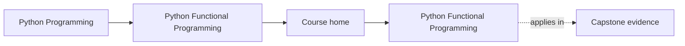
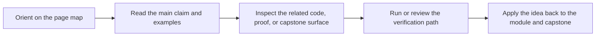

# Python Functional Programming

<!-- page-maps:start -->
## Page Maps

<!-- page-maps:end -->

This course teaches functional programming in Python as a discipline of explicit dataflow,
controlled effects, and reviewable operational boundaries. The goal is not to imitate a
different language. The goal is to make ordinary Python systems easier to reason about,
refactor, test, and run under production pressure.

## Who this course is for

- Python engineers building services, pipelines, automation, or data tooling
- reviewers who want stronger criteria for purity, boundaries, and error handling
- maintainers who need refactors and async work to become safer instead of riskier

## Who this course is not for

- readers looking for a beginner introduction to `lambda`, `map`, or list comprehensions
- teams that want functional vocabulary without changing hidden state or effect design
- learners who want abstractions before they understand the contracts those abstractions protect

## What you will learn

By the end of the course, you should be able to:

- separate pure transforms from effectful coordination in real Python code
- design pipelines that stay configurable, lazy, and testable under growth
- model expected failures and domain states as data instead of tangled control flow
- move infrastructure behind explicit protocols, adapters, and async coordination layers
- sustain a long-lived codebase with evidence, review standards, and migration discipline

## Start here

- Read the [Orientation overview](module-00-orientation/index.md).
- Keep the [FuncPipe Capstone Guide](capstone.md) open from the beginning.
- Work through the modules in order. The sequence is deliberate.

## The module path

- [Module 01: Purity and Substitution](module-01-purity-and-substitution/index.md) establishes the semantic floor: purity, substitution, composition, and local refactoring discipline.
- [Module 02: Data-First APIs and Expression Style](module-02-data-first-apis-and-expression-style/index.md) turns pure helpers into configurable, explicit, data-first building blocks.
- [Module 03: Iterators and Lazy Dataflow](module-03-iterators-and-lazy-dataflow/index.md) introduces lazy pipelines, reusable stages, and deliberate materialization.
- [Module 04: Resilience and Streaming Failures](module-04-resilience-and-streaming-failures/index.md) turns streaming into something survivable with typed failures, retries, and cleanup rules.
- [Module 05: Algebraic Data Modelling](module-05-algebraic-data-modelling/index.md) makes domain states, validation, and aggregation explicit through richer value shapes.
- [Module 06: Monadic Flow and Explicit Context](module-06-monadic-flow-and-explicit-context/index.md) shows how to chain dependent work lawfully without hiding configuration or failure handling.
- [Module 07: Effect Boundaries and Resource Safety](module-07-effect-boundaries-and-resource-safety/index.md) moves files, clocks, logging, transactions, and adapters behind reviewable boundaries.
- [Module 08: Async FuncPipe and Backpressure](module-08-async-funcpipe-and-backpressure/index.md) adds bounded async coordination, fairness, and deterministic testing.
- [Module 09: Ecosystem Interop](module-09-ecosystem-interop/index.md) shows how to work with stdlib tools, frameworks, and external libraries without losing the core design.
- [Module 10: Refactoring and Sustainment](module-10-refactoring-and-sustainment/index.md) focuses on performance, observability, migration, governance, and long-term survivability.

## How the capstone fits

The FuncPipe RAG capstone is the course's executable proof. It is not a side project and
not a graduation appendix. It is the repository the course keeps pointing to when it
talks about purity, laziness, typed failures, effect boundaries, and async orchestration.

Use it to answer practical questions:

- Where does the pure core stop?
- Which abstractions are backed by tests instead of commentary?
- Where is laziness preserved, and where is materialization deliberate?
- Which effects are described as contracts, and which are driven by concrete adapters?

## Study rhythm

- Read each module overview before touching its lessons.
- Work through the lessons in order unless you are deliberately reviewing.
- After every module, inspect the matching capstone surfaces before moving on.
- Treat refactor, law, and review chapters as checkpoints rather than optional extras.

## Common failure modes this course is trying to prevent

- treating FP as syntax instead of as a contract around state and effects
- mixing pure transforms with logging, retries, or I/O until nothing is locally understandable
- introducing laziness or async work without a clear boundary for when computation happens
- adding abstractions that make the code harder to debug than the imperative version
- adopting "functional style" while leaving the production risks untouched
