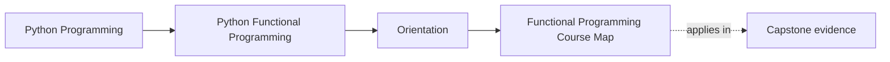
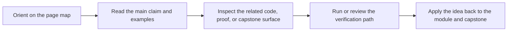

# Functional Programming Course Map

<!-- page-maps:start -->
## Page Maps

<!-- page-maps:end -->

Use this page when you need the whole course visible on one screen before you commit to a
reading route. The goal is to stop the course from feeling like a stack of advanced
topics and keep it legible as one design journey.

## The four course arcs

### Arc 1: semantic clarity

Modules 01 to 03 build the semantic floor for the rest of the course.

- Module 01 teaches purity, substitution, and local reasoning so you can tell which code can be trusted as dataflow.
- Module 02 teaches data-first APIs and expression style so configuration and composition stay explicit.
- Module 03 teaches iterators, laziness, and streaming dataflow so execution timing stops being accidental.

Leave this arc able to explain where materialization happens and why.

### Arc 2: survivable failure and modelling

Modules 04 to 06 turn functional style into something that can survive domain pressure.

- Module 04 teaches folds, streaming failures, retries, and resource-aware flows.
- Module 05 teaches algebraic modelling, smart construction, and validation as explicit value design.
- Module 06 teaches explicit context, layered containers, and law-guided composition.

Leave this arc able to represent failure and validation without hiding them inside control flow.

Read [Mid-Course Map](mid-course-map.md) when you want the shortest bridge from the
semantic floor into this arc and the next one.

### Arc 3: effect boundaries and async pressure

Modules 07 to 08 move from local reasoning to system boundaries.

- Module 07 teaches ports, adapters, capability protocols, and resource safety.
- Module 08 teaches async coordination, backpressure, fairness, and deterministic async proof.

Leave this arc able to explain where effects begin, which contracts govern them, and how async work stays reviewable.

### Arc 4: interop and long-lived sustainment

Modules 09 to 10 ask whether the design can survive a real team and a real codebase.

- Module 09 teaches interop with ordinary Python libraries, CLIs, and distributed boundaries.
- Module 10 teaches refactoring, performance, observability, governance, and sustained review standards.

Leave this arc able to improve an existing system without dissolving the functional boundaries you built earlier.

## Use this map to choose a route

If your pressure is mainly about:

- local reasoning, start with Modules 01 to 03
- explicit failures or domain states, start with Modules 04 to 06 after confirming Modules 01 to 03 feel stable
- ports, adapters, retries, or resources, start with Modules 07 to 08 after confirming the earlier semantic floor
- interop, migration, or sustainment, start with Modules 09 to 10 after checking the earlier arcs first

## Capstone alignment

Keep the FuncPipe RAG capstone open while reading the map.

- Arc 1 appears in pure helpers, configured pipelines, and lazy stream stages.
- Arc 2 appears in result containers, validation flows, and explicit context carriers.
- Arc 3 appears in capability protocols, effect boundaries, and async runtime adapters.
- Arc 4 appears in CLI surfaces, interop packages, and the proof and sustainment workflow.

## Best companion pages

- `index.md`
- `first-contact-map.md`
- `mid-course-map.md`
- `mastery-map.md`
- `../guides/start-here.md`
- `../guides/proof-matrix.md`
- `../capstone/capstone-file-guide.md`
