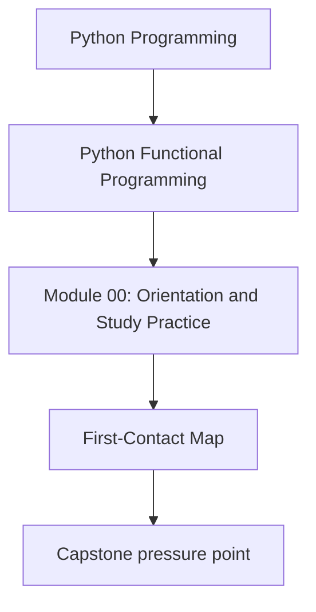
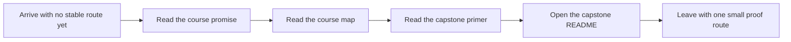

# First-Contact Map

<!-- page-maps:start -->
## Concept Position

<!-- page-maps:end -->

Use this page for your first honest session with the course. The goal is not to cover as
much ground as possible. The goal is to make the first hour coherent enough that later
reading choices feel deliberate instead of random.

## The first-contact route

Take this route in order:

1. Read `../index.md` to understand the course promise and what it does not claim to teach.
2. Read `course-map.md` to see the four-course-arc structure.
3. Read `../guides/course-guide.md` to understand how modules, guides, reference pages, and the capstone fit together.
4. Read `../guides/funcpipe-rag-primer.md` so the capstone vocabulary is no longer friction.
5. Read `../capstone/index.md` to understand why the capstone is the executable proof for the course.
6. Open `../capstone/capstone-map.md` and scan the repository shape, working commands, and proof route.
7. Run one small command: `make PROGRAM=python-programming/python-functional-programming capstone-test` or `make PROGRAM=python-programming/python-functional-programming capstone-tour`.

That is enough for a first session. Do not try to settle every advanced concept before Module 01.

## What you should know before Module 01

Before you start the first content module, you should be able to answer:

- What problem is this course trying to solve in real Python systems?
- Why is the capstone part of the teaching surface instead of an optional side project?
- Which broad arc covers your current pressure: semantics, failures, effects, or sustainment?
- Which command will you use when you want your first inspectable proof surface?

## What not to do on the first pass

- do not jump straight into async material because it feels more advanced
- do not treat the capstone as a separate project that can be ignored until the end
- do not browse every guide before you have one stable starting route
- do not confuse "I recognize the terminology" with "I can explain the boundary"

## Best companion pages

- `course-map.md`
- `course-orientation.md`
- `../guides/start-here.md`
- `../guides/funcpipe-rag-primer.md`
- `../capstone/index.md`
