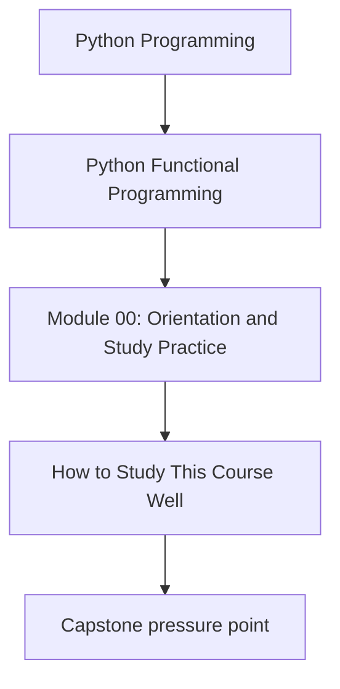
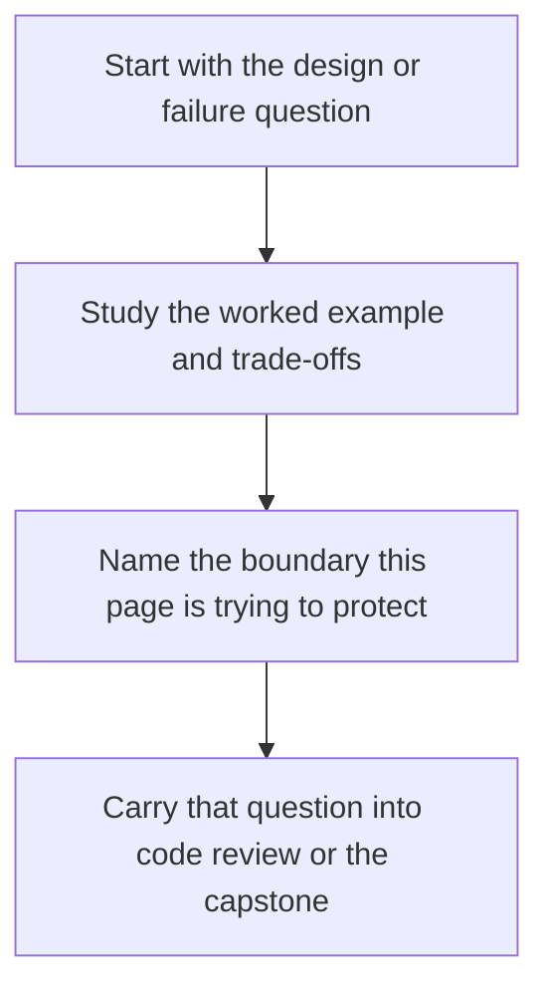

# How to Study This Course Well


<!-- page-maps:start -->
## Concept Position




<!-- page-maps:end -->

Read the first diagram as a placement map: this page is one concept inside its parent module, not a detached essay, and the capstone is the pressure test for whether the idea holds. Read the second diagram as the working rhythm for the page: name the problem, study the example, identify the boundary, then carry one review question forward.

This course is large. The only way to make it useful is to study it with a clear rhythm.

## The recommended rhythm

For each module:

1. Read the opening page to understand the design pressure for that module.
2. Read a small cluster of cores, then inspect the corresponding capstone code immediately.
3. Run the tests after ideas that materially change your mental model.
4. Leave one piece of evidence behind: a note, a refactor, or a small property test.

That rhythm matters because this course is not trying to make you memorize functional
vocabulary. It is trying to improve the way you structure Python systems.

## What to do with the capstone

Keep the FuncPipe RAG capstone open while reading:

- `capstone/src/funcpipe_rag/` for implementation structure
- `capstone/tests/` for executable claims
- [FuncPipe Capstone Guide](../capstone/index.md) for entrypoints and repo shape

Use the capstone as a concrete answer to "where does this idea live in a real codebase?"

## What counts as success in a module

You understand a module when you can do all three:

- state the main design rule in one sentence
- point to one place in the capstone where that rule matters
- explain one failure mode that appears when the rule is ignored

If you cannot do that yet, keep reading slowly instead of jumping ahead.

## Local setup checklist

From the repository root:

```bash
make PROGRAM=python-programming/python-functional-programming install
make PROGRAM=python-programming/python-functional-programming test
make PROGRAM=python-programming/python-functional-programming docs-serve
```

Fix environment or test failures before starting the modules. Later material assumes this
baseline works.

## What not to do

- do not treat every abstraction as equally important
- do not jump to async or monadic flows before purity and lazy dataflow are stable
- do not copy patterns into your own code without also copying their tests or invariants
- do not assume a concept is good merely because it sounds more functional
