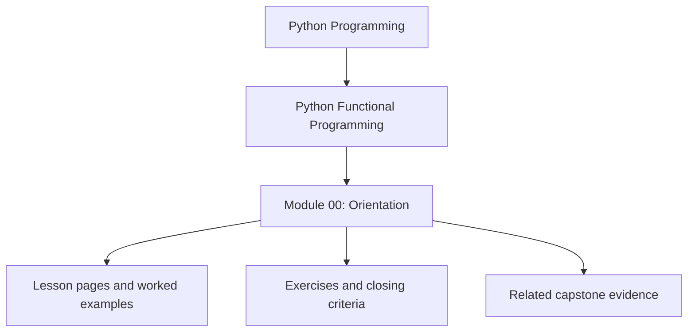
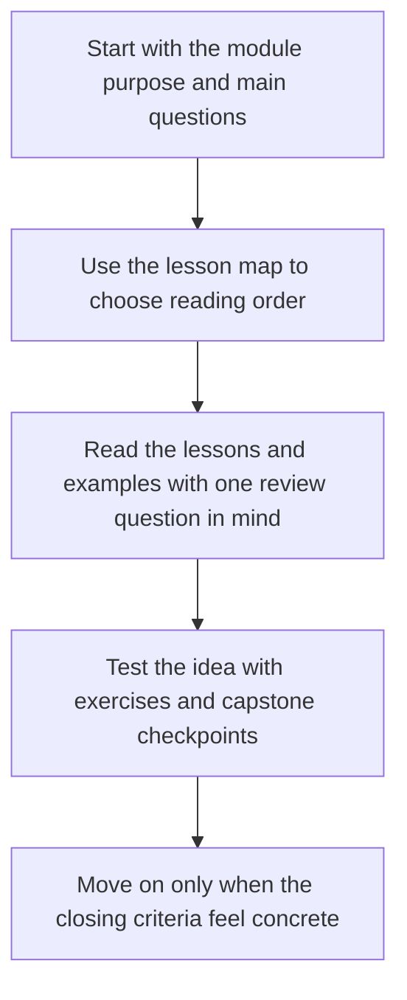

# Module 00: Orientation

<!-- page-maps:start -->
## Module Position

<!-- page-maps:end -->

Read the first diagram as a placement map: this page sits between the course promise, the lesson pages listed below, and the capstone surfaces that pressure-test the module. Read the second diagram as the study route for this page, so the diagrams point you toward the `Lesson map`, `Exercises`, and `Closing criteria` instead of acting like decoration.

This course teaches functional programming in Python as a discipline for making dataflow,
effects, and operational risk easier to reason about. The goal is not to imitate another
language. The goal is to make real Python systems clearer under testing, refactoring,
integration, and growth.

## Learning outcomes

- explain the course boundary: functional programming here means clearer Python systems, not imitation of another language
- identify the prerequisites that must already feel routine before the later modules become productive
- choose the right reading route through the orientation pages, guides, and capstone surfaces
- describe how the capstone evolves from semantic floor to long-lived sustainment evidence

## What this course is not

- It is not a syntax-first introduction to `lambda`, `map`, or list comprehensions.
- It is not a tour of abstractions detached from production code.
- It is not an excuse to rename imperative complexity with functional vocabulary.

## What this course is

- A design guide for separating pure transforms from effectful boundaries
- A pipeline guide for lazy dataflow, typed failures, and explicit coordination
- A systems guide for ports, adapters, async pressure control, and long-lived refactoring
- A review guide for judging whether an abstraction improves or hides the code

## Recommended prerequisites

- Comfortable Python fluency: functions, modules, exceptions, iterators, and tests
- Prior exposure to type hints, `dataclasses`, and pytest
- Willingness to treat purity, effects, and failure handling as design contracts

## Readiness check

You are ready for this course if you can already do most of the following without looking
up syntax:

- write and test a small pure helper function
- explain why shared mutable state creates non-local bugs
- trace data through a generator or iterator pipeline
- describe the difference between domain logic and I/O orchestration
- use type hints to communicate function inputs and outputs

If some of those still feel shaky, continue more slowly and keep the capstone open while
you read. The course assumes engineering curiosity, not perfection.

## Orientation path

- Read the full [Course Orientation](course-orientation.md).
- Read [How to Study This Course](how-to-study-this-course.md).
- Keep the [FuncPipe Capstone Guide](../guides/capstone.md) open from the beginning, and keep [Start Here](../guides/start-here.md) available when you need the short learner route again.

## Capstone roadmap

The FuncPipe RAG capstone matures with the course:

- Modules 01 to 03 establish purity, configuration, and lazy pipeline shape.
- Modules 04 to 06 introduce typed failures, algebraic modelling, and lawful composition.
- Modules 07 to 08 move effects and async coordination behind explicit boundaries.
- Modules 09 to 10 focus on interop, review standards, and long-lived sustainment.

## Exercises

- Write a one-paragraph statement of what this course owns and what it explicitly does not try to teach.
- Identify the prerequisite that feels least stable for you, then name the module where that gap would become expensive.
- Open [Start Here](../guides/start-here.md) and [FuncPipe Capstone Guide](../guides/capstone.md), then note which route you will use for first contact and which route you will use for proof.

## Closing criteria

- You can explain why purity, effects, and failure handling are treated as design contracts instead of style preferences.
- You know which orientation page to revisit when you need the short route, the full route, or the capstone route.
- You can describe how Modules 01 to 10 change the capstone, not just what topics they mention.
