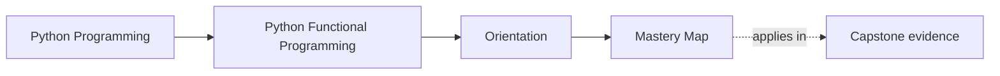
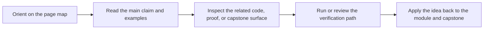

# Mastery Map

<!-- page-maps:start -->
## Page Maps

<!-- page-maps:end -->

Use this page when you are returning to the course after the first full pass or when the
open question already lives in interop, governance, or long-lived sustainment. The goal
is to turn "I read this before" into a repeatable mastery route: name the pressure,
revisit the smallest set of pages that own it, and leave with executable evidence.

## Return by engineering pressure

### "My pure core keeps leaking coordination concerns"

Revisit:

- Module 01 for substitution and local reasoning
- Module 02 for data-first APIs and configuration as data
- Module 07 for capability and boundary discipline

Then inspect:

- `src/funcpipe_rag/fp/`
- `src/funcpipe_rag/pipelines/`
- `src/funcpipe_rag/boundaries/`

### "I can model failures, but the flow is still hard to read"

Revisit:

- Module 04 for Result and Option style error handling
- Module 05 for explicit domain states and validation
- Module 06 for law-guided composition and explicit context

Then inspect:

- `src/funcpipe_rag/result/`
- `src/funcpipe_rag/fp/validation.py`
- `tests/unit/result/`

### "Our async or retry story is making the code magical"

Revisit:

- Module 07 for effect boundaries and idempotent effects
- Module 08 for async pipelines, backpressure, and deterministic async testing

Then inspect:

- `src/funcpipe_rag/domain/effects/`
- `src/funcpipe_rag/domain/effects/async_/`
- `tests/unit/domain/test_async_backpressure.py`

### "We are integrating with ordinary Python libraries and losing the design"

Revisit:

- Module 09 for interop and distributed boundary discipline
- Module 10 for sustainment, governance, and proof expectations

Then inspect:

- `src/funcpipe_rag/interop/`
- `src/funcpipe_rag/boundaries/shells/cli.py`
- [Capstone Proof Guide](../capstone/capstone-proof-guide.md)

## What mastery should feel like

You are using the course at a mastery level when you can do the following quickly:

- name the lowest-cost module or guide that owns the current pressure
- explain the boundary in plain Python engineering language, not only FP vocabulary
- find one capstone file and one proof surface that either support or challenge your claim
- reject an abstraction when it increases review cost more than it improves clarity

## Best companion pages

- `course-map.md`
- `first-contact-map.md`
- `../guides/proof-matrix.md`
- `../guides/proof-ladder.md`
- `../reference/self-review-prompts.md`
