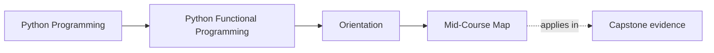
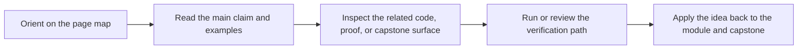

# Mid-Course Map

<!-- page-maps:start -->
## Page Maps

<!-- page-maps:end -->

Use this page when Modules 01 to 03 no longer feel like the blocker, but the second half
of the course still feels too large to enter cleanly. The goal is to turn the middle of
the course into a readable bridge from semantic clarity to system pressure.

## Resume from the last stable boundary

If you are returning after a break, re-anchor with:

1. [Orientation](index.md)
2. [Functional Programming Course Map](course-map.md)
3. [Module Promise Map](../guides/module-promise-map.md)

Then use the last boundary you still trust:

| If you still trust yourself through... | Re-enter with... | Keep open... |
| --- | --- | --- |
| Modules 01 to 03 | this page and Module 04 | [Proof Matrix](../guides/proof-matrix.md), [Capstone Map](../capstone/capstone-map.md) |
| Modules 04 to 06 | Module 07 and [Pressure Routes](../guides/pressure-routes.md) | [Boundary Review Prompts](../reference/boundary-review-prompts.md), [Review Checklist](../reference/review-checklist.md) |
| Modules 07 to 08 | [Mastery Map](mastery-map.md) and Module 09 | [Proof Matrix](../guides/proof-matrix.md), [Capstone](../capstone/index.md) |

Use one small proof route before resuming:

- `make PROGRAM=python-programming/python-functional-programming capstone-test`
- `make PROGRAM=python-programming/python-functional-programming capstone-tour`
- `make PROGRAM=python-programming/python-functional-programming capstone-verify-report`

## Modules 04 to 06: survivable failure and modelling

Use this stretch when the main pressure is no longer "what is pure?" but instead:

- how failures should become explicit values instead of hidden control flow
- how domain states should stay legible under validation and branching
- how context should remain visible while dependent work composes

Capstone check:

- inspect `src/funcpipe_rag/result/`
- inspect `src/funcpipe_rag/fp/validation.py`
- read `tests/unit/result/` and `tests/unit/fp/`

## Modules 07 to 08: effect boundaries and async pressure

Use this stretch when the design pressure moves outward into real system boundaries:

- resource handling, retries, and idempotent effects
- adapters, protocols, and capability boundaries
- async backpressure, fairness, and deterministic coordination proof

Capstone check:

- inspect `src/funcpipe_rag/boundaries/`
- inspect `src/funcpipe_rag/domain/effects/`
- inspect `src/funcpipe_rag/domain/effects/async_/`
- read `tests/unit/domain/`

## How to know you are ready for Module 09

Move into interop and sustainment when you can answer:

- where your pure core ends
- where failures become values instead of implicit branching
- where effects enter and how those boundaries are tested
- which capstone file you would open first for a resource, retry, or async review question

## Best companion pages

- [Functional Programming Course Map](course-map.md)
- [Mastery Map](mastery-map.md)
- [Pressure Routes](../guides/pressure-routes.md)
- [Capstone Map](../capstone/capstone-map.md)
