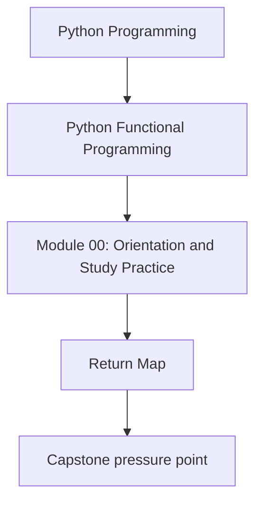
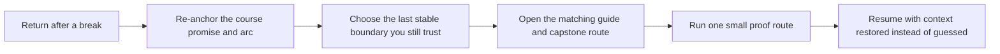

# Return Map

<!-- page-maps:start -->
## Concept Position

<!-- page-maps:end -->

Use this page when the course is familiar but no longer fresh. The goal is not to reread
everything. The goal is to restart from the last stable design boundary instead of from
the most advanced module title that still looks recognizable.

## Step 1: Re-anchor the course shape

Before you reopen a content module, reread:

1. [Orientation](index.md)
2. [Functional Programming Course Map](course-map.md)
3. [Module Promise Map](../guides/module-promise-map.md)

That restores the course arc, the promise of each module, and the pressure-based route
before details start competing again.

## Step 2: Re-enter from the last boundary you still trust

Use the last module range you can still explain clearly without rereading as your re-entry
boundary.

| If you still trust yourself through... | Re-enter with... | Keep open... |
| --- | --- | --- |
| Modules 01 to 03 | [Mid-Course Map](mid-course-map.md) and Module 04 | [Proof Matrix](../guides/proof-matrix.md), [Capstone Map](../guides/capstone-map.md) |
| Modules 04 to 06 | Module 07 and [Engineering Question Map](../guides/engineering-question-map.md) | [Boundary Review Prompts](../reference/boundary-review-prompts.md), [Review Checklist](../reference/review-checklist.md) |
| Modules 07 to 08 | Module 09 and [Mastery Map](mastery-map.md) | [Outcomes and Proof Map](../guides/outcomes-and-proof-map.md), [FuncPipe Capstone Guide](../guides/capstone.md) |
| Module 09 or later | Module 10 and the capstone proof routes | [Self-Review Prompts](../reference/self-review-prompts.md), [Proof Matrix](../guides/proof-matrix.md) |

## Step 3: Use one proof route before resuming

Pick one small proof route that matches the boundary you are returning to:

- `make PROGRAM=python-programming/python-functional-programming capstone-test` when you need executable confidence quickly
- `make PROGRAM=python-programming/python-functional-programming capstone-tour` when you need the human walkthrough route
- `make PROGRAM=python-programming/python-functional-programming capstone-verify-report` when you need saved executable proof

The proof route should restore your bearings, not replace the module.

## Signals you returned too far ahead

Move backward one boundary if you cannot answer:

- where purity still ends and orchestration begins
- which capstone package or test file proves the claim you are trying to recover
- which course arc owns the current pressure

If those answers are fuzzy, the issue is probably not missing vocabulary. It is that the
last stable boundary was earlier than you first assumed.

## Best companion pages

- [Functional Programming Course Map](course-map.md)
- [Mid-Course Map](mid-course-map.md)
- [Mastery Map](mastery-map.md)
- [Start Here](../guides/start-here.md)
