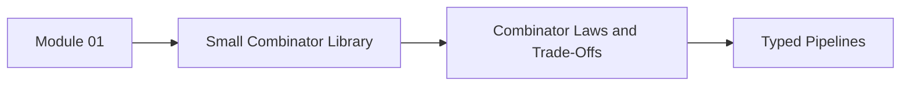
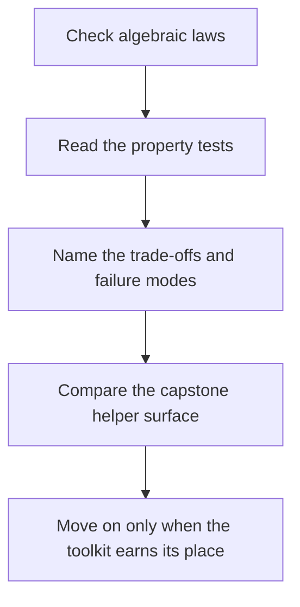

# Combinator Laws and Trade-Offs


<!-- page-maps:start -->
## Page Maps




<!-- page-maps:end -->

This lesson exists because building a helper library is not the same thing as justifying
it. Once you have a small combinator kit, the next question is whether it preserves the
behavior you care about and whether it stays simpler than the imperative baseline.

## What this lesson proves

- the helper surface obeys identity, composition, and idempotence laws where expected
- property-based tests can falsify bad combinator refactors quickly
- a combinator library is only worth keeping when it reduces duplication and review cost
- order preservation and type clarity matter more than functional vocabulary on its own

## Equational review route

Use substitution to check whether a combinator pipeline is still honest:

1. inline the combinator definitions mentally or on paper
2. confirm the rewritten pipeline still means "data in, data out"
3. compare the result with the hand-written imperative baseline
4. stop if the abstraction hides control flow instead of clarifying it

For Module 01, the most important question is not "can I write this point-free?" The
important question is "can another engineer still substitute the pieces locally and trust
the result?"

## Property-based review route

Property tests are the fastest way to catch abstractions that look elegant but break
important guarantees.

Good properties for this lesson include:

- `fmap(identity) == identity`
- `fmap(f ∘ g) == fmap(f) ∘ fmap(g)`
- applying the same filter twice is the same as applying it once
- left folds preserve associativity when the operation itself is associative
- the combinator pipeline and the hand-written pipeline return the same value

### Bad refactor example

Order-preserving deduplication is a good example because the failure is subtle: a helper
that converts to `set` looks shorter but silently destroys ordering.

```python
from typing import Callable, Iterable, List, TypeVar

T = TypeVar("T")


def bad_unique() -> Callable[[Iterable[T]], List[T]]:
    def inner(xs: Iterable[T]) -> List[T]:
        return list(set(xs))

    return inner
```

That implementation is smaller, but it no longer matches the behavioral contract of a
stable pipeline helper.

### Better specification

```python
from typing import List, TypeVar

T = TypeVar("T")


def stable_unique(xs: List[T]) -> List[T]:
    seen = set()
    out: List[T] = []
    for x in xs:
        if x not in seen:
            seen.add(x)
            out.append(x)
    return out
```

The point is not only to get the code right. The point is to make the intended contract
obvious enough that a test can guard it.

## When the library is worth it

Keep the combinator layer when it gives you these benefits:

- the same pipeline pieces are reused in multiple places
- the helpers preserve types and naming clearly enough to review
- the tests describe stable algebraic expectations, not only examples
- a new pipeline becomes easier to assemble than a hand-written loop forest

Do not keep it when:

- the helper names are more abstract than the problem
- the pipeline is so small that direct code is clearer
- profiling shows the abstraction cost matters and the hot path is simple
- the team cannot explain the laws the library depends on

## Capstone check

Before moving on, compare the combinator helpers in the capstone with the tests that
justify them:

1. inspect `capstone/_history/worktrees/module-01/src/funcpipe_rag/fp.py`
2. inspect `capstone/_history/worktrees/module-01/tests/test_laws.py`
3. decide whether each helper is buying clarity or just renaming normal Python

## Reflection

- Which helper in your own codebase would survive a law-based review?
- Which helper only exists because earlier code was repetitive?
- Which helper looks elegant but makes the execution story harder to follow?

**Continue with:** [Typed Pipelines](typed-pipelines.md)
