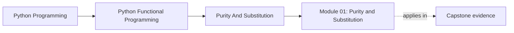
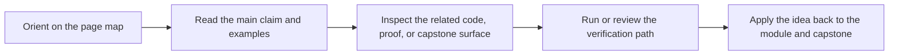

# Module 01: Purity and Substitution

<!-- page-maps:start -->
## Page Maps

<!-- page-maps:end -->

This module establishes the semantic floor for the whole course. If the learner cannot
separate pure transforms from hidden state here, every later abstraction will feel
ornamental instead of necessary.

## What this module teaches

- how purity and substitution change the way you review Python code
- how immutability and value semantics reduce hidden coupling
- how small composable transforms make testing and refactoring cheaper
- how to judge whether a rewrite preserves behavior instead of only reshaping syntax

## Lesson map

- [Imperative vs Functional](imperative-vs-functional.md)
- [Pure Functions and Contracts](pure-functions-and-contracts.md)
- [Immutability and Value Semantics](immutability-and-value-semantics.md)
- [Higher-Order Composition](higher-order-composition.md)
- [Local FP Refactors](local-fp-refactors.md)
- [Small Combinator Library](small-combinator-library.md)
- [Typed Pipelines](typed-pipelines.md)
- [Isolating Side Effects](isolating-side-effects.md)
- [Equational Reasoning](equational-reasoning.md)
- [Idempotent Transforms](idempotent-transforms.md)
- [Refactoring Guide](refactoring-guide.md)

## Capstone checkpoints

- Identify which helpers in FuncPipe stay pure across refactors.
- Trace where configuration is explicit instead of ambient.
- Check whether tests prove behavior or only exercise examples.

## Before moving on

You should be able to explain why a function is pure, why that matters for substitution,
and where a thin effect wrapper belongs when purity is impossible. Use
[Refactoring Guide](refactoring-guide.md) and compare against
`capstone/_history/worktrees/module-01` before moving forward.
