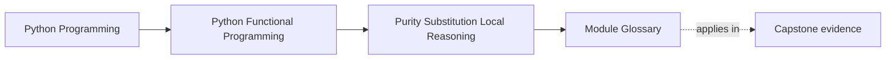
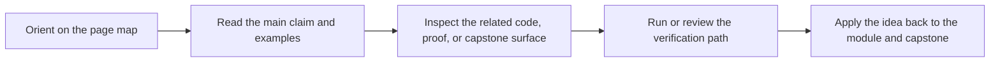

# Module Glossary

<!-- page-maps:start -->
## Page Maps

<!-- page-maps:end -->

This glossary belongs to **Module 01: Purity, Substitution, and Local Reasoning** in **Python Functional Programming**. It keeps the language of this directory stable so the same ideas keep the same names across reading, practice, review, and capstone proof.

## How to use this glossary

Read the directory index first, then return here whenever a page, command, or review discussion starts to feel more vague than the course intends. The goal is stable language, not extra theory.

## Terms in this directory

| Term | Meaning in this directory |
| --- | --- |
| Combinator Laws and Trade-Offs | the module's treatment of combinator laws and trade-offs, used to make the module's main design claim concrete in design work, refactoring, and capstone evidence. |
| Equational Reasoning | the module's treatment of equational reasoning, used to make the module's main design claim concrete in design work, refactoring, and capstone evidence. |
| Higher-Order Composition | the module's treatment of higher-order composition, used to make the module's main design claim concrete in design work, refactoring, and capstone evidence. |
| Idempotent Transforms | the module's treatment of idempotent transforms, used to make the module's main design claim concrete in design work, refactoring, and capstone evidence. |
| Immutability & Value Semantics | the module's treatment of immutability & value semantics, used to make the module's main design claim concrete in design work, refactoring, and capstone evidence. |
| Imperative vs Functional | the module's treatment of imperative vs functional, used to make the module's main design claim concrete in design work, refactoring, and capstone evidence. |
| Isolating Side Effects | the module's treatment of isolating side effects, used to make the module's main design claim concrete in design work, refactoring, and capstone evidence. |
| Local FP Refactors | the module's treatment of local fp refactors, used to make the module's main design claim concrete in design work, refactoring, and capstone evidence. |
| Module 01 Refactoring Guide | the repair route for applying the module's main design claim to existing code without losing behavior, clarity, or proof. |
| Pure Functions & Contracts | the module's treatment of pure functions & contracts, used to make the module's main design claim concrete in design work, refactoring, and capstone evidence. |
| Small Combinator Library | the module's treatment of small combinator library, used to make the module's main design claim concrete in design work, refactoring, and capstone evidence. |
| Typed Pipeline Review | the review surface that pressure-tests the module after the first read so you can check judgment, not just recall. |
| Typed Pipelines | the module's treatment of typed pipelines, used to make the module's main design claim concrete in design work, refactoring, and capstone evidence. |
