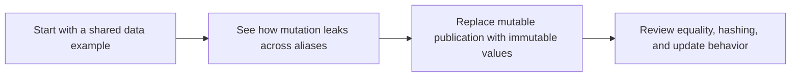

# Immutability & Value Semantics


<!-- page-maps:start -->
## Lesson Map


<!-- page-maps:end -->

This lesson is about protecting data the same way purity protects functions.

## Start With the Python Problem

Two names pointing at the same mutable object are enough to break local reasoning. One part
of the program mutates the value, another part observes the change, and now the meaning of
the data depends on who touched it last.

Immutability is the data-side answer to that problem: once a value is published, you can
trust that it will keep meaning the same thing.

## Keep This Question In View

> How do you make shared data safe to trust by preventing post-creation mutation and comparing values by what they contain?

By the end of this lesson, you should be able to explain:

- when `tuple`, `frozenset`, and frozen dataclasses are the right publication boundary
- why equality by contents is easier to reason about than equality by identity
- why hashable published values must not be mutated after creation

---

## 1. Conceptual Foundation

### 1.1 The One-Sentence Rule

> **Default to frozen, hashable, value-equality data; never expose mutable containers—or wrap them behind read-only views.**

### 1.2 Value Semantics in One Precise Sentence

> Value semantics means objects are compared by their contents (not identity) and never change after creation; structural sharing is an implementation strategy that makes updates efficient.

### 1.3 Why This Matters Now

Immutability makes data reviewable in the same way purity makes function calls reviewable.
When a value cannot change after publication:

- aliases stop being surprising
- equality becomes meaningful for "same information"
- caching and lookup behavior stop rotting after incidental mutation

### 1.4 Bug Story: Mutating a Hash Key

Imagine caching embeddings by chunk:

```python
from dataclasses import dataclass
import hashlib
from typing import Tuple, Dict

@dataclass(eq=True, unsafe_hash=True)  # unsafe_hash=True on a mutable class is almost always a bug factory; prefer frozen=True and immutable fields instead
class MutableChunkWithoutEmbedding:
    doc_id: str
    text: str
    start: int
    end: int

cache: Dict[MutableChunkWithoutEmbedding, Tuple[float, ...]] = {}
chunk = MutableChunkWithoutEmbedding("doc1", "text", 0, 4)
cache[chunk] = (0.1, 0.2)  # Cache hit
old_hash = hash(chunk)
chunk.text = "mutated"  # mutation after hashing
new_hash = hash(chunk)
assert old_hash != new_hash  # hash changed
assert cache.get(chunk) is None  # lookup fails → key “lost”
```

**Problem:** mutation invalidates the hash, so the key becomes logically "lost" inside the
dictionary. That is why values used as set members, dictionary keys, or cache identities
must be immutable after creation.

---

## 2. Mental Model: Mutable Reference vs Immutable Value

### 2.1 One Picture

```text
Mutable publication                       Immutable publication
+-----------------------------+         +------------------------------+
| a ----> shared list         |         | a ----> value object         |
| b ----> shared list         |         | b ----> same value meaning   |
| mutate through a            |         | update means "make new value"|
| b silently observes change  |         | old references keep meaning  |
+-----------------------------+         +------------------------------+
```

### 2.2 Contract Table

| Clause                     | Violation Example                      | Detected By                              |
|----------------------------|----------------------------------------|------------------------------------------|
| No post-creation mutation  | `list.append`, `dict.__setitem__`      | Hypothesis mutation check + deepcopy     |
| Value equality             | `is` instead of `==`                   | Hypothesis equality property             |
| Hash stability             | Mutable in set/dict key                | Hypothesis rehash property               |
| Structural sharing         | Full copy on update                    | Manual inspection + benchmarks           |

**Note on Nested Mutation:** `frozen=True` only stops attribute rebinding. If an attribute
still holds a mutable list or dict, deep mutation is still possible. In this module,
"immutable" should be read as "safe to share without later mutation."

**Note on Local Mutables:** Local mutable temporaries are fine; publishing them as part of the API is not.

### 2.3 Shallow vs Deep Immutability

`@dataclass(frozen=True)` prevents rebinding attributes but not mutating nested mutables:

```python
from dataclasses import dataclass
from typing import List

@dataclass(frozen=True)
class ShallowImmutable:
    items: List[int]  # Nested mutable

obj = ShallowImmutable([1, 2])
# obj.items = [3]  # Error: can't rebind
obj.items.append(3)  # Succeeds! Nested mutation
assert obj.items == [1, 2, 3]
```

For deep immutability, change list[int] to tuple[int, ...] and construct it immutably at the boundaries:

```python
from dataclasses import dataclass
from typing import Tuple

@dataclass(frozen=True)
class DeepImmutable:
    items: Tuple[int, ...]

deep = DeepImmutable((1, 2))
# deep.items = (3,)      # Error: can't rebind frozen field
# deep.items += (3,)     # Also an error: attempts to rebind a frozen field
```

---

## 3. Running Project: Immutability in RAG Types

Our **running project** (from `module-01/funcpipe-rag-01/README.md`) enforces immutability on Core 1/2's types.  
- **Goal:** Make data safe for sharing, hashing, caching.  
- **Start:** Core 1/2's types.  
- **End (this core):** Frozen types with properties for no mutation/hash stability. Semantics aligned with Core 1/2.

### 3.1 Types (Canonical)

These are defined in `module-01/funcpipe-rag-01/src/funcpipe_rag/rag_types.py` (as in Core 1) and imported as needed. No redefinition here. All core RAG dataclasses in rag_types.py are frozen=True and contain only immutable fields. Because all RAG dataclasses are frozen=True and only contain immutable fields, their default __hash__ implementations are safe to use as dict keys and set members.

### 3.2 Mutable Variants (Anti-Patterns in RAG)

Full code:

```python
from dataclasses import dataclass
from typing import List
from funcpipe_rag import CleanDoc, ChunkWithoutEmbedding, RawDoc, Chunk, RagEnv


# Mutable RawDoc (anti-pattern)
@dataclass  # Mutable
class MutableRawDoc:
    doc_id: str
    title: str
    abstract: str
    categories: str


# Mutable clean (nested mutation)
def mutable_clean_doc(doc: MutableRawDoc) -> MutableRawDoc:
    doc.abstract = " ".join(doc.abstract.strip().lower().split())
    return doc  # Mutates input


# Mutable chunk (mutable list output)
def mutable_chunk_doc(doc: CleanDoc, env: RagEnv) -> List[ChunkWithoutEmbedding]:  # Mutable list
    text = doc.abstract
    chunks = []  # Mutable accum (local OK, but returned mutable)
    for i in range(0, len(text), env.chunk_size):
        chunks.append(
            ChunkWithoutEmbedding(doc.doc_id, text[i:i + env.chunk_size], i, i + len(text[i:i + env.chunk_size])))
    return chunks  # Caller can mutate returned list


# Mutable embed (mutates input for demo)
import hashlib


@dataclass  # Mutable for demo
class MutableChunkWithoutEmbedding:
    doc_id: str
    text: str
    start: int
    end: int


def mutable_embed_chunk(chunk: MutableChunkWithoutEmbedding) -> Chunk:
    chunk.text += " mutated"  # Nested mutation
    h = hashlib.sha256(chunk.text.encode("utf-8")).hexdigest()
    step = 4
    vec = tuple(int(h[i:i + step], 16) / (16 ** step - 1) for i in range(0, 64, step))
    return Chunk(chunk.doc_id, chunk.text, chunk.start, chunk.end, vec)
```

**Smells:** Mutable fields (rebindable), nested mutation (abstract changed), mutable outputs (caller can append to chunks). Note: Local mutable accum is OK; problem is exposing mutable API.

---

## 4. Refactor to Immutable: Value Semantics in RAG

### 4.1 Immutable Core

Use frozen dataclasses, tuples for safe sharing. Full code:

```python
from funcpipe_rag import RawDoc, CleanDoc, ChunkWithoutEmbedding, Chunk, RagEnv
from typing import Tuple
import hashlib


# Immutable clean (returns new)
def clean_doc(doc: RawDoc) -> CleanDoc:
    abstract = " ".join(doc.abstract.strip().lower().split())
    return CleanDoc(doc.doc_id, doc.title, abstract, doc.categories)  # New instance


# Immutable chunk (tuple-valued API with immutable elements)
def chunk_doc(doc: CleanDoc, env: RagEnv) -> Tuple[ChunkWithoutEmbedding, ...]:
    text = doc.abstract
    return tuple(
        ChunkWithoutEmbedding(doc.doc_id, text[i:i + env.chunk_size], i, i + len(text[i:i + env.chunk_size]))
        for i in range(0, len(text), env.chunk_size)
    )


# Immutable embed (no mutation)
def embed_chunk(chunk: ChunkWithoutEmbedding) -> Chunk:
    h = hashlib.sha256(chunk.text.encode("utf-8")).hexdigest()
    step = 4
    vec = tuple(int(h[i:i + step], 16) / (16 ** step - 1) for i in range(0, 64, step))
    return Chunk(chunk.doc_id, chunk.text, chunk.start, chunk.end, vec)
```

**Wins:** New instances on update, immutable outputs (tuple prevents append), no mutation. Note: From this core onward, chunk_doc returns tuple instead of list to enforce immutability; update full_rag accordingly.

### 4.2 Persistent Update Example

Python's dataclasses support persistent updates via `replace`:

```python
from dataclasses import dataclass, replace
from typing import Tuple

@dataclass(frozen=True)
class Config:
    host: str
    port: int
    tags: Tuple[str, ...]  # immutable

base = Config("localhost", 8000, ("api",))

# “Update” using structural sharing: new object reuses unchanged pieces
cfg_prod = replace(base, host="prod.example.com")

assert base.port == cfg_prod.port        # shared value
assert base.tags is cfg_prod.tags        # same tuple object, reused (this is an optimization, not a semantic guarantee)
assert base is not cfg_prod              # new Config instance
```

This is persistent update: you get a new value back, but unchanged substructures (like the tags tuple) are shared.

### 4.3 Impure Shell (Edge Only)

The shell from Core 1 remains; immutability focuses on core data.

### 4.4 Connection to Later Cores

Immutability enables referential transparency, making equational reasoning (Core 9) possible by ensuring expressions equal their values. It also unlocks safe concurrency (no races) and caching (stable hashes), key for pipelines (Core 4) and parallelism (Core 10).

---

## 5. Equational Reasoning: Substitution Exercise

**Hand Exercise:** Replace expressions in `clean_doc`.  
1. Inline `abstract = " ".join(...)` → normalized string.  
2. Substitute into `CleanDoc` → fixed value.  
**Bug Hunt:** In mutable_clean_doc, substitution fails (mutates original doc).

---

## 6. Property-Based Testing: Proving Equivalence (Advanced, Optional)

Use Hypothesis to prove immutability.

You can safely skip this on a first read and still follow later cores—come back when you want to mechanically verify your own refactors.

### 6.1 Custom Strategy (RAG Domain)

From `module-01/funcpipe-rag-01/tests/conftest.py` (as in Core 1).

### 6.2 Immutability & Hash Properties for RAG Types

Full code:

```python
# module-01/funcpipe-rag-01/tests/test_laws.py (excerpt)
from hypothesis import given
import hypothesis.strategies as st
from copy import deepcopy
from typing import List
from funcpipe_rag import clean_doc, chunk_doc, embed_chunk, full_rag
from funcpipe_rag import RawDoc, CleanDoc, ChunkWithoutEmbedding, Chunk, RagEnv
from .conftest import raw_doc_strategy, env_strategy, doc_list_strategy


# Properties for clean_doc
@given(doc=raw_doc_strategy())
def test_clean_doc_no_mutation(doc: RawDoc) -> None:
    original = deepcopy(doc)
    clean_doc(doc)
    assert doc == original


# Properties for chunk_doc
@given(doc=st.builds(CleanDoc, doc_id=st.text(min_size=1), title=st.text(), abstract=st.text(), categories=st.text()),
       env=env_strategy())
def test_chunk_doc_no_mutation(doc: CleanDoc, env: RagEnv) -> None:
    original = deepcopy(doc)
    chunk_doc(doc, env)
    assert doc == original


@given(doc=st.builds(CleanDoc, doc_id=st.text(min_size=1), title=st.text(), abstract=st.text(), categories=st.text()),
       env=env_strategy())
def test_chunks_equal_imply_equal_hash(doc: CleanDoc, env: RagEnv) -> None:
    c1 = chunk_doc(doc, env)
    c2 = chunk_doc(doc, env)
    assert c1 == c2
    assert hash(c1) == hash(c2)


@given(doc=st.builds(CleanDoc, doc_id=st.text(min_size=1), title=st.text(), abstract=st.text(), categories=st.text()),
       env=env_strategy())
def test_chunk_hash_stable(doc: CleanDoc, env: RagEnv) -> None:
    c = chunk_doc(doc, env)
    h = hash(c)
    assert hash(c) == h


# Properties for embed_chunk
chunk_we_strategy = st.builds(
    ChunkWithoutEmbedding,
    doc_id=st.text(min_size=1),
    text=st.text(min_size=1),
    start=st.integers(min_value=0, max_value=1000),
).map(
    lambda c: ChunkWithoutEmbedding(
        c.doc_id, c.text, c.start, c.start + len(c.text)
    )
)


@given(chunk_we=chunk_we_strategy)
def test_embed_chunk_no_mutation(chunk_we: ChunkWithoutEmbedding) -> None:
    original = deepcopy(chunk_we)
    embed_chunk(chunk_we)
    assert chunk_we == original


@given(chunk_we=chunk_we_strategy)
def test_embedded_equal_imply_equal_hash(chunk_we: ChunkWithoutEmbedding) -> None:
    e1 = embed_chunk(chunk_we)
    e2 = embed_chunk(chunk_we)
    assert e1 == e2
    assert hash(e1) == hash(e2)


@given(chunk_we=chunk_we_strategy)
def test_chunk_value_equality(chunk_we: ChunkWithoutEmbedding) -> None:
    e1 = embed_chunk(chunk_we)
    e2 = embed_chunk(chunk_we)
    assert e1 == e2
    assert e1 is not e2


# Composite property (full_rag)
@given(docs=doc_list_strategy(), env=env_strategy())
def test_full_rag_no_mutation(docs: List[RawDoc], env: RagEnv) -> None:
    original = deepcopy(docs)
    full_rag(docs, env)
    assert docs == original
```

**Note:** Properties enforce no mutation and hash stability across stages.

### 6.3 Shrinking Demo: Catching a Bug

Bad refactor (nested mutation in embed_chunk):

Full code:

```python
import hashlib
from dataclasses import dataclass
from funcpipe_rag import Chunk


@dataclass  # Mutable for demo
class MutableChunkWithoutEmbedding:
    doc_id: str
    text: str
    start: int
    end: int


def bad_embed_chunk(chunk: MutableChunkWithoutEmbedding) -> Chunk:
    chunk.text += " mutated"  # Nested mutation
    h = hashlib.sha256(chunk.text.encode("utf-8")).hexdigest()
    step = 4
    vec = tuple(int(h[i:i + step], 16) / (16 ** step - 1) for i in range(0, 64, step))
    return Chunk(chunk.doc_id, chunk.text, chunk.start, chunk.end, vec)
```

Property:

```python
from hypothesis import given
import hypothesis.strategies as st
from copy import deepcopy

@given(st.builds(MutableChunkWithoutEmbedding, doc_id=st.text(min_size=1), text=st.text(min_size=1), start=st.integers(min_value=0), end=st.integers(min_value=1)))
def test_bad_embed_chunk_no_mutation(chunk: MutableChunkWithoutEmbedding) -> None:
    original = deepcopy(chunk)
    bad_embed_chunk(chunk)
    assert chunk == original  # Fails on mutation
```

Hypothesis failure trace (run to verify; example):

```
Falsifying example: test_bad_embed_chunk_no_mutation(
    chunk=MutableChunkWithoutEmbedding(doc_id='a', text='a', start=0, end=1),
)
AssertionError
```

- Shrinks to minimal chunk; mutation changes text, failing equality. Catches nested bug via shrinking.

---

## 7. When Immutability Isn't Worth It

Rarely, for profiled hot paths (e.g., array processing), use mutable internals but expose immutable API.

---

## 8. Pre-Core Quiz

1. Mutable default argument → violates which clause? → **No shared mutation**  
2. Mutating list inside tuple → violates? → **No shared mutation**  
3. Using `is` instead of `==` on dataclasses → violates? → **Value equality**  
4. `@dataclass(frozen=True)` prevents nested list mutation? → **No (shallow only)**  
5. Tool to detect nested mutation in tests? → **Hypothesis + deepcopy**

## 9. Post-Core Reflection & Exercise

**Reflect:** In your code, find one mutable container. Freeze it; add immutability properties.  
**Project Exercise:** Update RAG types to immutable; run properties on sample data.

All claims (e.g., referential transparency) are verifiable via the provided Hypothesis examples—run them to confirm.

**Further Reading:** For more on purity pitfalls, see 'Fluent Python' Chapter on Functions as Objects. Check free resources like Python.org's FP section or Codecademy's Advanced Python course for basics.

**Continue with:** [Higher-Order Composition](../module-01-purity-substitution-local-reasoning/higher-order-composition.md)
