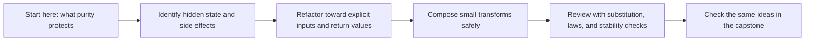

# Module 01: Purity, Substitution, and Local Reasoning

<!-- page-maps:start -->
## Module Map

<!-- page-maps:end -->

This module teaches the semantic floor for the whole course:

- which functions are safe to reason about locally
- which kinds of hidden state break substitution
- how to refactor toward explicit data flow before the abstractions get fancier

If this module does not feel concrete, later topics like combinators, typed pipelines, and
effect management will feel ornamental instead of useful.

## Keep These Pages Nearby

Use these support surfaces while reading so the semantic floor stays attached to the
course promise and the capstone proof route:

- [First-Contact Map](../module-00-orientation/first-contact-map.md) for the shortest stable entry route
- [Module Promise Map](../guides/module-promise-map.md) for the plain-language contract of the module
- [Module Checkpoints](../guides/module-checkpoints.md) for the exit bar before Module 02
- [Capstone Map](../capstone/capstone-map.md) for the matching core packages and proof surfaces

Carry this question into the module:

> Which code can still be trusted as a local transform, and what immediately stops being substitutable once hidden state or effects enter?

## What You Should Learn Here

- How purity and substitution change the way you review Python code.
- How immutability and value semantics reduce hidden coupling.
- How small composable transforms make testing and refactoring cheaper.
- How to judge whether a rewrite preserves behavior instead of only reshaping syntax.

## Reading Route

Read the pages in this order:

- [Imperative vs Functional](imperative-vs-functional.md)
- [Pure Functions and Contracts](pure-functions-and-contracts.md)
- [Immutability and Value Semantics](immutability-and-value-semantics.md)
- [Higher-Order Composition](higher-order-composition.md)
- [Local FP Refactors](local-fp-refactors.md)
- [Small Combinator Library](small-combinator-library.md)
- [Combinator Laws and Trade-Offs](combinator-laws-and-tradeoffs.md)
- [Typed Pipelines](typed-pipelines.md)
- [Typed Pipeline Review](typed-pipeline-review.md)
- [Isolating Side Effects](isolating-side-effects.md)
- [Equational Reasoning](equational-reasoning.md)
- [Idempotent Transforms](idempotent-transforms.md)
- [Refactoring Guide](refactoring-guide.md)

If you are reviewing instead of reading front-to-back:

- Open `Imperative vs Functional`, `Pure Functions and Contracts`, and `Isolating Side Effects` when you need the boundary between pure core and effectful shell.
- Open `Immutability and Value Semantics`, `Higher-Order Composition`, and `Local FP Refactors` when you need to improve real code without changing the behavior.
- Open `Typed Pipelines`, `Equational Reasoning`, and `Idempotent Transforms` when the code is already pure enough that you want stronger review tools.

## Exercises

- Take one helper from the capstone and classify it as pure, effectful, or mixed, then justify the classification in terms of substitution.
- Rewrite one small imperative branch as a value-preserving transform and state what behavioral evidence would prove the refactor safe.
- Pick one input transformation and explain whether repeated application is idempotent, conditional, or unsafe.

## Capstone Checks

- Identify which helpers in FuncPipe stay pure across refactors.
- Trace where configuration is explicit instead of ambient.
- Check whether tests prove behavior or only exercise examples.

## Before Moving On

You should be able to explain why a function is pure, why that matters for substitution,
and where a thin effect wrapper belongs when purity is impossible. Use
[Refactoring Guide](refactoring-guide.md) and compare against
`capstone/_history/worktrees/module-01` before moving forward.

## Closing Criteria

- You can defend a purity judgment without appealing to taste or syntax alone.
- You can point to the exact place where an effect wrapper belongs when the transform itself cannot stay pure.
- You can compare two implementations and explain whether they are meaning-preserving under substitution.

## Directory Glossary

Use [Glossary](glossary.md) when you want the recurring language in this module kept stable
while you move between lessons, exercises, and capstone checkpoints.
