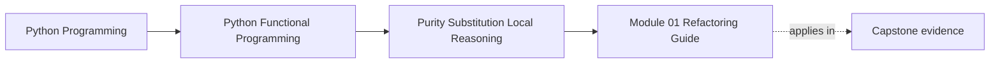
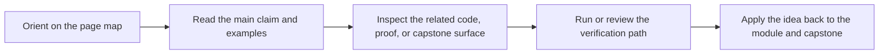

# Module 01 Refactoring Guide

<!-- page-maps:start -->
## Page Maps

<!-- page-maps:end -->

Read the first diagram as a placement map: this page is one concept inside its parent module, not a detached essay, and the capstone is the pressure test for whether the idea holds. Read the second diagram as the working rhythm for the page: name the problem, study the example, identify the boundary, then carry one review question forward.

This guide closes Module 01. The goal is not only to remember the vocabulary of purity.
The goal is to prove that you can preserve a pure core while keeping effects at a narrow
entry point.

## Stable comparison route

1. run `make PROGRAM=python-programming/python-functional-programming history-refresh`
2. open `capstone/_history/worktrees/module-01/src/funcpipe_rag/`
3. compare `pipeline_stages.py`, `rag_types.py`, and `rag_shell.py`
4. read `capstone/_history/worktrees/module-01/tests/test_laws.py`

## What to refactor toward

- pure stage functions that return new values instead of mutating shared state
- immutable value types that make equality and replacement cheap to reason about
- one thin shell that owns I/O and delegates to pure helpers
- tests that prove laws and behavior instead of only replaying examples

## Exit standard

Before Module 02, you should be able to say which file owns pure transformation, which
file owns effects, and what would break if those responsibilities leaked into each other.
